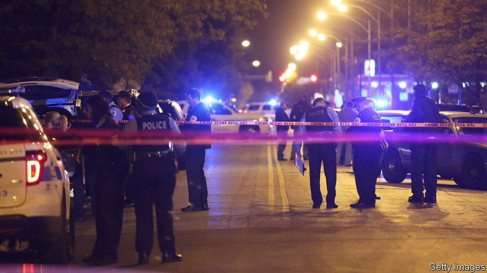

###### Solving murders

# America is unusually bad at clearing up homicides 

##### Why are inner-city murders so hard to solve? 

 

> Sep 12th 2022 

For the past three years Donald McGraw, a Chicago transit-authority worker, has been fighting for justice for his nephew. In September 2019 De’Andre Clark, a 25-year-old aspiring actor, was murdered in Chatham, a neighbourhood in the south of the city, while sitting in his car. In the days afterwards, Mr McGraw, with other family members, went street to street posting flyers asking for information and knocking on doors. Within weeks, he had found a witness (a young woman) and a video of the murder, recorded on a doorbell camera. Clark was apparently the victim of a drug deal that went wrong. He had met his killer to buy cannabis, and got into a fight over the quantity. The dealer responded by taking out his gun and shooting him.

Mr McGraw reckons he knows who the shooter was. The video did not show his face, but it coincided with other footage from a petrol-station camera, showing the two meeting earlier. The young woman told him (but not the police) that the killer even bragged about it. “I am saying bring this guy into custody, read him his rights and show him the tape,” says Mr McGraw. “He’ll talk himself right into it. He’ll be putting himself there at the murder.” For three years Mr McGraw has been protesting outside police headquarters, showing his evidence and demanding action. “We should not have to go and take matters into our own hands to try to get justice for De’Andre. We’ve got a big police department,” he says. Yet no arrest has been made.

Clark’s murder and the lack of justice for it are sadly common. In the 1960s around 90% of reported murders led to an arrest. The latest data from the fbi point to a figure closer to 50%. That does not necessarily mean that clear-up rates have fallen so much. In the 1960s some murders might not have been reported, and others were not really solved, even if somebody was arrested. Yet it seems likely that some of the decline is genuine. Chicago claims to clear up around 50% of cases, for example, but of those, only half result in a conviction (cases can also be “cleared up” if suspects are murdered or prosecutors refuse to bring charges). 

Shootings are not easy to solve. Guns kill people quickly, without leaving lots of dna, as stabbings do. Acquaintances who shoot after an argument may not leave much evidence of planning. But that was always true. And the reality is that a large share of murders in America happen in broad daylight, in public places. There are more cameras, more forensic technology and, thanks to mobile phones, more evidence of where people were and what they were doing. So why do so many murders still go unsolved?


One answer is deep distrust of the police, which means that witnesses do not always come forward. The highest murder rates in America tend to be in cities with the most ingrained history of segregation, such as Baltimore, Chicago, New Orleans and St Louis. In such places murders are often public acts, intended to demonstrate toughness. But police officers, many of whom are outsiders to these communities, find them hard to penetrate. “Even well-intentioned police officers are looked on with a lot of suspicion,” says one former prosecutor from Cook County, which covers Chicago and surrounding suburbs. Most cases, she says, must be built from witnesses, yet there is huge hostility to police. Victims have been known to refuse to reveal who shot them despite being close to death. Even among people who do not hate the police, “there’s always a feeling of why would I stick my neck out there?” 

That may explain higher clear-up rates for white murder victims. White people are more likely to speak to the police. The Cook County prosecutor cites a case in the Gold Coast, Chicago’s richest neighbourhood, in which a man shot his wife in the street. “I had so many witnesses come forward! I had a guy saying he would come back from Australia!” By contrast, after a shooting in Englewood, a mostly black neighbourhood not far from where De’Andre Clark was killed, ”you can have the same thing, somebody being shot in a busy street, and literally nobody will come forward.” Even Mr McGraw admits it is a problem. The young woman who told him about his nephew’s murder will not be a witness, he says. “Why would anyone in their right mind want to talk to the police?” he asks. That might explain why there has been no arrest.

Added to this is an underfunded and sclerotic justice system. Police often complain that prosecutors let violent suspects go, and do not bring charges even in strong cases. Prosecutors counter that the evidence they are brought is often not convincing enough. It is difficult to say who is right, but it seems that the justice system does not help. In Cook County it can take several years to bring cases to trial. Although holding suspects in jail for years before they reach a courtroom is not unheard of in America, it is still controversial. And witnesses will be known to defendants far earlier, when the prosecution files its evidence. Relocating or protecting witnesses can be difficult and costly: people are not easily torn away from family connections.

Dedicated police officers who have enough time can get around this by seeing potential witnesses repeatedly and coaxing them into testifying. They can also try to build cases on other evidence, particularly from cameras and forensics. The problem is that in cities with hundreds of murders, the police do not always have the time. Looking over hundreds of hours of video footage, searching phones and checking ballistics is expensive, time-consuming work. Labs tend to be overstretched. “If you hit a brick wall, you’ve got six other cases waiting,” says the prosecutor. 

When shootings increase, the number of detectives available does not increase in parallel. So each detective has less time for each case. According to a study by the Police Executive Research Forum in 2019, only around 8% of police officers in the Chicago Police Department, or 1,127 in total, were detectives, a significantly smaller share than in other big cities. Just 128 were devoted to solving murders. Since then, the number of dedicated homicide detectives has increased to 190. But with the number of murders 60% higher in 2021 than it was in 2019, each detective on average still has more work to do.

The vicious spiral

What this can mean is that if shootings rise, and fewer cases are cleared up, shootings may then rise further. Suspects who are not arrested may become victims of retaliatory shootings. People are more likely to carry guns to protect themselves. By contrast, when murder rates fall, detectives have more time, and can solve more cases, pushing rates down further. In New York, which has one of the lowest murder rates of any big city in America, there are around 5,000 detectives. If the same proportion are devoted to homicide as in Chicago, each will have over eight times as much time for every case. 

Kenneth Corey, chief of the New York Police Department (nypd), says his department has overhauled how its detectives work. In January it created a specialist unit to collect as much video evidence as it could after a shooting, asking for footage from doorbell cameras, security cameras and mobile phones. Neighbourhood officers, whose job it is to know a specific patch, are roped in. “In some cases, we’re able to follow the suspect on video back the whole way to their residence,” he says. That delivers stronger cases to prosecutors. Unlike the trend in Chicago, in New York in the first quarter of 2022 the ratio of murders solved to new murders was 80%, and it has been higher than in other cities for some years. In Manhattan more murders were solved than occurred, as older cases were cracked.

Even with a 100% chance of getting caught, there would still be murders. Few killers think of the risk of jail as they pull the trigger. States with low crime and high clear-up rates, which tend to be more rural, whiter places such as Wyoming, still experienced spikes in violent crime in 2020. But if more murderers were caught, retaliatory killings would be less likely. And people who get justice are more likely to trust the police. As Sasha Cotton, former director of public safety in Minneapolis, says: “If victims feel like the crimes that have been perpetrated against them are not going to be solved, then they lose faith in the entire system.” Mr McGraw is more direct: “It’s a slap in the face. When they allow these shooters to remain out here, they’re just setting the mindset that I can do anything and I’m not going to be arrested for it.” A notorious example is Maryland’s biggest city: Baltimore.■

