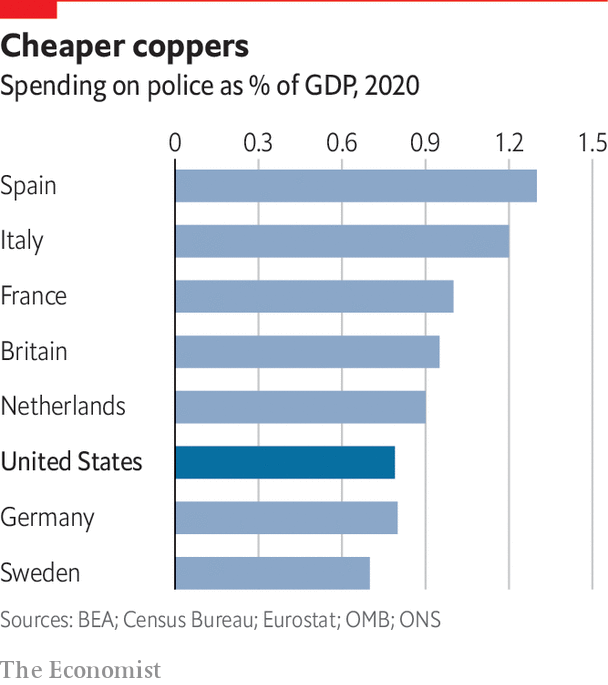

###### The global context

# American exceptionalism exists, but other countries also have problems 

##### The rise in violent crime in America is almost unique, but not wholly 

 

> Sep 12th 2022 

In the summer of 2020, when young Americans flooded their cities to declare that black lives matter, they did not do so alone. Within days, similar protests spread as far as Kenya, Colombia and South Africa, in what became a global movement against racism and racist policing. In London, thousands congregated in Trafalgar Square and outside the American embassy. Taking their cue from Minneapolis, they chanted “Hands Up, Don’t Shoot” at police officers. British police rarely shoot anyone, though the recent killing of Chris Kaba, an unarmed black man, in south London has triggered new protests.

Yet America’s experience in the two years since 2020 appears unique. Among rich countries only America has experienced murder rates that have spiked dramatically. In the year to March 2021 the number of murders in Britain fell to its lowest in five years. In France murders fell in 2020 and only slightly rebounded in 2021. Canada, perhaps the country that is most like America, and one where gun ownership is widespread, saw a rise in homicides in 2020, but of only 10%. In the same year, in its biggest city, Toronto, murders declined.

America also spends less on policing than other rich countries: some 0.8% of gdp, against an average of around 1% in the European Union. Germany has 23% more police officers per person than America; France has 33% more.

 


Dig deeper, however, and America seems less out of line. Although the murder rate in Britain remains low, London saw the highest-ever number of knife murders of teenagers in 2021. Murder is also more common in minority communities than in white ones and, just as in America, the gap is growing. According to the Home Office, between 2018 and 2021, black people were six times more likely to be victims of homicide than white people and four times more likely than other ethnic groups. Compared with the period from 2012 to 2015, the murder rate for black people almost doubled, to around five per 100,000; the rate for white people stayed around 0.8.

A study in April from Cambridge University found that gang violence in Britain is not unlike America’s either. It disproportionately involves young black men and tends to spread in the same way. Data from Thames Valley Police finds that disputes are a powerful predictor of violence. Having harassed somebody else involved in crime meant a 243-fold rise in the likelihood of being attacked. Although the police in Britain solve more murders (in the year to July, London’s Metropolitan Police cleared up 103 out of 114), violent crime also has roots in unaccountable policing and inequality. Six of England’s and Wales’s 43 police forces have been put into “special measures” after scandals involving sexism and racism.

Britain is not America. As high as the murder rate for black people is, it is lower than the rate for all races across the Atlantic. Black people are a far smaller share of the population. Guns are extremely rare, accounting for less than 6% of homicides. Yet what Britain shows is that America is not completely alone. What is really different is not that its situation is unique, but that it is on a vastly bigger scale.■

