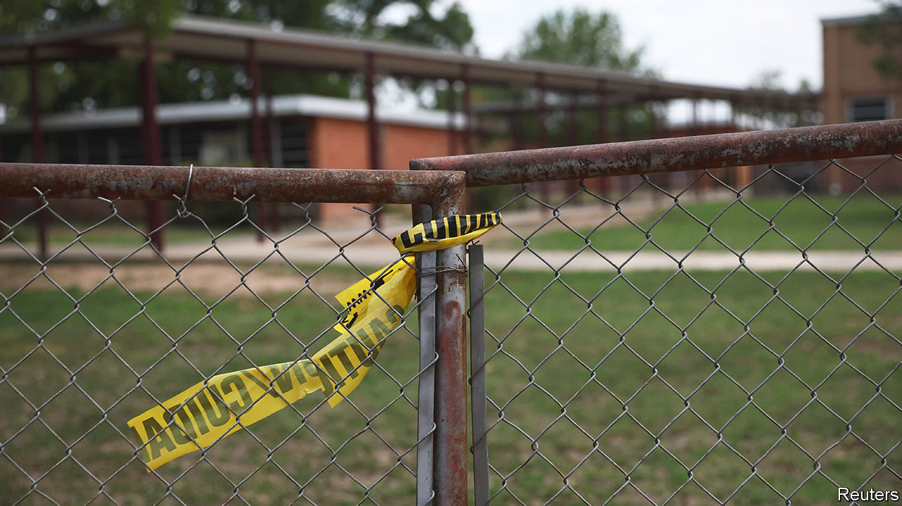
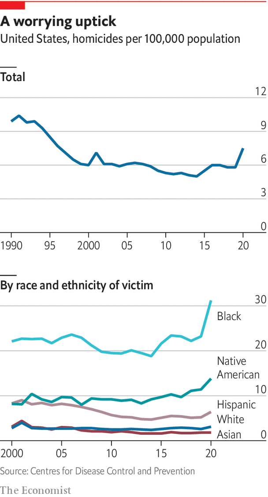

###### The sociology of murder

# An anatomy of hard times in the city 

##### What underlies inner-city murders in America 

 

> Sep 12th 2022 

Sitting at a table in the kitchen of Chicago cred, a charity working with young men at risk of committing or becoming victims of violence, Isaac Israel, who lives in the south of the city, explains why somebody in his situation might want to carry a weapon. “I feel like as long as the criminals have a gun, I should have a gun,” he says. “What I’m seeing as a civilian, is you gotta protect yourself…in our neighbourhoods, the police only come after what happens.” Growing up on Chicago’s South Side, he says, “is about survival”. “I look at it like being in the military, because we have war every day on our streets, but it don’t get announced, it don’t get talked about.”

Mr Israel paints a picture of an anarchic world, in which people cannot trust anybody but themselves to provide safety. “It’s like crabs in a bucket,” he says. Just as crabs will pull any crab which seeks to escape from a bucket back inside, anyone who begins doing well in a poor neighbourhood risks attracting enemies. “Say, I might catch a wave, and I am doing good in life,” explains Mr Israel, imagining that he comes into money or finds a new girlfriend. This makes him vulnerable. Other men who feel envious might pick on him. If he lets his guard down, he could lose it all. And that explains why he might need to carry a gun.

The homicide rate for black men in America is roughly 13 times higher than for white men, and seven times higher than for black women. To understand why, it helps to see Mr Israel’s perspective. In depictions of inner-city violence in such tv shows as “The Wire”, a gritty series about drug gangs and police in Baltimore, murders are taken seriously. In the show, people are shot because they are suspected of talking to police or are a competitive threat to a powerful drug enterprise. Killings are undertaken by dedicated hit men, who plan meticulously. In reality, little of the killing on America’s streets is like this. 

 


Most shootings start with trivial arguments, often between young men who know each other. “That first killing is often about some disrespect, some long-standing conflict, something that we may not have our hand on,” says Charlie Beck, a former police chief in Chicago and Los Angeles. It might be something as simple as an insulting post on Instagram, or a “diss” track in “drill” music. But then things escalate, as shootings produce retaliatory shootings. These involve a relatively small number of people, operating in a few neighbourhoods. In Chicago, over a third of shootings happen in just 5% of the city by area. In New York the police reckon that just 800 people account for at least a fifth of all violent crime.

One study about Milwaukee published in 2016 found that “argument or fight” accounted for the motive in 25% of homicides, far ahead of drugs or money and second only to “unknown”. Another study of Chicago homicides from 1965 to 1995 found that 77% were down to “altercations”, dramatically more than those directly linked to criminal activity such as drug dealing. Shootings are commonest in summer, and at weekends, when people are drinking and escaping the heat by socialising outside.

Why do a minority of young black men resort to violence so often? Guns are present in almost every part of American society; and everyone gets into arguments. One explanation comes from Elijah Anderson, a sociologist at Yale University, whose book “Code of the Street” looked at inner-city violence in PhiladelphiaMr Anderson argues that a violent culture has arisen among a minority of young black men in the poorest areas in response to racist, ineffective policing and entrenched inequality. In the poorest black neighbourhoods, he argues, young men with few economic options compete for status in a deeply competitive, unequal society, in which the ownership of physical goods (such as cars or expensive clothes) signals success.

According to Mr Anderson, using violence, even in response to modest slights, can be a way to build “street credibility”. A reputation for being tough is protection from being victimised by others. But such a reputation must be maintained. “It becomes the coin that you use to negotiate your own security,” he says. This may explain why young men join gangs, which are responsible for an outsized share of shootings. Most gangs are not big organised-crime groups with clear hierarchies, like those in “The Wire”. They are more often informal cliques of perhaps half a dozen young men and teenagers, who have probably known each other from childhood. To make money they get involved in selling drugs or stealing. But that is not their primary purpose, which is to provide protection to their members.

The anarchy arises from a lack of consequences for violent crime. This is not because the police are absent. It is because police forces in the poorest neighbourhoods tend to operate indiscriminately. To tackle gun crime they stop young men in cars and on the street for offences that have little to do with violence. Such “pretextual stops”, prompted by traffic violations, jaywalking or loitering, are used to search for guns or drugs. The result is that the vast majority of violent crimes go unpunished, even as trivial offences are treated harshly. Black communities are, in effect, simultaneously over- and under-policed. When judicial consequences bear only a limited relationship to whether you have committed a serious crime, the police are seen as a malign and arbitrary power in people’s lives, not as enforcers of just laws. 

As one young man standing in a group on a street corner in Minneapolis, ankle-tracking bracelet in full display, puts it, the police “don’t care about black people”. In this neighbourhood, “they’re harassing us every day,” he says. If someone tries to rob you, you cannot go to the police: you must protect yourself. “What else are you meant to do, just sit there and let yourself be beat?” If necessary, “you kill him, that’s what the street says anyway.” Or as another man in Atlanta says, if you’re a young man, and a family member is murdered, “you feel you’ve got to take it into your own hands. The police aren’t there to help you. In fact they’ll probably flip on you.” Police want to be seen as heroes, he says, but “people here think they’re going to harm you.”

Why has violent crime soared particularly in the past few years? One plausible explanation is that the pandemic may have pushed more young men onto the street, as social services closed down, and made their lives more stressful, leading to more arguments. This has happened across America (road rage and bad driving have also risen). But it is most visible in the poorest communities, because the baseline level of violence was already high. The number of guns in circulation has also risen dramatically. The police, never especially effective in providing security, may also have dialled back in response to the protests in 2020 after Floyd’s murder, leading more people to choose to carry guns. The conditions for extreme violence and murder have always been there. But that leaves another big question: why is it so hard for the police to clear up when it happens?■

