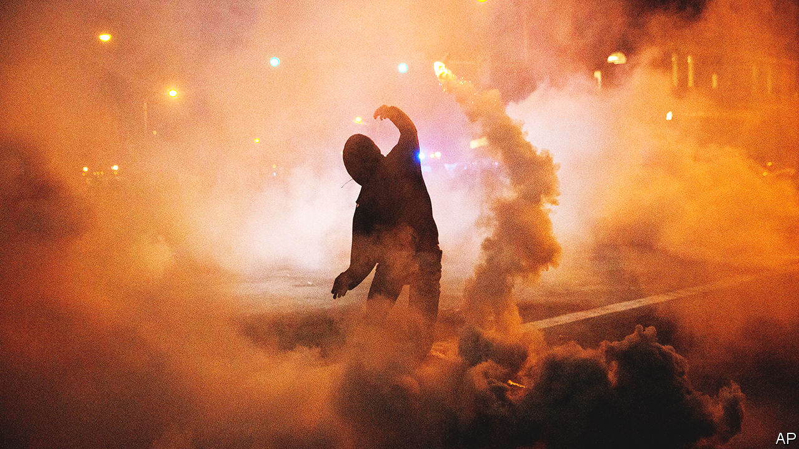
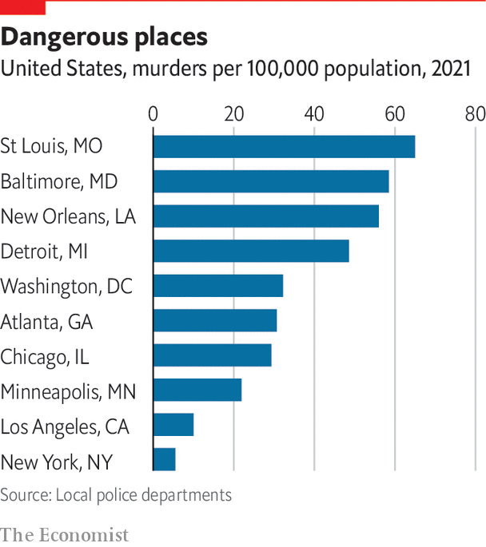

###### Decline and reform

# How Baltimore became a sad harbinger of the future 

##### How an east-coast city gave warning of what would come 

 

> Sep 12th 2022 

In a federal courtroom in Baltimore on July 14th, a defendant named Steven Angelini sat at a desk wearing a mask and an orange jumpsuit. Until the day before, he had been an officer in the Baltimore Police Department (bpd), albeit suspended to desk duty. Then he was indicted by federal prosecutors on charges of distributing cocaine and oxycodone (a powerful prescription opioid). The hearing was to determine whether Mr Angelini should be given bail. According to the prosecution, he had fed information and prescription drugs to a motorcycle gang, and offered to supply an illegal “ghost gun” and ammunition, in exchange for cocaine. Mr Angelini was denied bail. The judge, justifying his decision, declared that “nothing in this community is more dangerous than drug dealers with firearms.” 

That a police officer should be accused of dealing in drugs and firearms ought to be extraordinary enough. Yet the arrest was only the latest of a series in Baltimore, stretching back five years. In 2017 eight members of the bpd were arrested. All had been members of a Guns Trace Task Force, which was created to build meticulous cases against gun smugglers, but morphed into a violent, unaccountable gang. The cops stopped hundreds of people, almost all black men in dangerous parts of the city, and searched them. The guns they found they turned in; but money they stole, and drugs they sold back on the street, via intermediaries. When accused of civil-rights violations, they invented evidence, planting guns or drugs themselves. Six pleaded guilty. Two more stood trial, and were found guilty by juries. Since then a trickle of other officers have been arrested and charged by federal agents and local departments.

 


Few cities illustrate the unhappy relationship between broken policing and violent crime better than Baltimore. The city has struggled for decades. Yet unlike other cities, Baltimore’s homicide rate did not spike in 2020: it soared earlier, in 2015, and has remained elevated ever since. And it did so in response to a riot, sparked by police brutality. On April 12th 2015 Freddie Gray, a 25-year-old, was picked up by police officers in West Baltimore who searched him and found a knife (which is not illegal). Mr Gray was bundled into a van and driven round the city at high speed without being strapped in. When the van stopped, his spine was almost severed. He later died in hospital. The arrest was captured by bystanders on mobile phones. 

Before his funeral two weeks later, anger at the police department reached boiling point. After days of peaceful protests, teenagers who had walked out of school started looting a pharmacy. By nightfall, buildings across the city were ablaze and dozens, if not hundreds, of businesses had been looted. Before Gray’s death, homicides in Baltimore had averaged around 200 a year, a big number for a city of only 600,000. But almost immediately afterwards, the rate began climbing. By the end of 2015 the city had suffered almost 350 murders, up from 211 in 2014. 

A predictable upsurge

Daniel Webster, who studies gun violence at Johns Hopkins University in Baltimore, says that this was predictable. “I can remember so vividly as I watched parts of Baltimore burn,” he says. “I had this sinking feeling that we were in for a very long period of trouble.” Violent crime usually climbs after riots; it did so in 1968, after the murder of Martin Luther King. Baltimore proved no exception. Understanding the exact causal mechanism is difficult. But Mr Webster puts forward what is probably the most accepted explanation. In essence, a model of policing that relied heavily on mass arrests rather than intelligence gathering suddenly and catastrophically failed.

In the decade or two before the riots the bpd had a zero-tolerance approach to policing. Cops were directed to flood crime hotspots and search almost everybody. In 2003 over 110,000 people were arrested. A large share were released without charge. Flooding high-crime areas to search for guns can reduce violence, says Mr Webster. The problem with the way it was done in Baltimore was that it was not intelligence led, and so not sustainable. Officers who made lots of arrests, or found lots of guns, benefited from impunity—carrying on working even when accused of civil-rights violations. City prosecutors maintained a secret list of officers they did not trust to testify in court. Relations between residents and the police were ruined. When the riots came, undoing years of mistrust proved impossible. Cops complained that they were being punished for just doing their jobs. Arrests tumbled. Black Baltimoreans’ faith in the police sank lower. Fewer people called 911 when they heard a shooting, or were ready to volunteer information. So violent crime soared.

Tough, unaccountable policing might bring down crime in the short run, but not by enough. What Baltimore shows, says Mr Webster, is a “greater fracturing between police and community”. And that is what happened in many cities in 2020. In the wake of the death of George Floyd in Minneapolis that summer, many cities experienced unrest similar to Baltimore’s five years previously. Massive protests sometimes turned violent, with buildings set on fire and police officers assaulted. The result was also similar. Police, nervous of being prosecuted, and steeped in a culture where aggression is the norm, pulled back. They were “afraid of doing anything”, says Kenneth Corey, of the nypd, even as black people and other minorities became more reluctant to call for help.

Can the relationship be repaired? Seven years on, Baltimore is still trying. Even as prosecutions of corrupt officers continue, the bpd is operating under a federal consent decree—a system of monitoring that is meant to drive improvement. “We are now a totally different department,” claims Michael Harrison, the city’s police commissioner. Every police officer has undergone training on how to be more racially sensitive, and how to de-escalate violent situations, in a programme called “Ethical Policing is Courageous” (epic). All cops now wear body cameras. Dedicated community police officers hold regular meetings with local residents. And the department’s internal-affairs section, which keeps tabs on bad policing, has been reformed. Ray Kelly, leader of the Citizens Policing Project, who has long criticised the police in Baltimore, says that, at least in principle, the reforms are impressive.

Rebuilding a police department is challenging at the best of times. Doing it when droves of cops are retiring and the murder rate is sky-high is, as Mr Harrison says, like “constructing a plane while flying”. It does not help that some Baltimore cops are sceptical. One former city official recounts a story of a training session in which officers were being taught how to de-escalate a situation involving a mentally ill woman. When asked what to do, one shouted out “taze her”, to laughter. Even Mr Harrison admits that changing policing culture is tricky. “We can’t allow the officers to complain and try to force us back into what they believe their job is,” he says. 

Will it work? Mr Kelly worries that black residents are losing patience. His office borders a street corner which he says may be home to the biggest open-air drug market in North America, with young men loudly hawking heroin at all hours (including to your correspondent). At least some people want a return to knocking heads. Brandon Scott, Baltimore’s progressive mayor, denies that he wants to go back. “Those racist, outdated policies don’t work,” he says. Yet in July, he hired Anthony Barksdale, a former deputy chief of the department, as deputy mayor for public safety. As recently as 2017, Mr Barksdale complained that reforms were “handcuffing your own cops”. The debate about policing is heating up—and it will play into forthcoming elections.■


