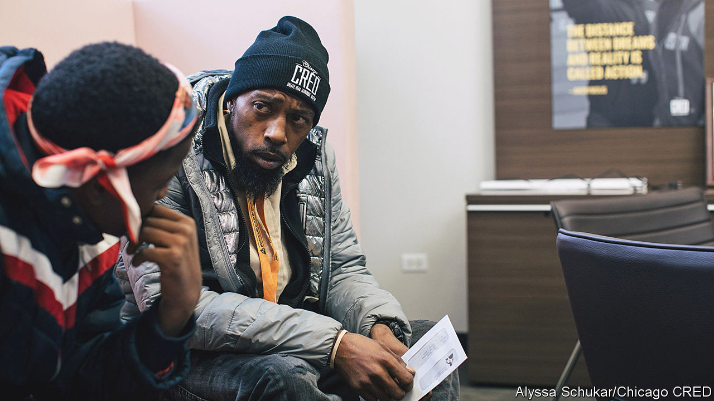

###### Alternatives to policing

# How softer non-policing strategies might help 

##### The hopes of, and limits to, non-policing anti-violence strategies 

 

> Sep 12th 2022 

On a basketball court just north of Atlanta’s city centre, on a hot summer’s day in July, Ricky Usher (generally known as Dip) is busy organising his charges. Several teams from around the city are lined up; a sound system blasts out music; groups of teenagers of both sexes sit on stands consuming burgers and tins of sugary pop. Dip, a large man with a gold tooth, who coaches the home side, roams between the young men and teenagers passing out advice and blue t-shirts advertising Atlanta Teen Leaders, the city-funded after-school programme.

Coaching basketball is Dip’s main job. But it helps with his other, as an “interrupter” for Cure Violence Global, an organisation based in Chicago that has programmes in 20 American cities, and in a dozen or so other countries around the world. Its model, explains Fredrick Echols, the ceo, is built round the idea that violence spreads in a community like a communicable disease. For a disease to spread, “there has to be an environment that supports the growth of the bacteria or virus,” says Dr Echols. Just as cholera spreads in overcrowded slums without clean water, violence spreads most in places where jobs are few, access to good education limited and inequality rampant.


Following this logic, Cure Violence programmes hire “violence interrupters”, who do a job not unlike health workers in a slum. Violence interrupters cannot undo inequality. But they can identify those most at risk of falling into violent behaviour and step in before it happens, rather as health workers identify people likely to get sick and treat them before they infect others. “I got relationships with a lot of these people,” says Dip, of young men involved in crime. “And if not them, I got their uncles, their aunties, their cousins.” Around the neighbourhood, “everybody knows somebody who knows me.”

Stopping a young man from shooting somebody else by power of persuasion is not easy. But Dip does “whatever it takes”. If he hears that two men have had an argument, he will find them. “That shit be like, disputes over money, disputes over love interests,” he says. If he can find a young man before he starts a fight, he persuades him to come for a drive, or takes him to a restaurant to chill out. Sometimes he pays for groceries or other essentials, since financial difficulty can drive violence. “If you’ve got a pocket full of money, you’re less willing to do some bullshit,” he says. Most young men do not really want to kill, he reckons. Rather, they’re traumatised, often from having been victims themselves, and turn to violence out of stress. Carrying a gun and using it is “a defence mechanism, most of the time”, he says.

According to Aric Johnson, Dip’s supervisor in Atlanta, successful violence interrupters need credibility most of all. They are usually men in their 30s or 40s who might have a history of violence and share (or at least understand) the mistrust of the police and formal institutions. “You can’t be no stool pigeon, you can’t be no snitch,” he says. But they also have to have moved on from violent crime. “Even in the dirt you’ve got to be stand up. You can’t be moving packages or calling shots.” Before becoming a Cure Violence supervisor, Mr Johnson was a violence interrupter, having got out of prison in his late 20s. He worked at a hospital in Atlanta, where he talked to gunshot victims to persuade them not to take revenge on those who shot them.

In the past few years, investment in such programmes, known as “Group Violence Interruption”, has soared. Cure Violence, which began as a project called Ceasefire in Chicago around 20 years ago, is one of the biggest providers. But many local organisations are working on variants of the same model, trying to identify violent young men and divert them. In Chicago cred, a group founded by Arne Duncan, Barack Obama’s former education secretary, pays a small stipend (starting at around $125 a week) to persuade clients to take classes in group trauma counselling, history and financial literacy. cred will sometimes take young men out on trips over weekends when violence is most likely.

A policeman’s lot is not a happy one

Cities are turning to such models partly out of desperation. Almost every urban police department across America has suffered from high attrition recently. Chicago has 1,500 fewer officers than in 2019. Violence interrupters can be hired more quickly than cops can be trained. The federal government has dished out plenty of cash through the American Rescue Plan, so it does not cost cities much of their own revenue. Among liberal politicians there is a growing belief that police have been asked to do too much, and are not best able to prevent violent crime, rather than respond to it. As Tamara Mahal, boss of Chicago’s Community Safety Co-ordination Centre, says: “Police have gotten into a lot of jobs that were not necessarily designed for law enforcement.”

Violence interruption is not the only model. Minneapolis has experimented with opening secure places where police can take people experiencing mental-health crises. Cops sometimes respond to calls by sending a counsellor trained in de-escalation. Chicago is pouring money into community groups that clean up derelict lots, plant trees or just provide portaloos for community concerts and the like. These projects might seem petty, says Ms Mahal, but the idea is to foster a belief that the city government is there for people, so reducing mistrust in institutions like the police.

Taken together, these programmes are sometimes said to amount to an “alternative to policing”. Occasionally they have been funded partly out of police budgets, a sort of “defund” by stealth. But senior police officers are mostly in favour. In some cities the police share information with interrupters, to help identify potential flare-ups. The question is, do they work? Anecdotally, the effect seems strong. Dip claims: “I’ve put a dent in a lot of the crime,” and his neighbours agree. But the academic evidence for their effectiveness is thin, partly because the models are still new, and partly because scientifically judging their effectiveness is extraordinarily difficult and expensive.

Yet studies that have been done show some positive effect. One in 2012 of an early Cure Violence programme in Baltimore, Safe Streets, found that it “showed statistically significant reductions in non-fatal shootings after programme implementation”, in some cases of over 50%. A University of Chicago study of readi, another programme in Chicago that selected clients from a pool of young men deemed vulnerable via a lottery, found that those chosen were 63% less likely to be arrested for a shooting or homicide than those not selected. They were also 19% less likely to be shot. The study could not prove with 95% statistical confidence that these results did not arise by chance. But it did find an 85% chance that the reduction in shootings was due to the programme.

Given how inexpensive such programmes are compared with the cost of running a police department, investing in them is a good idea, says Jens Ludwig, of the Chicago Crime Lab. But he warns that what they do not constitute is a true “alternative” to policing. In reality, they work best as a complement not an alternative. Having high clear-up rates helps violence interrupters, because they can tell clients that if they do not change their behaviour they will eventually go to prison. Charlie Beck, a former Chicago and Los Angeles police chief, says the programmes work best “when combined with smart, gang enforcement, not blanketing a major area—which creates a lot of tension—but targeting those that are actively involved in the violence.”

As Brandon Scott, mayor of Baltimore, puts it, his city needs a “carrot and stick approach”. Workers should be able to say to violent young men: “We know what you’re doing, and your life is in danger, and we’re going to give you the opportunity to change it.” But they also need the stick: “If you don’t, we’re going to bring the full force of the law to bear on you.” Violence-interruption models may not be able to deliver what police abolitionists want, which is a total removal of the stick. But for too long American cities have tried to control violent crime with sticks alone.■

