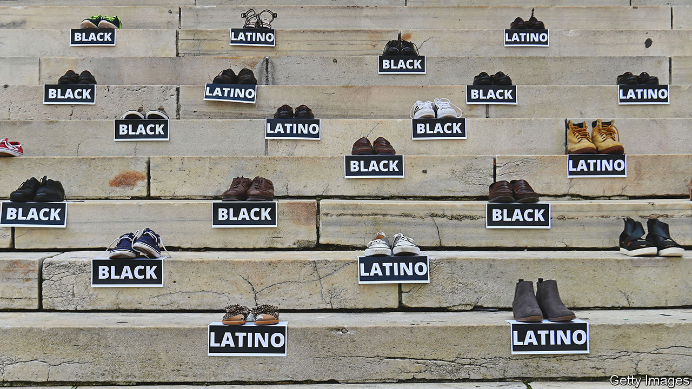

###### Violent crime in America

# How to stop the killing 

##### After a long decline, violent crime in America is rising again. In this special report Daniel Knowles looks at what can be done 

 

> Sep 12th 2022 

In a modest apartment just off the freeway in Creve Coeur, a suburb of St Louis, An’namarie Baker is packing up her son’s possessions. Three weeks earlier, at 3am on July 3rd, Damion was murdered in a litter-strewn car park south of the Busch Stadium, where the Cardinals play baseball. He had left a nightclub with a woman he had just met to drive her to pick up her car. According to the detective on the case, a man challenged him, demanding his keys. Instead, Mr Baker fought back, only for more men to emerge and open fire. Mr Baker was shot eight times, and the woman he was with five. Bullets from three different guns were found at the scene. He died; she survived. Nobody has been arrested.

Damion, says his mother, was the perfect child. “Being a mom is my proudest thing,” she says. She was raised in public housing in St Louis; her first son, Devon, was born when she was just 17. Damion won a scholarship to a Catholic private school, where he joined the American-football team, winning the state championship. That earned him another scholarship to Holy Cross, a private university in Massachusetts. On graduating, he set up his own property business, which did well. A few months before he was killed, he moved into his own apartment, taking along his collection of Pokémon cards. At the age of 25, he liked to play video games, mentor young footballers and read business books. He had never been arrested, or even fingerprinted. He had a habit of correcting people with the words “well, technically”.

“I just can’t believe that Damion pulled that ticket,” Ms Baker says. His academic and sports brilliance, and his clean record, might have protected him. Yet like thousands of other young black men, he was gunned down in the street, one of 132 people killed so far this year in St Louis, a city of 300,000 people. In 2021 199 people were killed, giving St Louis the highest murder rate of any big city in America. Globally only big cities in Mexico, Venezuela and South Africa record more murders as a share of population: all countries dramatically poorer than the United States.

According to the Centres for Disease Control and Prevention, a government agency, there were 24,500 homicides in America in 2020. That was a 28% rise on 2019, the biggest one-year jump in over a century. Murder rates spiked almost everywhere—in big cities, suburbs and rural areas. There were more victims of both sexes, almost every race and ethnicity, and of every age group. But the fastest-growing number, both proportionately and in absolute terms, was of young black men living in big cities. Of all homicides, 19,350 involved guns. Black people, of whom 12,000 were killed in that year, accounted for 70% of the increase in gun homicides.


More recent data nationwide are not yet available, but city-by-city figures suggest that the spike has not reversed itself. In 2021 Chicago saw over 800 homicides, the highest number since 1994, when America’s previous big wave of violent crime was beginning to subside. The murder rate in black neighbourhoods reached its highest-ever level. New York, although still among the safest cities in America, recorded its most murders in a decade. Cities as far afield as Austin in Texas and Portland in Oregon have passed all-time records for homicide. So far this year several cities, including Chicago and New York, have seen their murder rates dip a little. But they remain far higher than before the pandemic. Almost no cities have escaped unscathed. As well as murders, other violent crimes such as carjacking have soared even as less violent crimes such as burglary have declined.


The murder rate in America is over six times the levels in Britain, France and Germany, and over 20 times that in Japan. For every murder, there are more victims who are not killed but may be maimed for life, some carrying bullets in their flesh for years. Young black men suffer disproportionately: around one in 700 black men aged 18 to 24 was killed in 2020. Studies of Washington, dc, and Los Angeles have found that homicide reduces the average life expectancy of black men by roughly two years. But Americans of all races are murdered more than people in other rich countries. White non-Hispanic Americans are over three times more likely to be murdered than white Britons are. 

A costly business

Such violence does not just cut short individuals’ lives and cause misery to their families. It also makes local residents far more nervous. Older people fear leaving their homes; children are not allowed out to play. Those who have the means abandon once-cherished homes for safer places. As middle-class residents leave, cities can find themselves in a spiral of decline and disinvestment, because less tax has to fund the same public services. Taking all these into account, calculations made in 2004 put the cost of a single murder to society at $9.7m. That is equivalent to $15.7m today, and it would put the total cost of homicide in America at nearly $400bn a year, or just under 2% of gdp, most of it concentrated in the poorest parts of the country.

In 2020 protesters took to the streets of American cities to argue that “Black Lives Matter”. The uprising, sparked by the murder of George Floyd, an unarmed 46-year-old black man, by a Minneapolis police officer, helped to start a debate among progressives about whether policing was even necessary. It also created momentum among moderates for strengthening rules to hold law-enforcement officers to account. But the awful surge in the number of black men killed by people other than the police has taken the wind out of the sails of this discussion. Instead, Democrats like Willie Wilson, a candidate to be mayor of Chicago, promise to “take the handcuffs” off police and get back to the tough policing of the past. In July President Joe Biden announced $37bn more federal spending on crime prevention, including money to enable local governments to hire 100,000 more police officers. 

This  argues that reforming policing and the criminal-justice system are key to reducing America’s high levels of violent crime. Some contributing factors, such as the ready availability of guns, cannot be fixed by changes to policing. But violent crime, especially in the poorest neighbourhoods most prone to it, could still be sharply reduced. It will not happen unless politicians maintain their support for change. “Defunding” the police, a leftist obsession that became popular in 2020, is not the answer. But neither is a strategy that reverts blindly to the aggressive, untargeted policing of the past. Better ideas are needed. As Ms Baker says, “Why don’t we care more about this? It feels like as a country, we are allowing this to happen. How are we not doing a better job of curbing this?” A good way to start answering these questions is to look more carefully at what drives so many to commit murder in the first place.■

