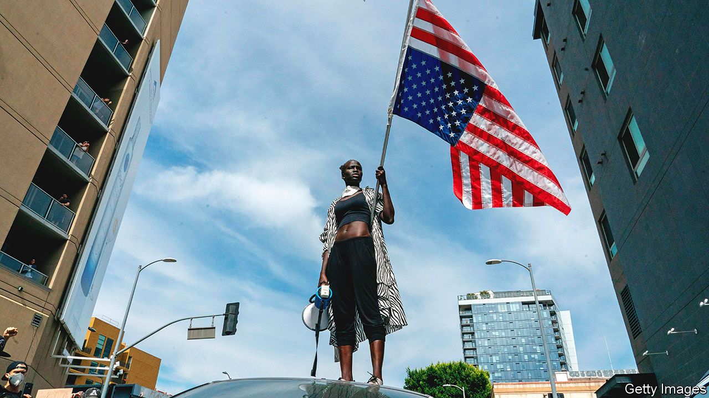

###### Conclusion

# Stopping the spiral of murder and violent crime 

##### America has relied too long on a toxic combination of over- and under-policing 

 

> Sep 12th 2022 

In the summer of 1975 the Council for Public Safety, a New York group run by trade unions, including those of the police and firefighters, mocked up a leaflet for passengers arriving at the city’s airports. The cover featured a picture of a skull wearing a shroud with the message, “Welcome to Fear City”. The leaflet offered such helpful advice as “stay off the streets after 6pm”, and “you should never ride the subway for any reason whatsoever”. It was never distributed, but it is remembered, at least partly because it rang true. In that year New York had over 1,600 murders. 

Today such a figure seems hard to imagine. The biggest risk most visitors face to their wallets comes from eating in restaurants, not from hooded figures carrying guns in the street. Last year, the city saw 488 murders, in a population of 8.5m. That is a substantially higher rate than in cities like Paris or London. But it is similar to what it was a decade ago when Michael Bloomberg, the then mayor, boasted about New York being the safest big city in America. It still claims to be.

Patrick Sharkey, a professor of criminology at Princeton University, argues that from the 1950s until the 1990s, rising violence in black neighbourhoods emerged in part as a response to racism. As they escaped from the South to northern cities, black people were driven by racist policies into appalling slums. When their factory jobs started to disappear in the 1970s, heroin and crack cocaine arrived instead. As neighbourhoods were abandoned, and people became more fearful, the social norms that had kept crime under control deteriorated, creating a perfect recipe for violent crime. Too often the investment was lacking.

It was often black leaders who pushed for more police and more punitive sentences to tackle drugs and violent crime. According to Mr Sharkey, the long decline in such crime that began after 1991 was brought about in part by more aggressive policing. The number of police officers soared. More cops on more street corners helped to contain violence by sheer force. But those same leaders also wanted investment in their neighbourhoods, and police officers who respected the majority of law-abiding black citizens, even as they were tough on crime. 

As a result, the fall in crime proved unsustainable. Many urban economies did not recover in the way that New York did. By 2015 the costs of rough, unaccountable policing had become impossible to ignore. As protests took off that year against police violence, murder rates in some cities started to rise. The pandemic, and the subsequent outpouring of rage at police, has made things worse. It “shut down the institutions of social life that bring people together”, says Mr Sharkey. That affected all Americans. But it was people in the poorest places who were least prepared for it.

The risk now is that a new spiral of disinvestment and decline will start up again. To stop it, America’s poorest people need more investment in their neighbourhoods, better education and greater access to jobs. In the long run, reducing the disaffection and poverty that too many Americans suffer from is the only way to stop a minority from resorting to violent crime. The proponents of “defunding” the police are right to call for more money for social projects. Where they are wrong is in imagining that taking the money away from America’s modest police budgets would provide anywhere near enough—or that policing can be dispensed with in a country that has nearly 400m guns in circulation.

Mr Biden is right to argue instead that more police officers are needed. But hiring more cops is not enough. They also need to do their work differently. Robert Peel, the founder of the Metropolitan Police in London, wrote almost two centuries ago that “the test of police efficiency is the absence of crime and disorder, and not the visible evidence of police action in dealing with them.” On that measure, America’s police are profoundly inefficient. For extra spending to work, retraining is clearly vital. But hostile police unions also need to be defanged, and the worst cops fired and prosecuted. Only greater accountability can rebuild shattered trust. That is the best way to a better future.■

