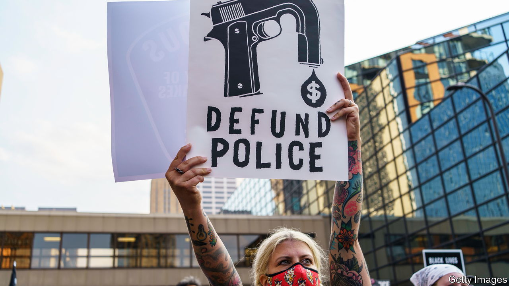
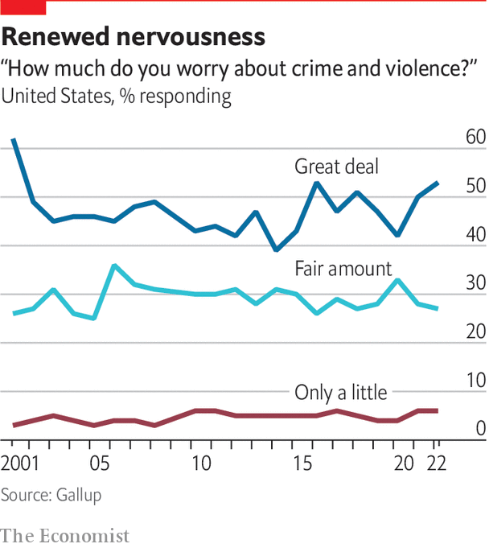
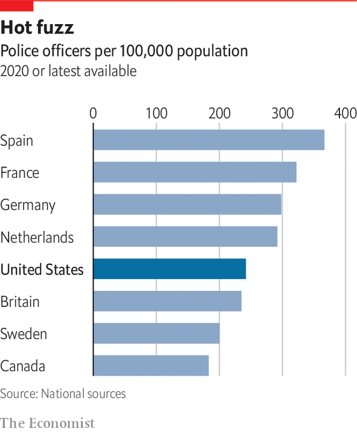

###### The politics of policing

# The public wants to refund, not defund, the police 

##### Progressive prosecutors are losing ground across America 

 

> Sep 12th 2022 

At the site where George Floyd was murdered in May 2020 in Minneapolis, a rough shrine has emerged. Surrounding a sculpture of a black fist are banners, flags and photos of other young men killed by police. On the burnt-out petrol station is a slogan: “Where there’s people, there’s power”. Affixed around the square are posters showing a police officer dressed in body armour clutching a scythe. In place of a face, it has a grinning skull. The text reads “All cops are Derek Chauvin”, the name of the police officer convicted of murdering Floyd. Underneath is a directive: “Smash the police state”.

In 2020 such thinking was common in Minneapolis. The city, which then had a powerful council and weak mayor, has always been liberal. But it was still a shock when nine council members stood next to a giant sign in Powderhorn Park, near where Floyd was killed, reading “Defund the Police”, and announced plans to “end policing as we know it”. When the mayor, Jacob Frey, who was primarily responsible only for the police department, said he wanted “a structural shift” in the department, but was not in favour of abolishing it, protesters outside his house booed him.

“Defund the police” never turned into a mainstream Democratic policy. Joe Biden has blamed small-government Republicans for squeezing police budgets, and has indeed promised more spending. But Minneapolis was not the only city to flirt with the idea. London Breed, mayor of San Francisco, pledged to shift $120m from the police department to projects for black people. Bill de Blasio, then mayor of New York, promised to cut the police department’s budget, albeit without going into detail. In left-leaning and liberal media, radicals of all stripes got plenty of airtime and column inches, even to make such extreme arguments as “In Defence Of Looting”.

 


It did not last. In November 2021 Mr Frey was re-elected in a landslide and, after a referendum, given powers more like mayors elsewhere, taking them away from councillors who had backed “defund”. A formal proposal from the council to abolish the Minneapolis Police Department and replace it with a new “department of public safety” was soundly defeated, with 56% of voters against. Perhaps most surprisingly, the revolt against the measure was strongest in Minneapolis’s black neighbourhoods, in the north and centre. Most votes in favour came from liberal, whiter districts, peaking in blocks around the University of Minnesota.

According to Jerry McAfee, a pastor and community organiser in north Minneapolis, activists pushing “defund” never understood black people’s concerns. “You had this great cry of defund the police at a time when people were being shot at alarming rates,” he says. “Even today, if you include St Paul, we’ve had over 1,000 people shot, 200 homicides, and there are no major marches, by city officials or by Black Lives Matter or any of the other groups who are supposed to care about us so much,” he complains. People in his neighbourhood do not want the police abolished, he says; they want them to do their jobs, arresting people who commit violent crimes, instead of roughing up the innocent. 

In some ways, the city got defunded without voting for it. Under the city charter, the Minneapolis Police Department is meant to have at least 730 officers. Before the pandemic, it had around 900. By the middle of this year, the total had fallen to 626, the lowest in decades. In the wake of the George Floyd protests, so many cops chose to retire, take medical leave or get jobs elsewhere that recruitment could not keep up. Billboards around the city are plastered with adverts promising jobs to potential recruits, as the police department tries desperately to get back to strength.

Yet the debate over how to reform a notoriously violent police department continues. In November voters will choose a new county attorney for Hennepin County, which covers the city of Minneapolis and several substantial suburbs. In the non-partisan primary election in August, the candidates who got through to the run-off were Martha Dimick, a former judge and prosecutor from the north of the city, and Mary Moriarty, formerly the county’s chief public defender.

Far apart

In rhetoric, the two candidates could hardly be further apart. Ms Moriarty is focused on reform. “We have to acknowledge that what we’ve been doing has not worked to keep us safe,” she says, arguing that young people involved in violent crime need trauma treatment as much as punishment. Her primary goal, she says, will be to hold bad police officers to account, and to promote alternatives to policing. By contrast Ms Dimick says: “My attitude is, we have to send a message. We are going to prosecute serious violent criminals…And if they’re convicted, they’re going to prison.” She agrees that there should be alternatives for low-level offenders. “Kids can be knuckleheads and make mistakes,” she says. But she also notes that Minnesota has one of the lowest incarceration rates of any state, and worries that too many violent criminals are being released.

 


It is hard to predict who will win. There is no polling and the two contenders have backing from different parts of the Democratic establishment. But district-attorney races have proved to be a clear test of voters’ feelings on police reform. In Baltimore Marilyn Mosby, the city attorney who charged police officers over the death of Freddie Gray, and stopped prosecuting drug possession, was kicked out in a Democratic primary (being accused of tax fraud did not help). In San Francisco in June, Chesa Boudin, a liberal district attorney, was recalled by voters after he was accused of being soft on crime. The trend has not been universal, though. In August a hardline Republican district attorney in Memphis was defeated. But progressives have generally lost out.

Across America, Democratic mayors have got into fights with progressive prosecutors. Last October Lori Lightfoot, mayor of Chicago, herself a former prosecutor, attacked Kim Foxx, Cook County’s district attorney, for not filing charges against people arrested after a mass shooting. If criminals “do not feel like the criminal-justice system is going to hold them accountable, we’re going to see a level of brazenness that will send the city into chaos,” she said. That has not stopped other candidates in the upcoming mayoral election in Chicago attacking her for being soft on crime. Eric Adams, now mayor of New York, a former cop, has also attacked supposedly soft prosecutors, as well as state bail laws that allow too many people accused of violent offences to stay out of jail.

The Democratic Party is groping towards a position its voters support. People are more worried about violent and other crime, and only a small minority support plans to defund the police. Recent polling by Gallup finds that 53% of people worry a “great deal” about crime and violence, the highest number since 2001. But they also support a less punitive system. Only 41% thought that the treatment of criminals was “not tough enough”, the lowest figure in 30 years. In 1992, at the peak of a previous crime wave, 83% of respondents said this. Substantial majorities back tackling social problems ahead of strengthening law enforcement. Candidates such as Ms Lightfoot, who call for support for the police but also for more accountability, seem to capture the public mood better than those calling for the police to be given free rein.

In August Mr Biden announced details of his “safer America plan”, including money to hire more officers. The plan added $20bn to “reduce the burden” on police by tackling social problems and encourage “the reform of laws that increase incarceration without redressing public safety”. The doubt is whether this will work electorally. For the Republicans, crime is an effective wedge issue to deploy ahead of the mid-term elections, because it divides moderate leaders from their activists. The American Civil Liberties Union reacted to Mr Biden’s plan by arguing that hiring more police might lead to “rampant rights violations”. Days later, Donald Trump denounced what he said were Democratic efforts to “destroy and dismantle law enforcement”. Such differences have drawn new attention to alternatives to policing.■

