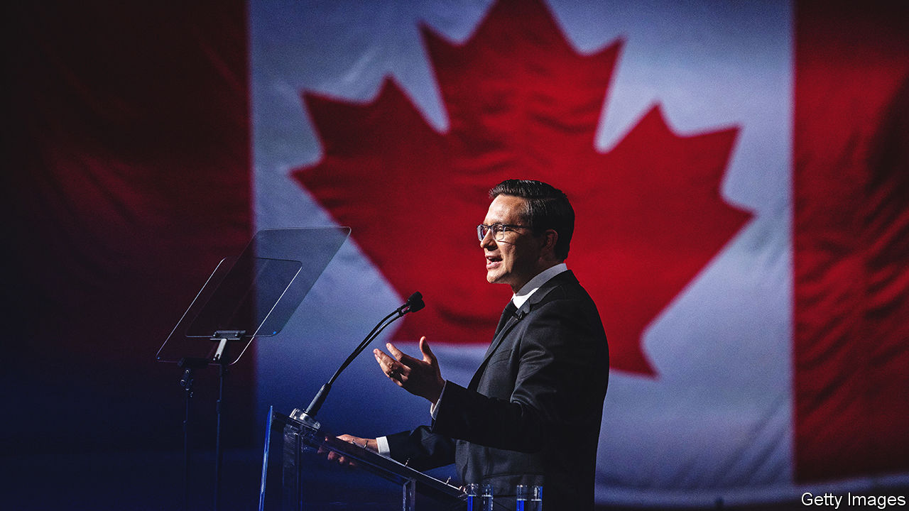

###### Poilievre the pugilist

# Canada’s Conservatives pick a brainy brawler as leader 

##### Pierre Poilievre delights the right by deriding wokery and taxes. That may not be enough to win power 

 

> Sep 15th 2022 

Canadian politics just got interesting. On September 10th the opposition Conservative Party chose as its leader Pierre Poilievre, a dapper scrapper who promises to transform a staid political debate into a brawl. His party is betting that an unhappy electorate will be in the mood for pugilism when the Liberal government, led by Prime Minister Justin Trudeau, next faces an election, probably in 2025. But it is not certain that Mr Poilievre’s combativeness will have broad appeal.

There is no mistaking the enthusiasm of Conservatives. In a barnstorming tour of Canada his campaign claims to have persuaded more than 300,000 new people to join the Conservative Party. That is more than two-fifths of the number entitled to vote in its leadership ballot. Mr Poilievre won more than two-thirds of the vote, crushing the second-place candidate, Jean Charest, an emollient centrist.

Mr Poilievre, “Skippy” to his colleagues, achieved this by stuffing into a punch-bag hate-figures, institutions and ideas and pummelling it vigorously. They include Mr Trudeau and his “radical woke coalition” with the New Democrats, a left-leaning party that backs Mr Trudeau’s minority government; the central-bank governor, Tiff Macklem, whom he has promised to sack; the World Economic Forum, a network of bigshots who hatch “globalist” plots; and “gatekeepers” such as city officials who block housebuilding. Mr Poilievre dislikes mainstream media and wants to defund the cbc, a public broadcaster. He backed the “Freedom Convoy”, a protest against vaccine mandates led by lorry drivers, which paralysed central Ottawa, the capital, earlier this year.

His attacks resonated. Although unemployment is low and consumer spending is strong, voters are angry about inflation and high house prices. Mr Poilievre largely ignores the role of global commodity prices and supply-chain problems in pushing up inflation, which was 7.6% in July, and is wrong to blame Mr Macklem, who acts independently of politics. But his claim that inflation is made worse by the government’s relatively loose fiscal policy has some merit.

During the Freedom Convoy Mr Trudeau alarmed civil libertarians by invoking for the first time the Emergencies Act, which gives the federal government powers to override laws and freeze bank accounts. That was overkill. The government is pressing ahead with a bill to regulate online streaming that its critics say could subject ordinary people to censorship. Mr Poilievre calls it “nothing more than a power grab”.

Though pugnacious, he is no outsider. He has been throwing political punches since he was a child in Alberta, an oil-producing province where conservatism is hard-edged. While a high-school student he wrote a letter to a local newspaper denouncing Canada’s government for raising pension contributions. He has been an mp since he was 25.

Mr Poilievre’s most consistent political conviction is a Reaganite preference for small government. The adopted son of schoolteachers, he learned early that “the greatest social safety net we can ever have” is “voluntary generosity among family and community”. As a student at the University of Calgary he entered a competition that asked contestants to write an essay on what they would do as prime minister. His answer: “I would relinquish to citizens as much of my social, political, and economic control as possible.” Now he promises to make Canada “the freest nation on earth”.

His rhetorical style evokes populists such as Donald Trump. But his enemies list is more circumscribed. Unlike Mr Trump, he favours immigration. In 2008 he questioned whether a federal plan to compensate indigenous victims of Canada’s brutal residential-schools system was value for money, but quickly apologised.

The bare-knuckle tactics that entrance Conservative members make some party leaders uneasy and may alienate voters. Some 70% of Canadians would take a negative view of politicians who backed the Freedom Convoy, according to a poll conducted in August. Mr Poilievre’s keenness to cap federal spending and his opposition to a national carbon tax, imposed by the Liberal government to help Canada reduce greenhouse-gas emissions, may not be as popular with mainstream voters as they are with Conservatives.

Encouragingly for Mr Poilievre, most voters have not yet made up their minds about him. On the eve of the leadership vote just under half had formed an opinion, according to Abacus Data, a pollster. His odds of succeeding at the next election depend largely on factors beyond his control, including the state of the economy and whether voters will be fed up with Mr Trudeau. Much will also depend on whether ordinary Canadians warm to the brainy brawler. In July Mr Poilievre put voters on notice that he would not change: “There is no grand pivot. I am who I am,” he said in an interview. But being a canny politician is part of who he is. He may decide that the way to win is to be more boring. ■

