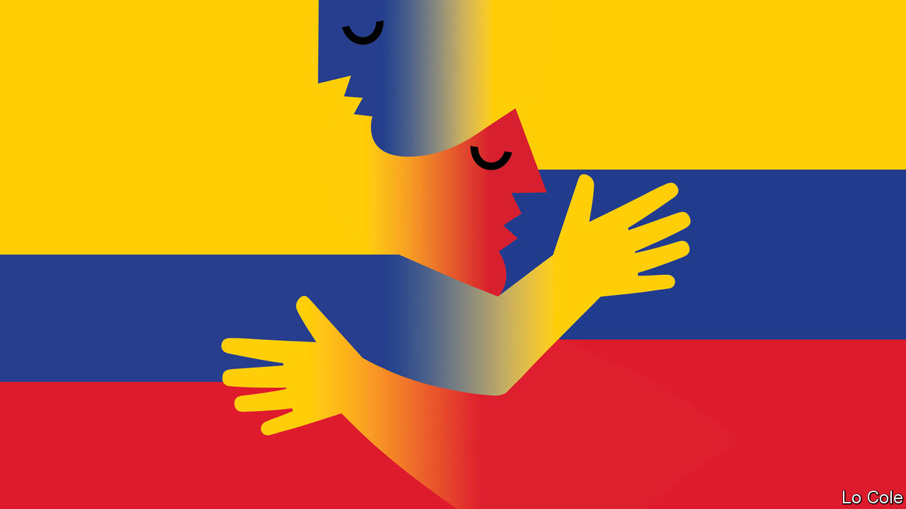

###### Bello

# Colombia’s new president cosies up to Venezuela’s despot 

##### Leaders of the Latin left find common ground, even with a thug 

 

> Sep 15th 2022 

For a century Cúcuta, Colombia’s sixth-largest city, lived on its ties to Venezuela, just half an hour away. It was the conduit for trade between the two countries, which peaked at $7.2bn in 2008. Of that, $6bn was Colombian exports, mainly of food, livestock, cars and clothing. This was a textbook example of regional integration, something more often talked about by Latin American politicians than practised. Politics killed it. First Hugo Chávez, a populist Venezuelan leader who disliked Colombia’s alliance with the United States, sought other suppliers. Then in 2019 Chavéz’s successor, Nicolás Maduro, a dictator, closed the border and broke off diplomatic relations after Colombia’s conservative president, Iván Duque, recognised the speaker of the opposition-controlled Congress, Juan Guaidó, as Venezuela’s rightful president. 

Now Gustavo Petro, a left-winger who succeeded Mr Duque last month, has moved swiftly to restore ties. A new Colombian ambassador, Armando Benedetti, has been sent to Caracas. Mr Petro and Mr Maduro said that later this month the border will re-open and direct flights between the two countries will resume.

Many Colombians welcome the return to something like cross-border normality. Cúcuta’s local newspaper greeted it “with hope”. “We need contacts and talks on cross-border issues,” says Rodrigo Pardo, a former foreign minister. He adds that not even Mr Duque expected the rupture to last three years, during which Mr Maduro’s position has grown stronger and Mr Guaidó’s much weaker. Of the 60 countries that recognised Mr Guaidó in early 2019, after Mr Maduro had won an unfree presidential election, only a handful still do, though this includes the United States.

Two issues concerning the 2,200km (1,400-mile) border are especially important. One is migration. Millions of Colombians have lived in Venezuela, many of them drawn by an oil boom in the 1960s and 1970s. And Colombia has become home to 2.5m of the 6.8m Venezuelans who have fled Mr Maduro’s regime and the economic collapse it has caused through graft, incompetence and price controls. Colombia has been welcoming to the new arrivals, granting them permits. But with destitute Venezuelans camped out in Colombian cities, tolerance is strained.

The second issue is security. Both the eln, a guerrilla group, and Colombian drug-trafficking gangs use Venezuela as a haven, with the apparent connivance of Mr Maduro’s thuggish regime. Mr Petro has proclaimed “total peace” as a priority of his government. By this he means negotiations with the eln and, seemingly, with narcotraffickers too.

These problems demand a measured approach and hard-headed negotiations on how to manage the border, notes a former Colombian official. That has not been the government’s way so far. Mr Benedetti rushed to meet a beaming Mr Maduro, and other Venezuelan bigwigs. He referred to the “so-called exodus”, parroting Mr Maduro’s denial that there has been one. He added that Colombia should start importing gas from Venezuela, using a pipeline between the two countries opened in 2007. No matter that this was used only to export Colombian gas, until Mr Maduro stopped it in 2015, and that Mr Petro wants to discourage hydrocarbon exploration at home. The new ambassador has scorned the opposition, calling Mr Guaidó a “nobody”. On the plus side, Mr Petro rejected a Venezuelan demand to extradite political exiles to face Mr Maduro’s brutal idea of justice.

In his rapprochement with Venezuela, Mr Petro is moving with a regional tide. Mr Duque’s approach was linked to a broader attempt led by Donald Trump’s administration to topple Mr Maduro’s regime through sweeping sanctions. It failed. Mr Maduro’s regime has rolled back some of its socialist policies, and Venezuela’s economy has enjoyed a modest revival. Its oil is once again of interest to the West. Sanctions are still in place, but Joe Biden’s officials have held exploratory meetings with Mr Maduro. Mr Benedetti says he has briefed the Americans on his actions. 

The left-wing governments now in office in Latin America favour negotiations to urge Mr Maduro to be a bit more democratic, if they care about that at all. Yet many Colombians do care. Mr Petro is distrusted by some of them because of his past embrace of Chávez. If realism becomes appeasement, Mr Petro risks reviving those fears and losing his own public. Welcome though a revival in trade would be, it behoves him to tread carefully across the border. 


 

