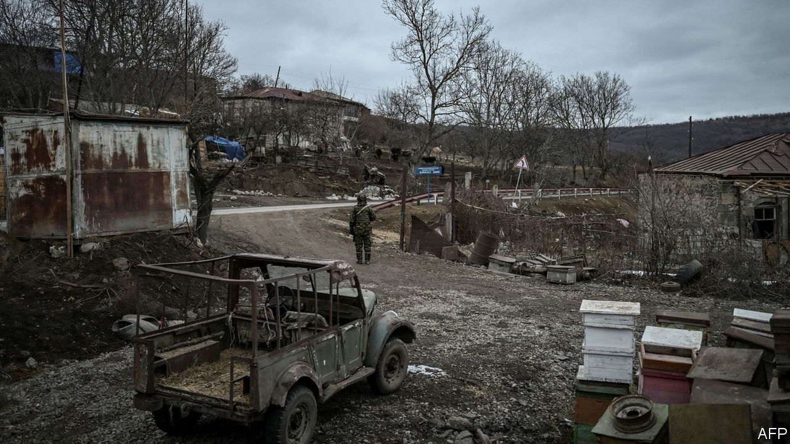

###### The Economist explains

# Why Azerbaijan and Armenia are fighting again 

##### An uneasy truce has broken down just weeks after peace-treaty discussions 

 

> Sep 13th 2022 

Armenia accused Azerbaijan of an unprovoked attack on September 13th, after its neighbour conducted overnight artillery and drone strikes against Armenian positions in the country’s east. Armenia’s prime minister, Nikol Pashinyan, said at least 49 soldiers had been killed. Azerbaijan claims it was retaliation for “subversive acts” by Armenia and that 50 of its own servicemen have died. Clashes have broken out sporadically around the border over the past year. But the latest ones are the heaviest since the  over Nagorno-Karabakh, an Armenian enclave that is formally part of Azerbaijan but which has been held by ethnic Armenian forces since the 1990s. America, the EU and Russia have called for an immediate end to renewed hostilities. What are the stakes, and why has the fighting resumed?

 


In late 2020 Azerbaijan, backed by Turkey,  to retake Nagorno-Karabakh. By the time Russia, an Armenian ally, imposed a ceasefire six weeks later, Azerbaijan had recovered swathes of the province, as well as a number of other districts occupied by Armenia. Under the deal, Russia deployed peacekeepers to Nagorno-Karabakh to avert further violence and maintain some degree of control over the conflict. 

The latest bloodshed involved hours of sustained shelling against Armenian border areas far from Nagorno-Karabakh. “This was not a response, but a concerted attack,” says Richard Giragosian of the Regional Studies Centre in Yerevan, Armenia’s capital. It came only a couple of weeks after Mr Pashinyan and Ilham Aliyev, the Azerbaijani president, met in Brussels to discuss prospects for a comprehensive peace treaty. Azerbaijan wants Armenia to acknowledge its sovereignty over Nagorno-Karabakh; Armenia demands guarantees for the region’s ethnic Armenians. Azerbaijan may have decided that the time was ripe to use armed force to force its neighbour into accepting a settlement on Azerbaijan’s terms: for one thing, Russia seems too bogged down in Ukraine to intervene on Armenia’s behalf. And the global energy crunch means Europe’s dependence on gas producers such as Azerbaijan is growing. Azerbaijan’s energy minister recently said the country planned to increase gas exports to Europe by 30% this year compared with 2021. 

What happens next? Armenia has asked Russia to invoke a treaty which commits Moscow to come to its defence in the event of an attack by a foreign country. Given the situation in Ukraine, Russia will probably respond with “symbolic measures” rather than a large-scale military involvement, says Laurence Broers of Chatham House, a think-tank. Azerbaijan will have to tread carefully, however. The government in Baku would certainly like to weaken Russia’s grip over the Caucasus but has nothing to gain from confronting it openly, says Mr Broers. That reduces the danger of an all-out war with Armenia. But as long as the Nagorno-Karabakh issue festers, and one side uses force to press home its advantage, the situation will remain volatile. ■

