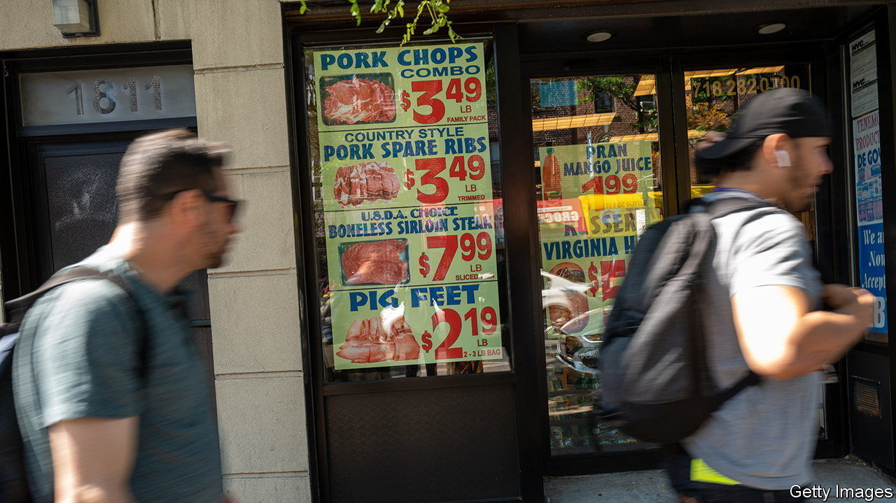
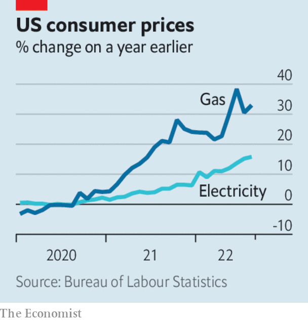

###### The world this week

# Business 

#####  

 

> Sep 15th 2022 

 


America’s  dipped in August to 8.3% from 8.5% in July, but month-on-month the consumer-price index unexpectedly rose by 0.1%. The government had hoped that falling petrol prices, now at a six-month low of $3.70 a gallon, would ease inflationary pressures. But core inflation, which does not include volatile energy and food prices, rose sharply. Household electricity bills were up by 15.8%, year on year, the biggest jump since 1981, and natural gas by 33%. 

Inflation did fall in  for the first time in nearly a year, to 9.9%, mostly because of the decrease in petrol prices. The rate is expected to fall again, given the government’s massive energy-relief package, which will cap household bills. 

 were rattled by the inflation data, which point to another big rise in interest rates by the Federal Reserve. The s&amp;p 500 dropped by 4.3%, the Dow Jones Industrial Average by 3.9% (all 30 stocks that make up the Dow fell) and the nasdaq by 5.2%. They were the biggest one-day declines in the indices for two years. 

Ursula von der Leyen, the president of the European Commission, gave details of a proposed  on  to help households struggling with rocketing bills. Ms von der Leyen aims to raise €140bn ($140bn) from electricity companies, and said that oil, gas and coal firms would have to make a “crisis contribution”. She also promised that the commission would undertake a comprehensive reform of the electricity market. 

Meanwhile, the  government said it would cap increases to household energy bills at 15% next year, and provide direct payments to those on low incomes. , Germany’s biggest distributor of gas, was in talks with the government that could see it nationalised. 

Will it make a dent?

The International Energy Agency said that  will have dropped by 1.9m barrels a day by February, compared with the start of Russia’s invasion of Ukraine, after an eu embargo kicks in later this year. Since the war began Russian output has barely fallen, because oil bound for America and Europe has been rerouted to China, India and other places. 

 shareholders approved Elon Musk’s  at $54.20 a share, a deal that he now wants to terminate. The company’s share price has tanked since Mr Musk made the offer in April, to around $40. A court hearing on the dispute is due to begin on October 17th. Meanwhile, a whistleblower who claims that Twitter is lackadaisical about security and has misled regulators testified to the Senate. Mr Musk will use the evidence to bolster his case at the trial. Twitter said the allegations were “riddled with inconsistencies and inaccuracies”. 

The eu’s General Court upheld almost all of the fine imposed on  in 2018 for illegally restricting the market for search on its Android devices. It did shave 5% off the €4.3bn penalty ($4.3bn) after it overturned one part of the competition regulator’s ruling. 

 was reportedly preparing to lay off hundreds of employees amid a decline in revenues. The news sent a chill throughout the financial industry. Meanwhile, Kwasi Kwarteng, Britain’s new chancellor of the exchequer, was said to want to remove the cap on  that was imposed on the City by the eu in 2014. Mr Kwarteng apparently thinks the move will improve economic growth.

Chips with everything

Foxconn, the Taiwanese contract manufacturer that assembles the iPhone and other devices, and Vedanta, an Indian industrial group, announced a venture to build a $19.5bn  in the Indian state of Gujarat. India has joined America, the eu and others in subsidising the domestic production of semiconductors as a means of protecting technology and supply chains. If the plant is built it will be a boost for plans by Narendra Modi, the Indian prime minister, to industrialise the country. 

Jeff Bezos’s  was grounded until federal regulators finish their investigation of a launch failure in which flames engulfed the rocket about a minute after take-off. The capsule, which is designed to carry paying passengers, detached itself and floated safely down to earth; Blue Origin, Mr Bezos’s space firm, described it as a successful separation. 

The  carrying Queen Elizabeth II’s coffin from Edinburgh to London was the most tracked ever, according to Flightradar24. More than 5m people followed the plane on its website and YouTube. The previous record was held by Nancy Pelosi’s flight to Taiwan in August, which was tracked by 2.2m people. Flightradar24 has been used extensively since the start of the war in Ukraine to observe the movements of Russian oligarchs in their private jets. 

