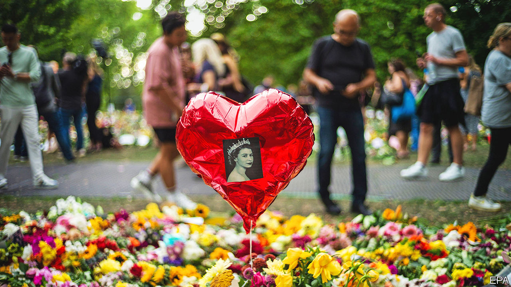
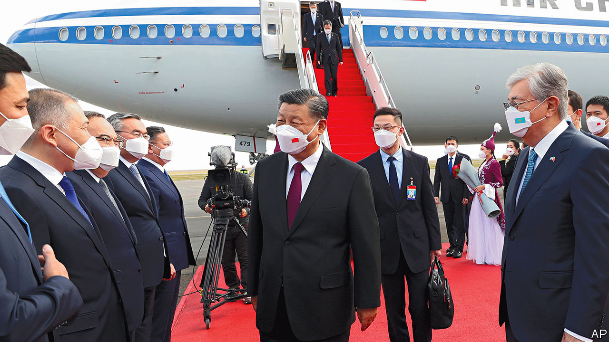

###### The world this week

# Politics 

#####  

 

> Sep 15th 2022 

Hundreds of thousands of people were expected to file past the coffin of as she lay in state in Westminster Hall in London ahead of her funeral. The 96-year-old monarch  at her Scottish home, Balmoral Castle. Charles III was  in the four nations of the United Kingdom, and in the 14 countries where the British monarch is also head of state. Millions of people in Britain and across the world paid their respects to the queen. 

Run away, run away!

A  in Kharkiv province won back more land in a week than Russia’s army had occupied in five months. Russian soldiers were caught off-guard. Many fled in disorder, abandoning their guns, trucks and even tanks to the advancing Ukrainians. It was the biggest setback for Vladimir Putin since he failed to capture Kyiv, the capital, at the start of his war. 

Ukraine’s president, , visited the front line to cheer his country’s troops. Mr Putin visited a Ferris wheel in Moscow, which broke down. Hawks on Russian state media  the conduct of the war. A few brave local politicians in Russia called for Mr Putin to resign, and even accused him of treason.

Troops from  and  clashed at their border. Scores were killed on each side. It was the worst conflict between the two countries since 2020, when they fought over the disputed area of Nagorno-Karabakh. Turkey reiterated its support for Azerbaijan. Russia, which is allied with Armenia, called for calm. 

Fighting also erupted between troops guarding the border between  and , killing two Tajik guards. The skirmish was over an outpost in a non-demarcated area. The two countries have scrapped before over the border. Last year more than 50 people were killed in clashes. 

In  general election the , a nationalist party that frets that immigrants are draining the welfare state, came second. Since the Sweden Democrats hold the balance of power they may participate in creating a new government of the right, though probably not as full members of a new coalition.

 became the head of  opposition Conservative Party. Mr Poilievre, who is 43 and has been an mp since he was 25, likes small government and decries wokery. He supported the “Freedom Convoy” led by lorry drivers that paralysed Ottawa earlier this year. “Canadians are hurting, and it is our job to transform that hurt into hope,” he said.

The Mexican Congress voted to put the National Guard under military command. The guard was created in 2019 as a civilian force to replace the federal police. Andrés Manuel López Obrador,  president, has increased the powers of the army, arguing that it is less corrupt than the police. 

 relations with  . Gustavo Petro, the new leftist president of Colombia, has re-established diplomatic relations with his despotic neighbour, Nicolás Maduro. The two countries’ shared border will re-open to cargo traffic later in September. Flights will also resume. However, Colombia refused to extradite Venezuelan dissidents to face brutal justice back home. 

Don Bolduc, a retired general who says Donald Trump won the presidential election of 2020 and covid-19 vaccines contain microchips, won a Republican primary in . He will be the party’s candidate for the United States Senate in November. Democrats think their odds of retaining the seat have now improved. 

Lindsey Graham, a Republican, introduced a bill in America’s Senate that would ban  nationwide after 15 weeks of pregnancy. It has no chance of passing. 

The Supreme Court backed an emergency injunction on  in New York that forces it to recognise a gay students’ club, and said it should thrash the case out in lower courts. Yeshiva, an Orthodox Jewish college, welcomes gay students, but says it should not have to approve a club that is “inconsistent with the school’s Torah values”.

Negotiators trying to delineate a maritime border between and  under American mediation said they were close to an agreement. If so, investment in finding and extracting oil and gas could accelerate. 

Germany is in talks about buying a new  from Israel. Since Vladimir Putin invaded Ukraine, Germany has been anxious to beef up its defences. 

 president, Abdel-Fattah al-Sisi, flew to  to meet the emir, ending a long period of estrangement. During the Arab spring of 2011 Egypt’s government was angered by Qatar’s support for Islamist groups. One such group later won an election in Egypt and formed a government, but it was overthrown by the army, then under Mr Sisi. 

The un halted aid shipments to Tigray, a northern region in  suffering starvation because of a blockade, after fighting resumed between government forces and those loyal to Tigray’s ruling party. 

After a close and disputed election, William Ruto started his first day in office as  president with some serious policy announcements. He said he would simplify rules for importing goods through Kenya’s main port and end fuel subsidies that could cost the government 0.8% of gdp this year, according to the imf.

 has asked Rwanda’s government to send troops to help it fight jihadists spilling over its northern borders from Burkina Faso and Niger. The first of about 700 Rwandan soldiers are expected in October. Rwanda has also deployed its forces to fight jihadists in Mozambique.

A meeting of minds

 


 met  in Uzbekistan, where they are attending a summit of the Shanghai Co-operation Organisation in Samarkand. The presidents of China and Russia discussed the war in Ukraine, among other things. It is Mr Xi’s first trip abroad since the start of the pandemic. 

In  a political activist was jailed for two years under  laws for dressing like the country’s queen at a pro-democracy event in 2020. The activist denied the charges and said she had merely worn a traditional Thai dress. At least 210 people have been charged with insulting the royals over the past two years, according to Thai Lawyers for Human Rights. 

