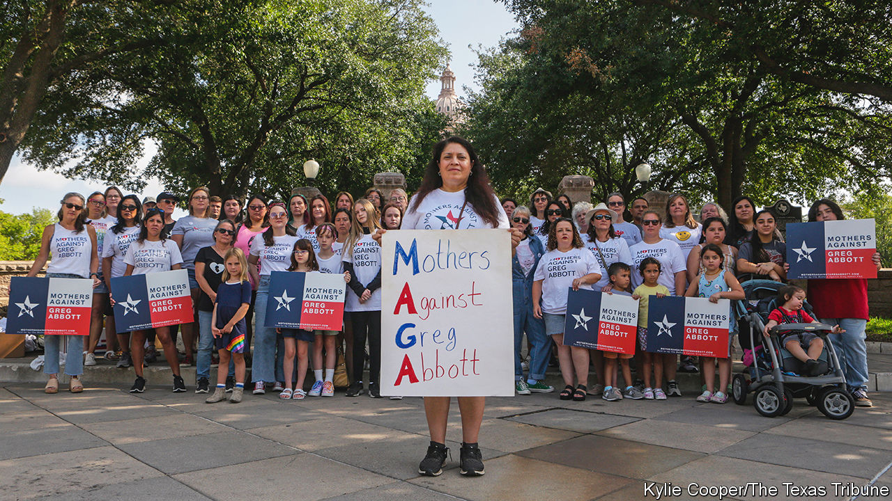

###### The other MAGA

# A grassroots group is channelling public frustration in Texas 

##### A different sort of MAGA makes its mark in the Lone Star State 

 

> Sep 15th 2022 

Walk round Dallas, and you may see some odd “maga” signs on lawns. They are not reprising Donald Trump’s slogan “Make America Great Again”. They are from a group opposed to Texas’s governor: Mothers Against Greg Abbott. 

Nancy Thompson, a marketing expert and mother of three, founded the group by accident. She decided to protest outside the capitol in Austin in August 2021, after Mr Abbott announced that he would not allow public schools to require masks. Her son was in hospital, and doctors warned about the risks covid-19 could pose, with vaccines not yet available to youngsters. She wrote “Mothers Against Greg Abbott” on a poster and saw the acronym. “I thought it was going to be good satire, or it was going to be a disaster,” she says.

Ms Thompson formed a maga group on Facebook. After the Texas Heartbeat Act took effect in September 2021, banning abortion after six weeks of pregnancy, her group gained members. (Last month Texas started banning abortion from conception.) The biggest surge came after a school shooting in Uvalde in May that left 19 children dead. Mr Abbott at first praised the police, saying “it could have been worse” without their efforts. It has since emerged that they wasted 73 minutes before confronting the gunman. Mr Abbott has refused to call a special session of the legislature to consider ways to curb gun violence. 

maga now has some 50,000 members, 80% of them mothers. It is registered as a political-action committee, supporting Democrats running for office in Texas, including Beto O’Rourke, a former presidential contender who is challenging Mr Abbott for the governorship. Mr Abbott, seeking a third term, is in the most competitive contest of his career. The race for governor “tells a broader story about the consequences of Republican overreach in terms of abortion and gun rights”, says Mark Jones of Rice University in Houston. For years, Republicans have passed conservative legislation appealing to primary voters that does not reflect mainstream opinion.

Mr Abbott has enlisted his wife to narrate one of his campaign ads. He is stressing a popular issue for Texans: border security. The only governor’s debate will take place on September 30th in the Rio Grande Valley, an area with high levels of border crossings Mr O’Rourke raised $27.6m from donors between late February and June, the highest amount any Texan state candidate has raised during a single reporting period. But Mr Abbott has even more ample funds to draw on. 

Victory for Mr O’Rourke is still a long shot. Polls show him trailing by around seven points. But even if he loses, he could carry down-ballot Democrats into office, as his failed Senate candidacy in 2018 did. The most competitive statewide race is for attorney-general, with the Democratic candidate, Rochelle Garza, polling within three points of the controversial, federally indicted incumbent, Ken Paxton.

Much will depend on women and Hispanics, and whether Mr O’Rourke can mobilise young voters. Some 973,000 Texans registered to vote from January to August, around 16% more than in the same period in 2018, according to Ryan Data &amp; Research, a political-consulting firm. The result will hinge on which maga prevails. ■


