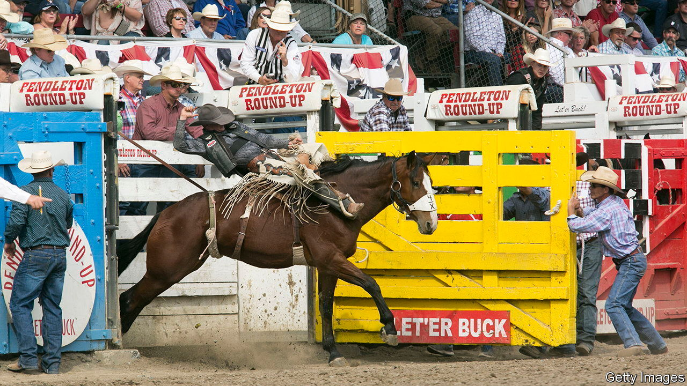

###### Let ‘er buck

# A rodeo in Oregon encapsulates the old Wild West 

##### The Pendelton Round-Up is a holdout for cowboy culture 

 

> Sep 15th 2022 

At most times of the year Pendleton is a sleepy place known for wool and whiskey. For one week each September, however, the town in eastern Oregon, with a population of just 17,000, hosts more than 50,000 visitors who flock to one of the last holdouts of the cowboy West. Since 1910 its annual rodeo, called the Pendleton Round-Up, has prided itself on its exhibition of working cowboys in a show of the best steer-wrestling, roping, barrel-racing and riding that the country has to offer.

Established in the 1850s as a trading post, Pendleton remains an important railhead. The town (motto: “The Real West”) makes much of its roots. The area is home to the Umatilla, Cayuse, and Walla Walla tribes. The tribes and ranchers have historically worked in tandem to put on the Pendleton Round-Up.

Reminders of the rodeo are visible even in modern trappings such as the Pendleton Ground-Up espresso bar. During the event, which began on September 10th, the town comes alive. School stops for the week. 

The cowboys drawn to Pendleton are the real deal. They come to show off their skills more than for showmanship. “The road to being a champion goes through Pendleton, Oregon,” declared an announcer this week, and the presence of many of the top names in rodeo backs him up. One cowboy from Oklahoma, a regular at the rodeo, says the Pendleton Round-Up is his favourite in the country. 

The show is divided between the no-frills disciplines, in which ranchers compete in timed horseback events, and highly dramatic elements such as extreme bull-riding. It is a journey back in time that values strength and perseverance. Yet Pendleton’s own resilience is unusual. Ghost towns litter the countryside around it. A nearby wildfire blows a thick haze through the town, leaving a sun that burns blood red, and white skies so thick that the surrounding hills and mountains are only sometimes visible. 

A modern westward expansion has made America’s coastal states ever more populous, changing what the West is. It is still a region of vast natural resources and the source, in its more fertile valleys, of much of the country’s food. But it is also a place where fashionable cities have grown, nestled among the mountains and spread into the desert. 

Unlike many other towns of the old West, Pendleton has endured in large part because it refuses to let go of the past. That is a model few others will be able to replicate. Pendleton lives on as a relic of a time gone by, clinging to the idea of “the real West”—even as much of the rest of the West morphs into something that would be unrecognisable to the cowboys who once roamed there. 


