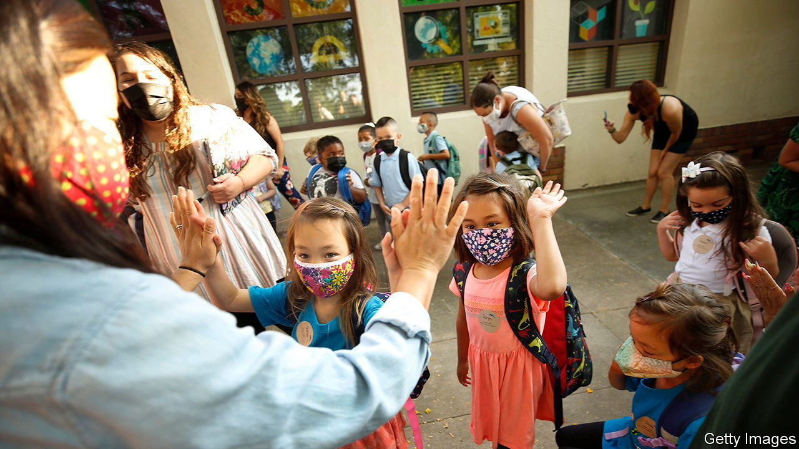

###### Free for all

# America-wide universal pre-school is dead, but California forges ahead 

##### Its programme is costly, but has many potential benefits 

 

> Sep 15th 2022 

“Agua?” a small boy with a long black ponytail stretches up his arm while standing on his toes, waving his red water bottle to and fro. A young bilingual woman, his new teacher, bends over and responds to him in Spanish. He nods and finishes the water in his bottle. Then he spins round and bounces over to a child-size desk to join his peers drawing pictures—from intricate daisies to messy swirls—with crayons. This child, along with about 50,000 other Californian four-year-olds, is experiencing his very first month of free universal pre-kindergarten.

California’s governor, Gavin Newsom, signed a bill last year to introduce free schooling for all four-year-olds by 2025. The first phase, for those who turn five between September 2nd and February 2nd, began this year. In each of the next three school years, extra months of age will be added, until all four-year-olds are eligible. The programme will cost $3bn a year once fully operational and is expected to enroll more than 300,000 pupils by 2025.

In America kindergarten usually starts at five; only 19 states plus the District of Columbia require attendance. None requires children to attend pre-kindergarten, but state-funded programmes are available in all but six states. Universal and free programmes are rarer: they exist only in the District of Columbia, Florida and Vermont. In 2019, 53% of American three- and four-year-olds were enrolled in school. America is far behind most rich countries: the oecd average is 90% for four-year-olds and 77% for three-year-olds.

Though most of the youngest children do not attend class, a majority of Americans favour government-funded universal pre-kindergarten for three- and four-year-olds. A survey this month by /YouGov found that 64% of Americans back it (86% of Democrats and 37% of Republicans). Despite this current partisan split, politicians on both sides have supported preschool in the past.

In 2018 President Donald Trump’s administration allocated more than $5.2bn to subsidise child care for poor families and gave Head Start, a federal programme for poor children including preschool, an extra $750m during the pandemic. Many were hopeful that President Joe Biden’s Build Back Better, now known as the Inflation Reduction Act, would include free preschool. But the final version did not.

Is universal preschool worth the cost? A study released earlier this year created a stir when its results suggested that it was not. The researchers, from Vanderbilt University, found that pupils enrolled in Tennessee’s preschool programme went on to suffer from lower academic achievement in third and sixth grades, had more disciplinary troubles in elementary school and greater need for special education. 

The reality is less bleak. A meta-analysis of pre-kindergarten programmes found that many studies show positive academic gains. Some of the effects were small, admittedly, and the more recent programmes are less effective than the earlier ones. What happens after preschool matters as well. A good preschool programme is more effective when it is followed by a strong elementary and secondary education.

Academic outcomes are by no means the only impact. Each dollar invested can yield up to $13 in economic returns. The Perry Preschool Project, a study of 123 low-income black children who attended preschool in the 1960s, found that attendance not only improved iq but also increased earnings later in life and reduced crime. Other studies have had similar results.

A free state-school option clearly helps families save money. A study by the Brookings Institution, a think-tank, estimated that the median family enrolling a child in at least eight hours of preschool a week spends over $8,000 a year on private options. Now parents in California will no longer need to pack their child a lunch—the state guarantees pupils two free meals each school day.

There may be social benefits, too. Mario Luis Small, of Harvard University, found that mothers with children in child-care centres had more close friends, and poor mothers experienced less hardship, potentially through learning about important resources through their friends.

Creating state pre-kindergarten also increases salaries for those who teach there, according to Linda Darling-Hammond, president of the California State Board of Education. Early-childhood educators are typically paid very little—in 2021 the median pay was $27,490. By moving into the public system, and getting support obtaining credentials, they will benefit from the higher public-school salary.

Lastly, state pre-kindergarten introduces wealthier parents to public school when they might choose private options otherwise, explains Ben Chida, chief deputy cabinet secretary to Mr Newsom. It could thus foster the racial and economic integration of California’s public schools. If it can do that, it will be worth every penny. ■


