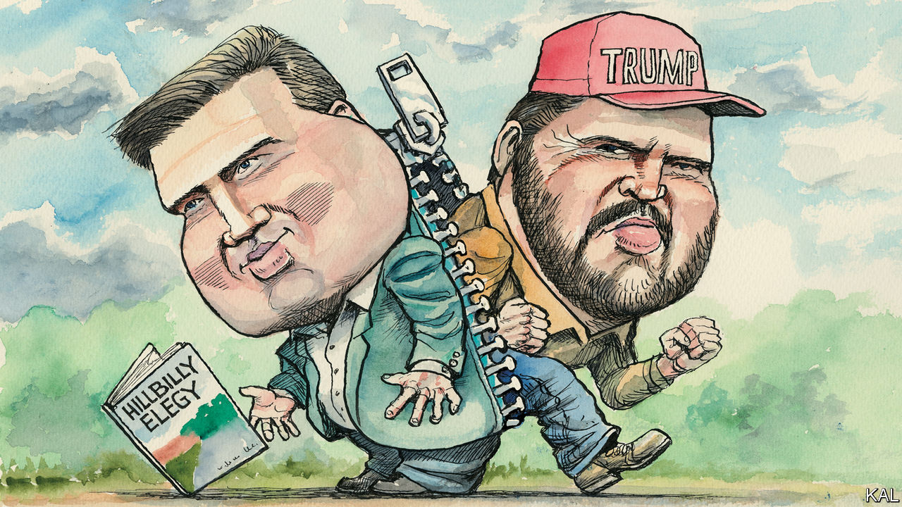

###### Hillbilly effigy

# How the left and J.D. Vance learnt to despise each other 

##### And what that says about American elites 

 

> Sep 15th 2022 

Did j.d. vance betray America’s progressive elite, or is it the other way around? Not long ago Mr Vance was celebrated in left-of-centre columns and salons as a heartland Jeremiah, a prophet of working-class despair who could demystify Donald Trump’s popularity. His bestselling memoir, “Hillbilly Elegy”, was “a compassionate, discerning sociological analysis of the white underclass that has helped drive the politics of rebellion”, declared the . Mr Vance, the review said, was brave to blame fellow hillbillies, not structural forces, for their dismal choices: “Whether you agree with Mr Vance or not, you must admire him for his head-on confrontation with a taboo subject.” 

There are no exhortations from the left to admire Mr Vance nowadays. And as he runs as a Republican to represent Ohio in the Senate, Mr Vance scorns the elites whose admiration he once courted. He sees the press, in particular, as benighted. 

“I think the four years of the Trump administration broke the brains of a lot of people in the media,” Mr Vance says, pausing to chat recently after visiting a cattle auction at the Morgan County Fair in McConnelsville, Ohio. Reporters obsessed over what Mr Trump said but ignored his successes on taxes and tariffs: “There was just the sense that I had that, look, the press has gone completely insane. And if you want their approval, you’re going to have to say a bunch of stuff that you don’t actually believe in.”

It is true that, as Mr Trump’s term wore on, the progressive elite came to ascribe his popularity to bigotry, rather than economic despair; many commentators began mocking Mr Vance’s message of empathy for poor white people. Yet the conservative elite also changed, as did Mr Vance’s ideas and public persona. Coinciding as it has with the Trump era, and conducted, as it necessarily was, out loud, his rapid evolution from public intellectual to venture capitalist to politician charts how Mr Trump’s style and positions penetrated the right’s intellectual class. 

Back when he expected Mr Trump to lose the 2016 election, Mr Vance credited him with raising important questions but worried that his rhetoric was divisive and his answers too simple, that his promises were “the needle in America’s collective vein”, as he wrote in the . Two years on, at a conference on national conservatism, he decried the choices not of hillbillies but of policymakers, to embrace globalisation and consumerism at the cost of good jobs. Within two more years he had advanced to conspiracy-fearmongering, noting that Jeff Bezos of Amazon supported Black Lives Matter, and that riots following the murder of George Floyd in 2020 destroyed small businesses. “Now who benefits most when small businesses on Main Street are destroyed?” he asked. “There is a direct connection between woke capital and the plunder that’s happening in society today.” 

His concerns about simplistic explanations and provoking rhetoric had melted away. By last July he was warning that Democrats had seized control of all national institutions and were waging culture war to take away ”our very sense of national pride and national purpose”. Citing Vice-President Kamala Harris, Senator Cory Booker and Representative Alexandria Ocasio-Cortez, he wondered: “Why have we let the Democrat Party become controlled by people who don’t have children?” That meant “not a single one of them actually has any physical commitment to the future of this country”. (Lack of children also explained the “obsessive, weird, almost humiliating, aggressive posture of our media”.)

It may not surprise you that Mr Vance has proved better at “head-on confrontation with a taboo subject” than running for office. His embrace of Mr Trump, and money from a venture capitalist, Peter Thiel, helped him win the primary. But Mr Thiel stopped writing him cheques, and Mr Vance ran a pallid campaign through the summer, while his Democratic opponent, Representative Tim Ryan of Youngstown, raised money hand over fist, touted his agreement with Mr Trump on trade, and battered Mr Vance. 

Ohio has become so Republican that ’s forecast still gives Mr Vance a 50% chance of winning. A Super pac with ties to Mitch McConnell, the Senate minority leader, is reportedly planning to spend $28m on ads for him. Mr Trump is to appear with him at a rally on September 17th. Mr Vance is busily attacking Mr Ryan on crime and inflation. He is an affable retail candidate, the kind with the brains and confidence to approach his “tracker”—the operative dispatched by Democrats to record his every move in hopes of a gaffe—and say a warm hello. (“My bosses said he’d be crazy to do that,” the startled tracker mumbled.) 

When the centre holds

The day before Mr Vance visited the Morgan County Fair, President Joe Biden spoke a county away in Licking, at the ground-breaking of a new Intel semiconductor plant that he, and local television news, celebrated as the beginning of the “Silicon Heartland”. Mr Biden praised Senator Rob Portman, the Republican whose retirement is opening the seat for which Mr Vance and Mr Ryan are vying. Mr Portman helped pass bipartisan legislation, called the chips Act, to subsidise the semiconductor industry. “You’re leaving a hell of a legacy,” Mr Biden said. Partisan culture war seemed an abstraction compared with the Intel plant and its thousands of jobs, steps towards confronting the problems that preoccupy Mr Vance. When asked about the chips Act, he calls it “a good thing” and cites it as the kind of bipartisan action he would pursue. 

J.D. Vance, at 38, is no Rob Portman. He may irrevocably yoke himself to Mr Trump and his election lies. Still, in this dizzying time, it seems too soon to say what sort of member of the elite he will ultimately become. Like everyone else, and maybe more than most, he is a work in progress: from hillbilly to intellectual, evangelical to atheist to Catholic, cultural conservative to libertarian to Trumpist, pundit to politician. That creates ground for suspicion of opportunism—but also, maybe, for a little hope. ■


