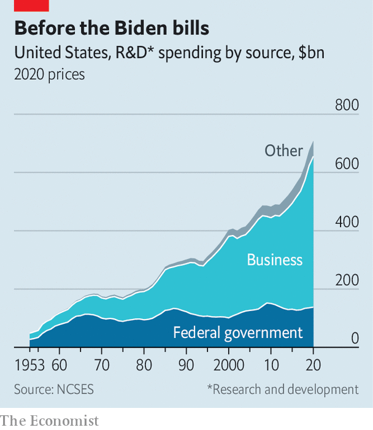

###### America Inc

# Joe Biden’s industrial policy is big, bold and fraught with difficulty 

##### From semiconductors to electric vehicles, the American government is going into business 

 

> Sep 13th 2022 

The president had a skip in his step as he walked to the podium in Licking County, Ohio, on September 9th. It was a ground-breaking ceremony for a new Intel factory, a centrepiece in America’s efforts to re-establish itself as a manufacturer of semiconductors. In fact work at the site had already begun, and a couple of yellow construction vehicles, undeterred by the occasion, continued rolling behind Joe Biden as he spoke. Wearing his trademark aviator sunglasses, he outlined the government’s plans to invest in everything from quantum computing to biotechnology: “We’re going to make sure we lead the world in industries of the future.”

 


It is nothing new for a president to boast of America’s clout in technology. It is more unusual to put a spotlight on the state rather than the private sector as the source of that clout. Industrial policy—an attempt by the government to cultivate strategically important sectors—has typically been seen as anathema by political and economic leaders in America in recent decades. With the notable exception of defence production, they have frowned on state involvement in business as counterproductive. The state’s share of research and development funding has steadily shrunk (see chart).

But views have been evolving fast, partly as a response to China’s economic model. Many in Washington now think that a more muscular industrial policy is essential to vouchsafing America’s future vitality. And with the passage of a trifecta of ambitious laws under Mr Biden, the conversation is now turning towards questions about how exactly to implement it.

The sums involved are vast. An infrastructure law passed last November assigns more than $20bn for new clean-energy technologies such as carbon capture and nearly $8bn for electric-vehicle charging stations. A technology bill approved in July will put $52bn into semiconductors while promising a further $170bn to support research in other fields. An act passed in August allocates $370bn to combat climate change, including investments in clean vehicles and renewable energy.

Together, all this may add up to nearly $100bn of annual spending on industrial policy over the next five years. That might seem small relative to total federal expenditure of almost $6trn this year, more than half of which goes to social priorities such as pensions. But it would roughly double the spending that can be categorised as industrial policy, based on estimates by the Centre for Strategic &amp; International Studies, a think-tank. This could grow to about 0.7% of America’s gdp, catapulting it past France, Germany and Japan, keen practitioners of industrial policy.

America may yet end up falling short of that. Much of the funding for scientific research will need to be approved each year by Congress. Still, the shift is dramatic.

Until now, America’s main industrial-policy programmes have been in the Department of Defence. There have been a few other initiatives. But nothing has been as successful as the defence industrial system, the fount of innovations that have spread to civilians, from nuclear power to the building blocks of the internet.

The legislation passed under Mr Biden draws on that experience. “This is an effort to take some of those defence approaches and move them into what has historically been the civilian side of government,” says William Bonvillian of the Information Technology &amp; Innovation Foundation, another think-tank. New institutions are being created: the Office of Clean Energy Demonstrations under the Department of Energy and a technology directorate under the National Science Foundation (nsf). Tobin Smith, an expert on science policy, says it will take the nsf well beyond its customary focus on pure research. “They are looking to advance new ideas and push them out into the marketplace,” he says.

The government is also taking a more hands-on approach in supporting the production of goods. That is most obvious in semiconductors, with $39bn set aside as subsidies for factories and equipment. Intel’s new plant in Ohio is one beneficiary. The climate law contains production subsidies, too, including up to $20bn in loans for new electric-vehicle factories.

The state will also serve as a customer for some of the emerging industries. Operation Warp Speed, America’s fast-track programme for covid vaccines, underscored how helpful it is to have the state as a buyer for more experimental products. Similar logic applies to renewable energy. The Biden administration believes that the procurement power of government can generate demand for 100 gigawatts of domestically made solar-power systems over the next decade—nearly as much as America’s installed solar-power capacity today.

Relax, the government’s in charge

Yet the mind boggles at the complexity of implementation. The three bills create separate initiatives and separate pots of money. “There really isn’t a federal infrastructure, outside of the Defence Department, to manage these programmes,” says Mr Bonvillian. It does not help that some of the money has more to do with pork-barrel politics than industrial need. 

On September 2nd the White House appointed John Podesta, a former top climate adviser to Barack Obama, to oversee the investments of more than $300bn that will flow into clean energy. Some people are reassured that an experienced operator will run the show. But history suggests bureaucracies struggle to innovate efficiently. 

On top of all that are the uncertainties in America’s politics. Donald Trump, though fond of building things, has vowed to root out the “deep state” and his former staffers talk about firing as many as 50,000 federal employees if he returns to office after the election in 2024. The industrial-policy machinery crafted by the Biden administration might struggle to survive.

It is easy to find sceptics about the government’s chances of getting it right. “I’m very concerned…I would say that they will not succeed,” says Gary Hufbauer of the Peterson Institute for International Economics, also a think-tank. Others are more optimistic. “You need to have a much more active and intentional policy if you want to bring into being industries that don’t exist,” says Todd Tucker of the Roosevelt Institute. But the debate about whether America should have a more muscular industrial policy is over. Like it or not, it is flexing those muscles. ■


