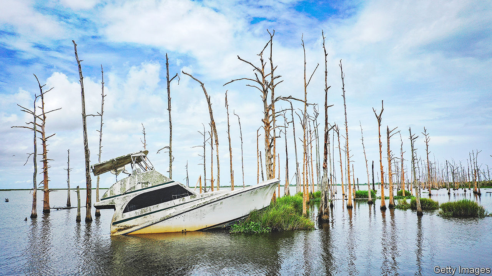

###### Environmental economics

# The Biden administration aims to quantify the costs of ecological decay 

##### Can a vital statistic help to save the planet? 

 

> Sep 15th 2022 

Any sensible business has a balance-sheet that tracks all of its assets and liabilities. But governments do not. A growing number of economists argue that gross domestic product (gdp), a single number that guides a plethora of policies but counts only income flows, is too narrow—especially when it comes to the environment. No national measurement exists to tally the full economic costs of depleting America’s natural assets. 

The Biden administration wants to change that. Last month the White House unveiled a 15-year plan for an ambitious—albeit wonkish—environmental initiative. Its Office of Science and Technology Policy and a dozen other government agencies aim to develop natural-capital accounts that record changes in America’s stock of natural resources, and quantify losses. Armed with new data, they plan to create a single statistic, alongside gdp, that rates how the country’s resources are faring. 

The first numbers are expected as early as next year. By 2036 they are supposed to have become core statistics. The hope is that well-defined price tags will illuminate trade-offs between growth and sustainability, helping to steer policymakers and investors away from harmful decisions.

Coming up with the Change in Natural Asset Wealth, as the new indicator will be called, is no small task. Scientists must first measure ecological changes such as water pollution (typically tallied in parts per million for a specific pollutant), soil erosion (counting the amount of soil lost, say) and the degradation of wetlands (the area reduced). Economists must then attempt to determine prices. 

The patchy data that exist suggest that in recent years America’s natural resources have taken a beating. According to the World Bank, which has tracked high-level changes in the value of some assets by measuring market prices and availability (as well as extraction costs), between 2010 and 2018 the value of forests and mangroves in America declined by 10%. That of ten minerals—among them copper and iron—dropped by 51%. Beekeepers have lost one-third of their colonies a year since 2006, according to Bee Informed Partnership, a non-profit group, and renewal rates fail to keep bee populations steady. 

These assets are important for the economy. Mangroves offer protection against hurricanes and pollinators are needed to grow one in every three bites of food people eat. Making electric vehicles and wind turbines would be impossible without copper, using today’s technologies. 

But progress should not be ignored, either. Nicholas Muller, an economist, found that by overlooking the air-quality improvements triggered by the Clean Air Act, statistics underestimated income growth by as much as 3% a year. More breathable air meant workers faced fewer health problems and could be more productive. Better measures of how nature contributes to the wealth of the country should bolster the economic case for its preservation.

Since the 1970s environmental economists have been tweaking fancy formulae to compute the value of natural goods and “ecosystem services”, the benefits that nature brings. Some, like timber, are traded in cash markets, which allows researchers to set their worth as the dollar amount people pay for them. For more complicated ones, like rivers or mountain ranges, economists survey people to gauge how much they are willing to spend to preserve them, or how far they will travel to access them. Ecological economists push the field to factor in a broader set of natural links. Accounting for the fact that wetlands protect habitats and mediate local climates, for example, can inform a fuller measure. 

If Mr Biden’s plan plays out as hoped, other countries will follow. “Everywhere in the world people are watching,” says Pushpam Kumar, an economist at the un Environment Programme. His agency now tracks broad measures of natural capital in 163 countries. In 2021 Britain’s treasury published a review on the economics of biodiversity. Australia has experimental natural-capital accounts and Canada has piloted a census of the environment. But no country has as comprehensive a national system as the Biden administration is proposing. American economists are giddy at the chance to put theories into practice. “This is how a science-informed democracy should work,” says Jon Erickson of the University of Vermont. 

Will this time be different?

The effort is not entirely new. The Bureau of Economic Analysis, an agency tasked with estimating gdp, tried its hand at natural-capital accounts in 1992 before budget cuts halted data collection three years later. Bill Clinton pushed to include nature in the country’s definition of wealth but discussions were sidelined when George W. Bush took office in 2001.

Two decades later, as extreme-weather events rage, the policy window has reopened. Satellites and better computing power make data collection and processing far easier now. But the initiative remains precarious. With the Democratic majority too weak to jump-start the project in Congress, Mr Biden resorted to an executive order. If political winds change, the effort could be blown away again.

That would be a pity. Eli Fenichel, an assistant director at the Office of Science and Technology Policy, who helps organise the initiative, believes that climate change would not have grown to the current crisis level had the cost of the carbon externality been tracked in official national environmental-economic accounts early on. “It’s just good governance,” he says. ■


