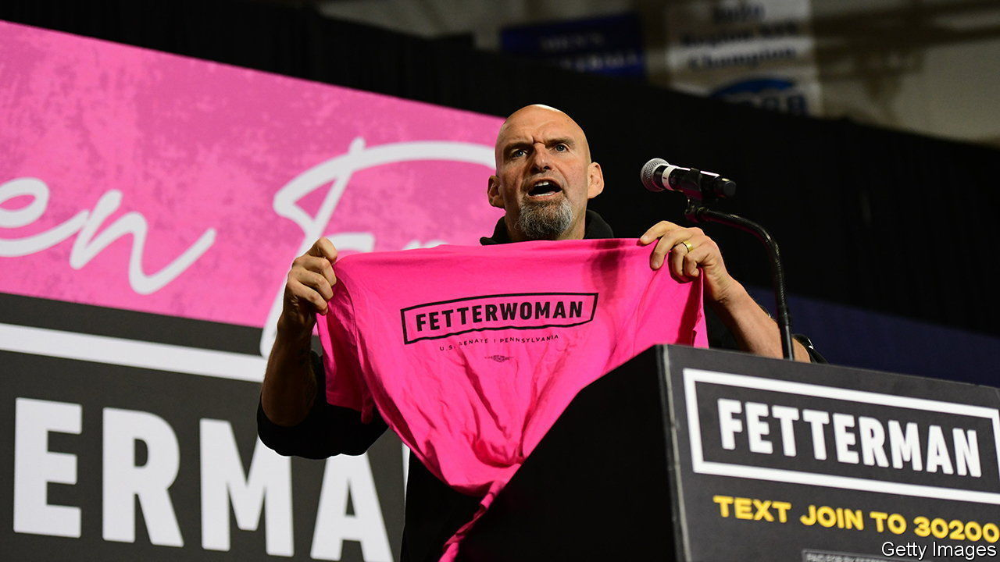
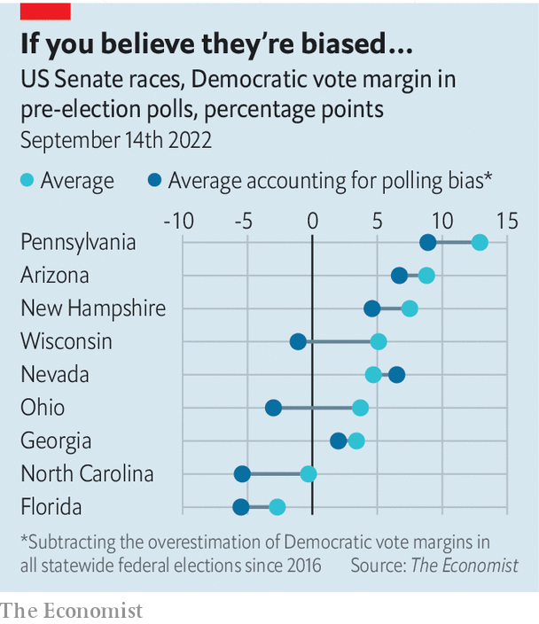

###### Midterm maths: Senate scenarios

# Will America’s polls misfire again? 

##### Our statistical model can show what the election would look like if they do 

 

> Sep 15th 2022 

The party that controls the White House typically loses seats in the House of Representatives in midterm elections. That pattern stretches back 80 years with few exceptions; in this century, only the elections in 2002 broke the rule. Might the ones in November do so again? According to our midterms forecasting model, Democrats have just over a one-in-four chance of keeping their majority in the House. And they are favoured in the Senate, where the party in power beats expectations only slightly more often.

Reasons for the Democrats’ surprisingly good prospects are easy to identify. Petrol prices have come down. President Joe Biden’s ratings have shot up. The overturning of  has energised Democrats. But how to quantify all this? And how confident are we in the party’s chances?

Our model finds the strongest signal in polling data. Surveys asking voters which party they favour in the national race for the House, for example, have shifted in the Democrats’ favour since the Supreme Court ruled on abortion. They now lead this “generic ballot” by over 1.5 percentage points. Polls in the Senate are particularly rosy: Democrats are well ahead in Ohio, Pennsylvania and Wisconsin, and at near-parity in Florida and North Carolina.

Aficionados may remember, however, that in both 2020 and 2016 bias in our polls-of-polls for individual races pushed our forecast farther from the results than if we had ignored the surveys altogether. Conservative Republicans were much less likely than Democrats and progressives to answer pollsters’ calls, skewing the numbers to the left. Some bias remained even after pollsters adjusted for the composition of the people taking their polls, giving more weight to the opinions of those underrepresented in them. That did not solve the problem completely. According to Patrick Murray, director of a polling organisation at Monmouth University, the most likely supporters of Donald Trump were the least likely to answer polls. 

One potential solution is to produce extra forecasts that assume varying levels of polling bias. What would our polls-of-polls show if we assume pre-election surveys are as biased as they have been in Senate and presidential contests since 2016? 

Take our projections in the Senate. The Democrats’ current advantage is largely due to favourable polling in four Republican-held seats: North Carolina, Ohio, Pennsylvania and Wisconsin. But these states have another thing in common. Each had a large polling error in the 2016 and 2020 presidential elections.

 


If we adjust our averages according to the bias in the polls of those elections, the Democrats’ lead vanishes in three of the four (see chart). In North Carolina, the expected margin for the Democratic candidate falls from a dead-heat to -5; in Wisconsin, from +5 to -1; and in Ohio, from +4 to -3. Only in Pennsylvania, where John Fetterman, the Democratic lieutenant-governor, has a double-digit lead over Mehmet Oz, his Republican opponent, do Democrats keep their advantage.

Democrats may take some solace in theories that the poll errors of 2016 and 2020 were specific to Mr Trump being on the ballot. That is what Mr Murray thinks. But hope will not deliver more accurate polls. Methodological changes will. Doug Rivers, the chief data-scientist at YouGov, an online pollster, has decided to weight its surveys to participation in primary elections. This would ensure that activists on either side are properly represented.

Yet our scenario may help prepare readers for what has become all too common: a broad misfire by the pollsters. If we repeat our simulations nationwide, the Democrats’ expected number of Senate seats, based on the polls alone, would drop from 52 to 50. The party’s probability of holding the majority would plummet from four-in-five to one-in-two. In other words, if you believe the pollsters have fixed their problems from the last election, or that bias is specific to Mr Trump running for office, you should expect a Democratic Senate come 2023. If not, the race is a toss-up. ■


