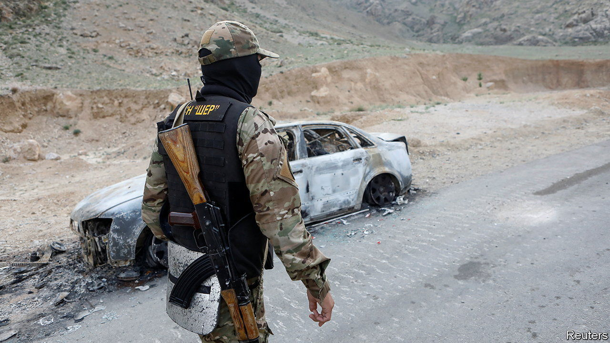
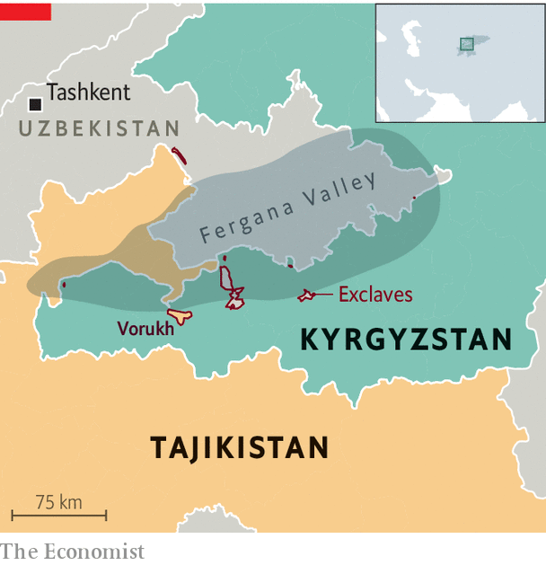

###### Beyond a boundary

# Fighting erupts between Kyrgyzstan and Tajikistan 

##### It is the deadliest border clash in Central Asia since the collapse of the Soviet Union 

 

> Sep 22nd 2022 

When the leaders of China, India, Russia and several Central Asian countries travelled to Uzbekistan for a security summit on September 15th and 16th, most observers were watching for signs of between Vladimir Putin, who is waging a war of aggression in Ukraine, and his counterparts in India and China, who have remained close to him. Yet the regional powers’ partners in the region were more concerned by events closer to home. The day before the meeting started, fighting broke out over territorial disputes between Kyrgyzstan and Tajikistan. 

The border clash is the worst between any of the five post-Soviet republics in Central Asia since they achieved independence in the early 1990s. Some 100 people have been killed, twice as many as in a bout of fighting last year. In a region already reeling from Russia’s invasion of Ukraine and a flare-up of hostilities between , the clashes are bound to cause more instability. 

 


The current trouble started with a shoot-out near Vorukh, a Tajik exclave in Kyrgyzstan (see map), and escalated into full-blown fighting two days later. Vorukh is one of nine pockets of land in the Fergana Valley that are ruled by one country but surrounded by another. The borders that produced  are at the heart of the dispute. Drawn in the Soviet era on the basis of population levels at the time, as well as horse-trading between local power-brokers, the meandering frontiers have prompted fierce competition over land and water ever since they turned from administrative boundaries into real borders after the collapse of the Soviet Union. The past two decades have seen some 230 border incidents with Kyrgyzstan alone, says the Tajik government. 

Both countries blame the other for the violence. Kyrgyz officials said the recent hostilities began after a Tajik border guard strayed into their territory and opened fire on Kyrgyz troops. The Tajiks said Kyrgyz officers shot at their forces without reason. By the time the two countries’ presidents negotiated a ceasefire on September 16th, the fighting had spread across an area of 2,000 square kilometres. Tajikistan counted 41 dead while 59 died in Kyrgyzstan, which also reported that over 136,000 civilians had been forced to flee their homes (Tajikistan did not publish numbers). 

Madeleine Reeves of Oxford University described the incident as an “armed military incursion by Tajikistan”, given that Tajik troops attacked infrastructure and civilian facilities some distance from disputed areas. Some observers speculated that Tajikistan is aiming to make life in Kyrgyz border villages so unpleasant that they empty out and become easier to take over. 

The fighting is an additional headache for Russia, which claims to act as a security guarantor in a region that it sees as its backyard. Both Tajikistan and Kyrgyzstan are Russian allies. Both host Russian military bases and are members of the Russia-led Collective Security Treaty Organisation (csto), the region’s answer to nato. 

Russia has issued mealy-mouthed expressions of concern and offered to help with proper demarcation of the border between the two countries. That would be a useful start. But with Russia distracted by its disastrous campaign in Ukraine, that seems unlikely to happen. For now, the violent bickering looks set to continue. ■

