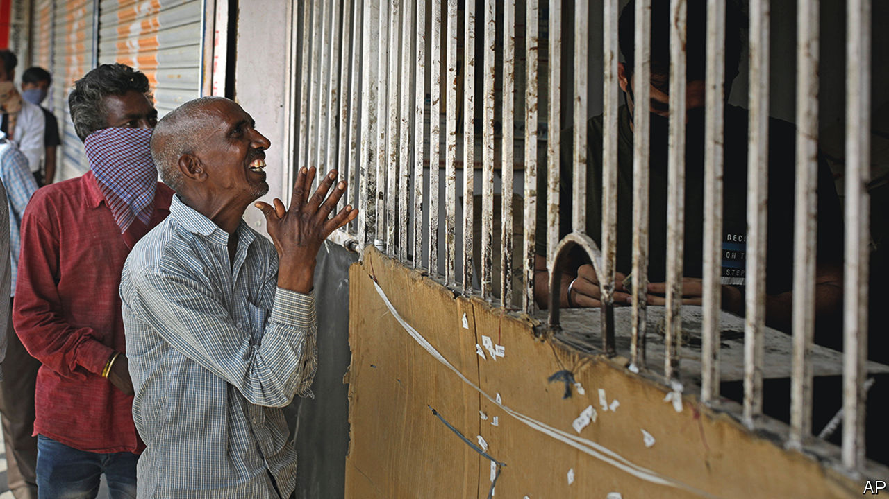

###### Unholy spirit

# India’s capital has run out of booze 

##### Acquiring alcohol has again become a hellish ordeal 

 

> Sep 22nd 2022 

Liquor stores in Mumbai take orders from customers on WhatsApp, deliver drinks to the doorstep and accept payment by credit card, mobile transfer and even cash. In booming Gurgaon, just over the state border from Delhi, India’s capital, enormous emporia entice thirsty—and thrifty—tipplers. In Delhi itself, though, potential buyers of booze must visit dank, government-run establishments, often in insalubrious markets, and join jostling, all-male queues for limited stocks of whatever is available that day. It is a hellish ordeal. 

Last year the Aam Aadmi Party (aap), which runs Delhi, belatedly came to the same conclusion. It allowed private vendors to start selling booze, arguing that ending the government’s monopoly would curb corruption and raise tax revenues. The new policy, which came into effect in November, markedly improved life for consumers. Clean, well-lit shops sprang up to rival those in Gurgaon. Market forces encouraged competition and discounts. Women began to buy their own bottles instead of dispatching male friends or relatives to push through the crowds on their behalf. It was an Eden of ethanol. 

That paradise has been lost. In July the government said it would take back control. The result was an immediate shortage. Most new shops sold off their stock and shut down. Bars and restaurants ran dry. Delhiwallahs dug out bootleggers’ numbers or resumed booze runs over the border. (Liquor policy is set at the state level in India.) On September 1st the government monopoly was restored. Even the handful of private shops from the old, old regime are gone. 

The main reason for the fiasco is political wrangling. In India’s federal system, Delhi is not quite a state, nor directly ruled by the national government, but something in between. The Bharatiya Janata Party, which runs the country, also exercises control over bits of the capital’s administration. It was against the policy from the start. No doubt it also spied an opportunity to poke a rival party in the eye. It accused the aap of turning the capital into a den of vice and corrupting women and the young. And it alleged corruption in the awarding of licences to sell liquor (the aap strongly denies this). The aap ditched the policy after the central government’s agencies launched a corruption probe and raids against its officials. 

No matter. The aap promises to present a new policy and try again in the coming months. In the matter of libations, paradise may yet be regained. 

