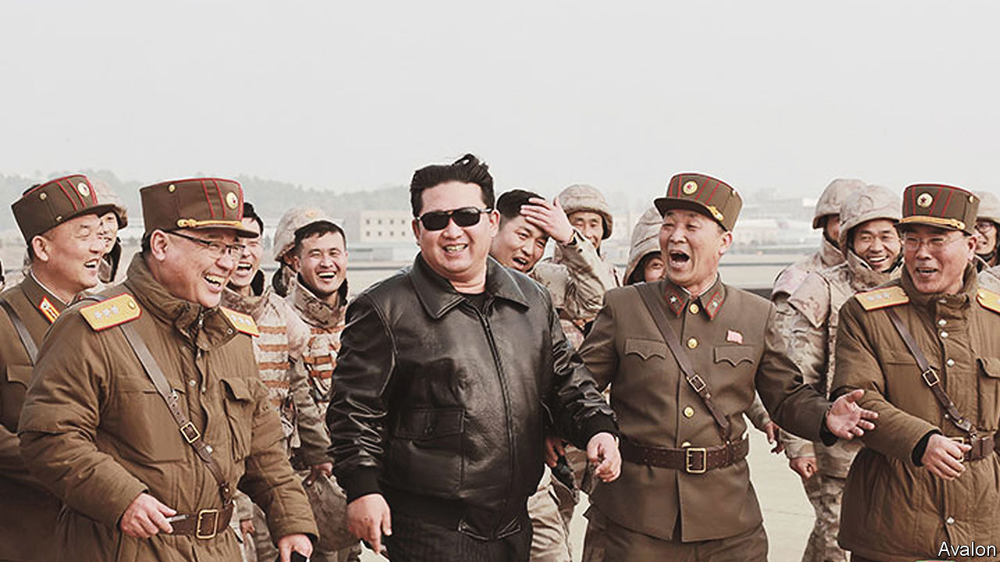

###### Pass the button

# Kim Jong Un considers devolving power over his nuclear arsenal 

##### The policy would strengthen his deterrent but raise the risk of accidents 

 

> Sep 22nd 2022 

Given the frequency with which Kim Jong Un threatens to annihilate his enemies, it is perhaps unsurprising that American and South Korean leaders just as often discuss launching a “decapitation strike” against North Korea’s dictator. Yoon Suk-yeol, South Korea’s current president, is no exception. He has repeatedly talked up his country’s “kill chain” plans, a system for pre-emptive strikes against North Korea’s missile facilities and its leadership if an attack is thought to be imminent. 

Mr Kim seems to be growing tired of death threats. In a speech to parliament on September 8th he reiterated that his country would never give up the bomb as long as “nuclear weapons exist on earth and imperialism remains”. Notably, he promulgated a law clarifying when North Korea might use its nukes. They could now be launched “automatically and immediately” if the leadership or nuclear command structure were “placed in danger”.

The move signals a significant maturation of the North’s deterrent. Previously Mr Kim had sole authority to use nukes. The new law preserves his “monolithic command” over the arsenal, but opens up the possibility that he might delegate this authority. The legislation is short and ambiguous, probably in a deliberate attempt to prevent South Koreans and Americans from testing Mr Kim’s red lines. But the message is clear enough: any attempt on Mr Kim’s life or the weapons that prop up his regime will lead to nuclear war.

This is an explicit statement of a “fail deadly” nuclear strategy, a promise that aggression will be met with automatic and unacceptable force. It is “a very traditional solution to a traditional problem”, says Ankit Panda of the Carnegie Endowment, a think-tank in Washington. 

During the cold war both America and the Soviet Union adopted such strategies. America stipulated that a “full” nuclear strike would be launched against the Soviet Union and China if its president were killed in the course of an attack on America. It revised this policy in 1968, permitting field commanders only “limited response”, deeming the risk of catastrophe too high. A corresponding Soviet system, named Perimeter, had to be switched on manually, but would then launch nuclear missiles without additional authorisation if it detected a nuclear strike and was unable to contact the Soviet general staff. 

Those with their fingers on the button are caught in what Peter Feaver, an American political scientist, has called the “always/never dilemma”. They want assurance that the weapons will always be ready to go when needed, but will never be used without proper authorisation. Devolving power over nukes helps with the “always” but not the “never”, as it raises the risk of both unapproved and accidental use.

The Kim dynasty has survived for seven decades by jealously guarding its power and coup-proofing the structure of its armed forces. Granting the nuclear codes to subordinates would empower them in a way that probably makes Mr Kim uncomfortable. Pre-delegating authority to initiate a nuclear attack also increases the possibility of technical or human errors. A commander ordering a strike based on information from a faulty attack-detection system is worryingly plausible. 

Such risks may motivate South Koreans and Americans to tread cautiously. There is little to prevent Mr Kim from developing new weapons. The regime has been impervious to threats and sanctions. Mr Yoon’s recent offer to help develop the North Korean economy in exchange for “substantive progress” towards denuclearisation was met with palpable disdain: Mr Kim’s sister called Mr Yoon a “naive little child”. Nuclear threats  Mr Kim’s regime. Yet if a nuclear weapon were to be fired without his permission, he would be the ultimate loser. America and South Korea have made it clear that using nukes would result in his regime’s annihilation.

America and South Korea have been expecting a new nuclear test . North Korea has remained quiet, perhaps waiting until after China has held its party congress in October so as not to annoy its patron. While they wait, the allies might consider toning down the death threats. ■

