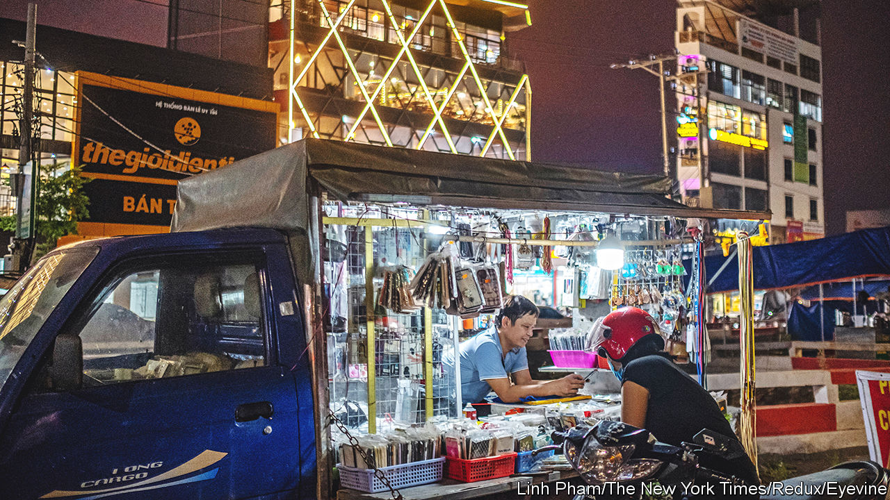
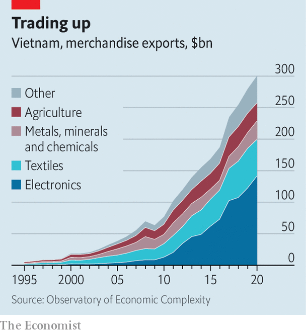
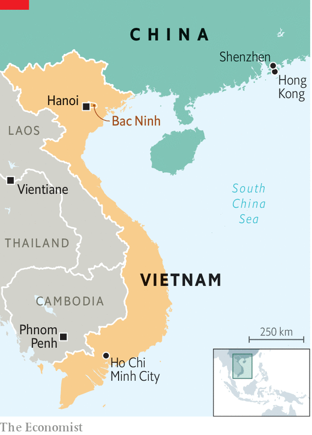

###### Chain reaction

# Vietnam is emerging as a winner from the era of deglobalisation 

##### Yet achieving its goal of becoming a rich country by 2045 will still be a huge task 

 

> Sep 22nd 2022 

Antony to swaggers between the rows of humming machines in his factory in Bac Ninh province, in Vietnam’s north-east, as they spit out blistering-hot bits of plastic. His firm, Hanpo Vina, ships the bits to the Samsung plant down the road as well as to nearby makers of printers, speakers, laptops and other electronic items. Mr To picks a Brazil-bound Samsung phone charger from a counter and displays it proudly. On the back, laser-etched in Portuguese, is a version of that familiar stamp of globalisation: .

That message—Made in Vietnam—has been emblazoned on ever more products in umpteen languages since the formerly communist economy started opening up and promoting private enterprise in the late 1980s. Since 2000, Vietnam’s gdp has  than that of any Asian country bar China, averaging 6.2% per year. It has lured big foreign firms in droves. What started with apparel makers such as Nike and Adidas seeking low-skilled labour has turned into a boom in electronics—higher-value goods that create better-paid jobs for more highly skilled workers. In 2020 electronics made up 38% of Vietnam’s goods exports, up from 14% of a much smaller pie in 2010 (see chart). 

 


The trade war between America and China, which , has helped. In 2019 Vietnam produced nearly half of the $31bn-worth of American imports that moved from China to other low-cost Asian countries (though some of these goods were probably just modified Chinese-made ones stamped “Made in Vietnam”). 

Add to that growing  between the superpowers, China’s onerous pandemic restrictions and its rising labour costs, and it is easy to see why many big firms are turning to Vietnam. Apple’s biggest suppliers, Foxconn and Pegatron, which make Apple Watches, MacBooks and other gadgets, are building big factories in Vietnam and look set to join the ranks of the country’s largest employers. Other big names moving chunks of production from China to Vietnam include Dell and hp (laptops), Google (phones) and Microsoft (game consoles). 

 


All of which could lead to more growth, and make millions of Vietnamese people better off. That in turn could boost the popularity of the Communist Party, which has run the country as a one-party state since the end of the war in 1975. The government wants Vietnam to become rich—with gdp per person exceeding $18,000, up from just $2,800 today—by 2045. It hopes to do this partly by moving from cheap garments to complex electronics that require investment and skilled labour.

Vietnam has many things working in its favour. Its workforce will remain young and sprightly as China’s ages and shrinks. The country is an enthusiastic member of over a dozen free-trade agreements, giving it easier access to scores of national markets. Its political leaders are less skittish about covid-19 than China’s, too. Vietnam fully reopened its borders in March. China retains many barriers to entry. 

The country of some 100m people also has geographical blessings, such as more than 3,000km of coastline. And it is right on China’s doorstep. Thanks to massive infrastructure spending on things like new roads, its electronics cluster is just a 12-hour drive from Shenzhen, China’s tech capital. “You don’t have to reinvent your supply chains here,” says one industrial-park operator. The government’s knack for staying cosy with both China and America is valuable, too. 

Yet there is still plenty to be done if Vietnam’s factories are to move farther up the value chain. Its manufacturing base is still much shallower than China’s. Foreign firms would love to buy more parts locally, which could be faster and more convenient than sourcing them from just over the border. But they usually fail to find what they seek. 

The Hanpo Vina factory of which Mr To is justly proud illustrates not only what Vietnam has achieved but also the limits of that success. It is a rare domestic supplier of parts to an . But the plastic bits it makes are some of the simplest in Samsung’s Galaxy phones. Moreover, its plastic-injection machines are imported from South Korea. The resin they mould into plastic comes from China. The Vietnamese stuff does not meet Samsung’s quality standards, admits Mr To. This sort of work is at the lower end of the electronics value chain, rewarded with lower pay, and easier for other countries with unskilled workers to swipe. 

Nor can Vietnam simply copy out of the playbook of China or South Korea. Globalisation is falling out of favour. Big markets are reshoring. Trade deals prohibit the state-aid tactics used by some other countries that went from poverty to prosperity. A former Vietnamese official notes that the Chinese government was able to set the rules for foreign companies keen to sell to China’s vast market. “In Vietnam we don’t have the power,” she says. 

Foreign investment helps, but it will take time to show results. Next year Samsung will open a research facility in Hanoi, the capital. It is also looking into setting up semiconductor factories in the country. In May Pham Minh Chinh, the prime minister, joined leaders of other South-East Asian countries for a summit with President Joe Biden in Washington. But he also used the trip to drop by the Silicon Valley headquarters of Apple, Google and Intel. 

The government has its own part to play. Workers are plentiful in Vietnam but talented managers are rare. So are skilled technicians. Although Vietnam already punches well above its income level for schooling, its university and vocational-training programmes need a boost. Michael Nguyen, the country head of Boeing, an aerospace giant that sources some parts in Vietnam, suggests firms such as his could work closely with universities to tailor training to what they need. If Vietnam is to grow as rich as China, let alone Japan, South Korea or Taiwan, it will have to invest not just in infrastructure, but also in its people. ■

