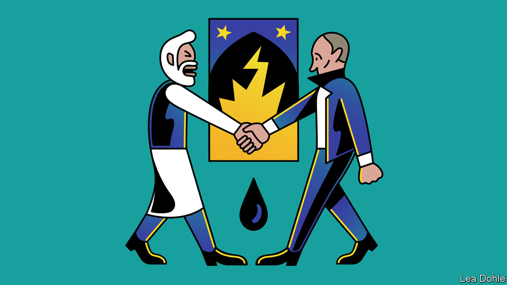

###### Banyan

# Why Narendra Modi criticised Vladimir Putin in Samarkand 

##### Russia is upsetting friends and losing influence in Asia 

 

> Sep 22nd 2022 

After vladimir putin invaded Ukraine in February, only two Asian governments, the dictatorships of North Korea and Myanmar, cheered his aggression. Yet the region’s two most populous countries so conspicuously abstained from un resolutions condemning Mr Putin’s attempt to wipe Ukraine off the map that it looked as if they were tacitly supporting the aggressor.

After all, China’s president, Xi Jinping, had just declared a friendship with “no limits” between Russia and China. As for Narendra Modi, India’s prime minister, who loves to boast of leading the world’s biggest democracy, his fence-sitting looked to some like an implicit endorsement of Mr Putin. That is certainly how Russia’s state-controlled media presented it.

Which explains why the meeting between the Indian and Russian leaders in Samarkand, in Uzbekistan, last week was so electrifying. It took place on the sidelines of the annual summit of the Shanghai Co-operation Organisation (sco), a security forum of Eurasian states that was marred by deadly border clashes between two of its members, Tajikistan and Kyrgyzstan. 

At the meeting, Mr Modi publicly dressed down Mr Putin over the seven-month-old war. “I know that today’s era is not an era of war, and I have spoken to you on the phone about this,” Mr Modi said in front of the cameras. As striking was Mr Putin’s squirming response. He acknowledged Mr Modi’s concerns and mendaciously promised to do everything he could to end the conflict. At the same summit Mr Putin acknowledged that China, too, was privately expressing concerns about the course of the conflict. 

Neither Mr Xi nor Mr Modi is about to dump Russia. Their countries have become the biggest buyers of Russian oil, which is under sanctions in the West. Moreover, India  upon Russian weaponry. But the evident shortcomings of Russian kit, as demonstrated in Ukraine, worry India, and give it another reason to avoid alienating the West, from which it increasingly . 

Meanwhile, the spikes in food and energy prices caused by Mr Putin’s war are a big domestic headache for the two Asian leaders. Russia’s widely documented brutality towards Ukrainian civilians is an embarrassment by association—India has called for an international investigation into possible war crimes. Above all, strongmen hate a loser, and a diminished Mr Putin is starting very much to look like one. Indeed, his decision on his return from Samarkand to call up reserves and annex parts of occupied Ukraine smacks , not renewed strength.

Mr Modi may have had one more reason to remonstrate with Mr Putin in Samarkand. India has long thought of Central Asia as a neighbourhood in which it has both economic and security interests. Geography has often made them difficult to serve, with a perennially hostile Pakistan and now a Taliban-led Afghanistan standing between India and the region. 

That is why India “hitched its Eurasian wagon to the Russian star”, as C. Raja Mohan of the Asia Society Policy Institute, an American think-tank, puts it. Close ties with the Soviet Union gave India privileged access to the Central Asian republics during the cold war. More recently, Russia lobbied for India’s inclusion in the China-dominated sco. But now the war in Ukraine is weakening Russia’s pre-eminent influence in Central Asia, and India’s with it.

To India’s irritation, the vacuum is being filled by China, which is already Central Asia’s biggest economic partner and now seeks . On his way to the sco, Mr Xi pointedly chose to stop in Kazakhstan, making it his first trip abroad since the pandemic started. There he reassured Kassym-Zhomart Tokayev, the president, of China’s support for Kazakhstan’s “independence, sovereignty and territorial integrity”.

Only one country is potentially challenging those: Russia. Like Ukraine, Kazakhstan shares a long border with Russia and has a sizeable ethnic-Russian minority. Since the collapse of the Soviet Union, Russian ultranationalists have claimed swathes of northern Kazakhstan. Their rhetoric has grown shriller this year. Pro-Kremlin commentators accuse Mr Tokayev of disloyalty for not supporting Russia over Ukraine after it  from an attempted putsch in January. That is just one example of how a distant war is causing the Asian kaleidoscope to turn in unexpected ways. Mr Xi calling on Mr Tokayev, for all his protestations of undying friendship with Mr Putin, is another.■


 (Sep 8th)


