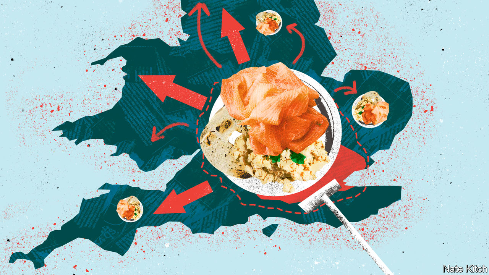

###### The smoked-salmon offensive

# After a frosty decade, business leaders are warming to the Labour Party 

##### Rachel Reeves, the shadow chancellor, promises stability in place of turmoil 

 

> Sep 22nd 2022 

As the labour party gathers for its annual conference in Liverpool, attention will focus on the lecture hall, where Sir Keir Starmer will insist that the party he leads is ready for office. But a truer indicator of how British politics is changing will be found on the sidelines, at a small gathering of business leaders and the shadow cabinet on September 26th. Tickets for that event sold out in July.

After a frosty decade, a fervent courtship is under way between the Labour Party and Britain’s largest firms. Rachel Reeves, the shadow chancellor, has launched a charm offensive that has involved 250 meetings with chief executives, chairs and founders, according to an internal tally. Many have come away impressed. “I’ve been dealing with Labour in and out of government for a quarter of a century, and this is the most professional in terms of business engagement of any leadership since Tony Blair,” says Miles Celic of TheCityuk, a lobby group for financial and professional-services firms. Labour’s overtures in the 1990s were known as the “prawn cocktail offensive”. These days it is dubbed the smoked-salmon offensive, reflecting a preference for breakfast meetings. 

For the party, it is an opportunity to shape new policies, tap potential donors and alter voters’ perceptions. Businesses are often cautious about making political endorsements, but what they say to each other trickles down to the electorate. What began as mild curiosity about Sir Keir’s leadership has turned into a scramble to get close to a party that seems likely to form Britain’s next government. “People’s ears pricked up as Boris Johnson started to disintegrate,” says a lobbyist.

Ed Miliband, the party’s leader from 2010-15, aspired to remodel British capitalism among German lines. One businessman says that visiting his office was like attending a seminar. Jeremy Corbyn, his successor until 2020, proposed nationalisations and higher taxes. Businesses that requested meetings were brushed off. 

Ms Reeves is trying to cast her party as a pillar of stability. Mr Corbyn’s manifesto has been replaced by pledges of ironclad fiscal discipline. Labour describes business as a solution to Britain’s problems, rather than a problem to be solved. It has refused to support a wave of strikes and promises a rapprochement with the eu. The party supported the Financial Services and Markets Bill, which aims to make the City more competitive.

Business leaders who have met Ms Reeves’s team credit their openness and seriousness. Calls are taken; emails are returned; draft speeches are shared. “They are being very clear about where they agree with us and disagree,” says a bank executive. Jonathan Reynolds, the shadow business secretary, and Tulip Siddiq, a shadow Treasury minister, are also well-regarded. “There is a consistent epicentre in the shadow cabinet of eight or ten people who know the scripts,” says another executive. 

There is scepticism, too. The party is cash-strapped and thinly staffed, which leaves some large holes over fiddly questions such as online-privacy regulation. Big accountancy and law firms are again lending staff to the party, a practice that largely stopped under Mr Corbyn’s tenure. That is a sign of rapprochement, but borrowed workers cannot make the party’s policy choices on its behalf. 

It helps Labour that businesses despair of the Conservative Party. Many people (including politicians) assume that firms want treats such as tax cuts and deregulation. They do—but they are more interested in a stable, predictable environment in which to invest. After 12 years in office and four radically different prime ministers, the Conservatives can hardly promise that. Boris Johnson’s tenure was especially shambolic. “For the last few years, we’re just not sure what we’re facing into with the government,” laments one executive.

Liz Truss, who succeeded Mr Johnson on September 5th, has launched yet another Tory revolution. As  went to press she was preparing to reverse rises in corporate and payroll taxes and is mulling relaxing rules on bankers’ bonuses. Such measures will benefit firms. But they also reinforce a suspicion that policy is being driven by ideological reflexes. Ms Truss’s tepid approach to net zero worries firms, who are under pressure from their customers and shareholders. As for the appointment of Jacob Rees-Mogg as business secretary, “I could think of a worse choice, but you’d have to give me an hour,” says the chairman of a large company.

The Conservative Party’s historic closeness to business allows it to ruffle more feathers than Labour. In the 1980s Margaret Thatcher felt free to reject the compromise-seeking of the Confederation of British Industry in favour of the anti-union Institute of Directors. Mr Johnson inflicted a diamond-hard Brexit, knowing that businesses would still prefer him to Mr Corbyn. 

Ms Truss is gambling that the Conservative Party’s advantage holds. She has an epithet for those she sees as responsible for Britain’s economic underperformance: “managerial”. Oddly, business leaders sometimes apply the same term to Ms Reeves. They mean it as a compliment. ■

