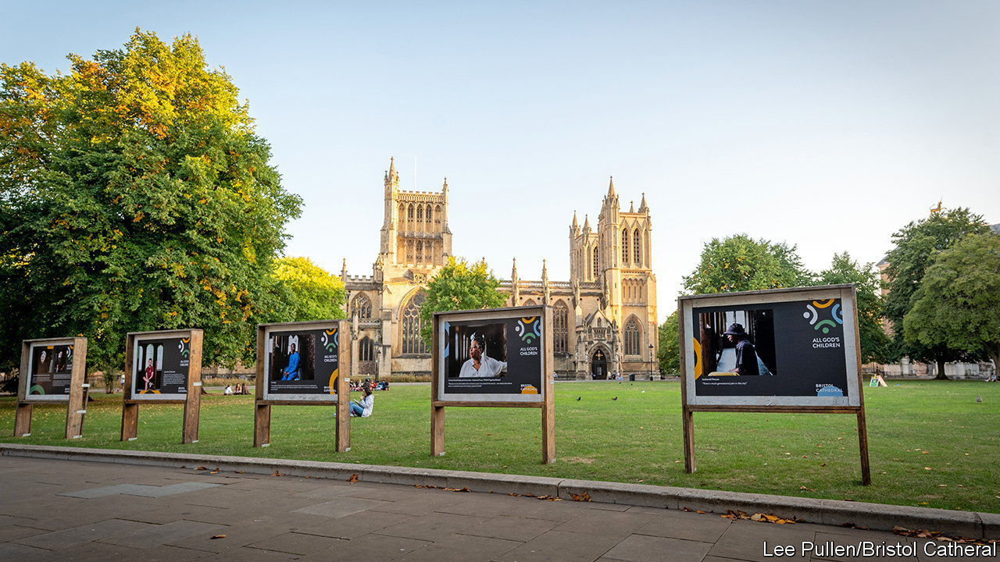

###### Race in Bristol

# In one British city, Black Lives Matter still reverberates 

##### The dispute over history and images continues 

 

> Sep 22nd 2022 

After protesters dumped a statue of Edward Colston in Bristol harbour in 2020, the city’s Anglican cathedral hastily covered several stained-glass windows. Some commemorate the 17th-century merchant, who was a leader of the slave-trading Royal African Company. The cathedral also has a spectacular rose window dedicated to Thomas Daniel by his sons, who were awarded hefty compensation after slavery was abolished in 1834.

The extent to which Bristol’s wealth and many of its finest buildings were built on the wretchedness of slaves is the thrust of a new exhibition at the cathedral. The first such effort in Bristol, it focuses on 200-odd burials of people who profited from the trade. Mandy Ford, the dean, says the exhibition shows that the horror was “in the warp and weft of the city”. It also provides for the inclusion of names and stories of some slaves, like Thomas Gullen, who died a free man in Bristol in 1791.

Responses to the exhibition, which closes in October, will inform the cathedral’s next steps. Visitors are asked whether it should create a permanent exhibition, remove memorials or commission new ones. Cathedral staff are discussing the same question with Bristol city council, Bristol University and black Bristolians.

The city has long had a radical streak. In 2011 it saw the largest Occupy protests outside London. Countering Colston, an activist group, has targeted the Society of Merchant Venturers, a group of business people of which Colston was a member. Earlier this year, its campaign prompted several pubs to boycott a Somerset cider-maker because its owner was a member of the society. That made some people angry. The efforts of the cathedral, whose exhibition was partly funded by the Merchant Venturers, may have a more lasting influence on how the city acknowledges its past.

Though the cathedral has received planning permission to remove the blocked-up windows, the glass company it would have used to replace them has gone out of business. That may prove “fortuitous”, reckons Reverend Ford. Feedback from visitors to the exhibition and wider conversations suggest most Bristolians want the windows to stay. But no decision has yet been made. “We want to welcome everyone here,” she says. “How can we do that if we seem to be aggrandising those who captured and trafficked people?”■

