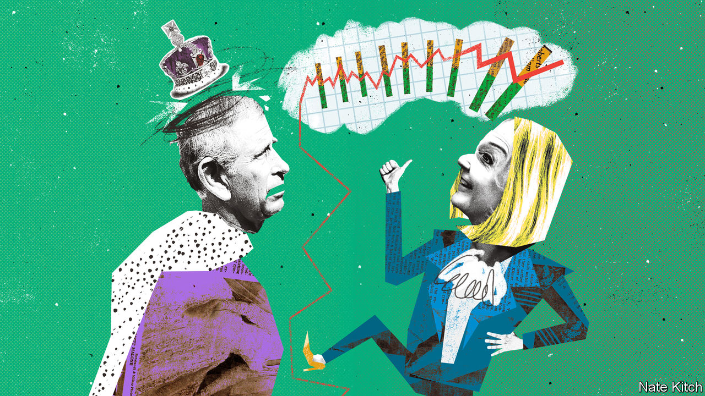

###### Bagehot

# King Charles versus Trussonomics 

##### Economic growth: the cause of, and solution to, all life’s problems 

 

> Sep 22nd 2022 

“Harmony: a new way of Looking At The World” is an arresting read. Published in 2010, the book by Prince Charles, now King Charles, is a peculiar work stretching from ecology to economics, via ancient philosophy and sacred geometry. At times Charles comes across as a regal Jordan Peterson, who researched symbolism before switching to life advice for teenage boys. In one section, the then heir to the throne discusses how often the shape of “the female organ of birth—the doorway or window between two worlds”, as the future king delicately puts it, appears in art, architecture and nature. 

But the sections on economic growth stick with the reader longer than Charles’s Freudian analysis of the shape of an almond. Mankind is on a path to misery, expanding gross domestic product at the expense of the environment, argues Charles. An addiction to consumption leaves people stressed. gdp is a 20th-century measure in a 21st-century world. Unfortunately for the new king, a person who takes the opposite view now sits in Downing Street. 

Liz Truss has made growth the be-all of her premiership. Boosting trend growth to 2.5% per year, as the government intends, may be a bloodless cry. But it is a loud one. Speaking at the United Nations in New York, Ms Truss hailed gdp as the route to power as well as prosperity, with democracies able to fend off the likes of Vladimir Putin only if they become richer. For Charles, economic growth is the problem. For the prime minister, it is the solution. 

Some aspects of the Carolean view are reasonable. Boosting the economy while ignoring environmental harm would be bonkers. Charles notes that increases in gdp stop correlating with increased happiness above a certain level. Sometimes the problem is the messenger more than the message. Arguing that there is more to life than money is a platitude. It is, however, a strange sentiment from a man who lives in a palace.

Ms Truss takes a hard-nosed view of increasing wealth. Charles approvingly quotes Gandhi at his most trite: “Happiness is when what you think, what you say, and what you do are in harmony”. By contrast, during the leadership campaign, Ms Truss said: “Happiness is a faster-growing private sector than public sector.” The prime minister’s line is unlikely to end up on a fridge magnet, but it is at least feasible. 

Consumption is a cause of our ills, argues Charles: “Poverty, stress and ill health…seem reluctant to respond to the cure of yet more consumption.” Economic growth has failed to alleviate these symptoms, he laments. Ms Truss sees consumption as the cure. It is such a fundamental aspect of her ideology that, even with the possibility of blackouts this winter, the government dares not ask people to turn down their thermostats and throw on jumpers. “Ever since I can remember, the environment has been presented as something worthy,” complained Ms Truss in a speech she made while environment secretary in 2014. “Feel guilty about buying more stuff. Take fewer flights. It’s all been about having less but it can—and should—be about having more.” (It is a mark of the straitened times that keeping the heat on has replaced flying as an aspiration.)

Ms Truss is right that unless Britain boosts its lousy growth rate, decline will follow. But the unelected monarch is, unfortunately, with the people in opposing the measures that would do just that. Strict planning laws make it difficult to build, which is just the way voters want it. Ms Truss cheered as towers sprang up across Britain’s cities; Charles led a popular backlash against them. Many voters like to say, as he did, that they are happy to give up on growth if it means a greener future. 

Politicians of all stripes console themselves with the notion that Britons voted to leave the eu in 2016 because they were misled by other, less upstanding politicians. “No one voted to be poorer,” runs the refrain. A scarier possibility is that people knew perfectly well what they voted for. Brexit will create a smaller economy, but voters simply did not care. Palace-dwellers are not the only people who are insulated from economic shocks. Home-owning pensioners are pretty well protected, too. 

It is little wonder that previous governments placed growth as a second-order issue to a higher purpose. Margaret Thatcher sold her radical reshaping of the state as something that went far beyond economics. “Economics are the method,” she said. “The object is to change the heart and soul.” Improved public services was the primary focus under Tony Blair’s government, economic growth simply the means of paying for it. Under David Cameron, economic growth would be a happy consequence of cutting the deficit. For Ms Truss, growth is the only goal. It is unlikely to be an innately popular one. 

Give me growth or give me death 

Ms Truss professes to be unfussed about a backlash. “Not every measure will be popular,” she said. “And there are always vested interests, people who oppose measures that increase economic growth.” So corporation taxes will be cut, and a popular (though foolish) cap on bankers’ bonuses will go. Plans to overhaul planning rules are mooted. Individually, each policy would turn a focus group into a lynch mob; doing all of them together is brave to the point of foolhardy. Ms Truss resembles a neoliberal kamikaze pilot, prepared to blow herself up for a righteous cause. 

Criticism will not come from the new occupant of Buckingham Palace. Charles is wiser than that. A Prince of Wales has a limited right to sound off on topics such as the environment or the joys of organic marmalade, but a monarch must keep quiet. Charles has promised he will keep his views on economic growth, the curves of a Stradivarius and the merits of Thomas Malthus to himself. Some causes may miss his voice. But when it comes to growth-boosting reforms, Charles has no need to pipe up. Most likely, the voters will do it for him. ■


