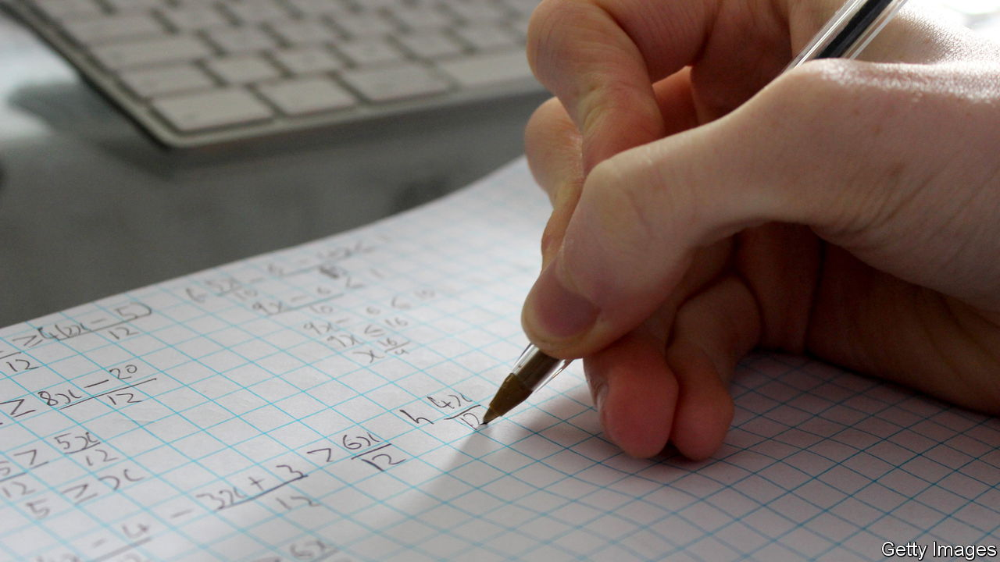
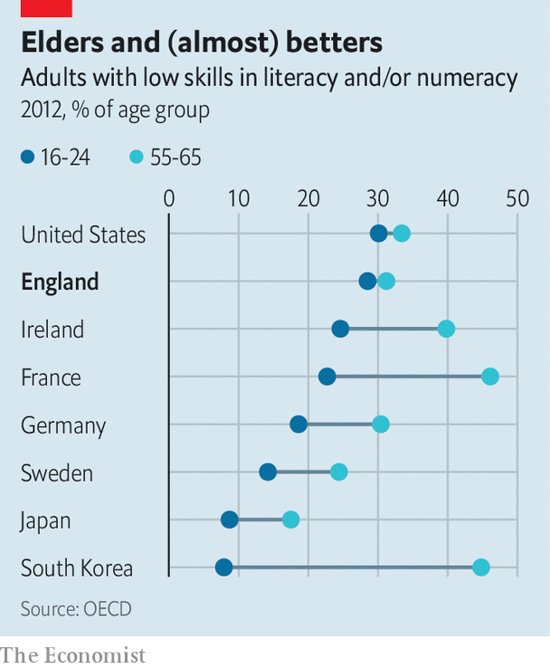

###### A lack of basic skills

# Many British adults lack basic numeracy and literacy 

##### If that changed, the country would be much better off 

 

> Sep 22nd 2022 

Gremlins in white boiler-suits harassed Britons in the early 2000s, springing from cupboards, drawers and sofas whenever people were asked to read or add up. The critters were the stars of government tv advertisements that aimed to prod adults into signing up for lessons in maths and literacy. The adverts drove adults into classrooms—and sent toddlers screaming from living rooms. For a while regulators banned them from appearing before 7:30 at night.

The oecd, a club of mostly rich countries, found in 2012 that 9m adults in England did not reach minimum standards in literacy, maths or both. They might struggle to understand all the instructions on a bottle of aspirin or work out how much petrol is left in a car from looking at a gauge. The government says that half of grown-ups today can do sums no better than a primary-school child. That weighs on efforts to boost productivity. 

 


The oecd found that most of Britain’s low-skilled adults were working. Many were outwardly well-qualified: they included 10% of university students and, rather alarmingly, 7% of recent graduates. England seems to be unusual in that young people who have only recently completed formal education are about as innumerate and illiterate as older adults (see chart). 

Over the past decade the government has made changes to the final few years of secondary schooling—the period in which Britons’ basic skills appear to slip most dramatically. A revamp in 2015 aimed to make gcses (national exams that are taken at the age of 16) more demanding. Pupils who do not earn passes in maths and English must keep retaking those tests until they are 18.

That might not be enough. In many rich countries, youngsters study maths and their native language until adulthood. In England, kids who manage to scrape a passing grade continue to ditch these subjects early. And the merits of making low-performing pupils sit endless retakes are doubtful. Sam Sims of National Numeracy, a charity, says the practice demoralises adolescents for whom standard schooling has already failed.

Meanwhile adult education has gone to seed. Since the days of the gremlins, grown-ups who lack basic qualifications have been offered free night classes. But the number enrolling has fallen from a high of 1.8m in 2012 to 700,000 last year, according to the Institute for Fiscal Studies, a think-tank. Employers do not seem fussed. A government survey finds that only 3-5% of companies with low-qualified staff think their workers need to brush up on basic skills.

First, admit you have a problem

Adults rarely discuss embarrassing deficits with friends or bosses, says Alex Stevenson of the Learning and Work Institute, another think-tank. So getting them to enrol in skills courses is hard work. Colleges struggling with tight budgets usually find there are more profitable things to do, even if the government is willing to cover course fees. These days only two-fifths of people appear to know that free help is available, reckons Mr Stevenson—and they are largely not the ones who need it. 

The government is now putting some £560m ($640m) into “Multiply”, a three-year project to boost basic numeracy. Exactly what it looks like will vary by region; local authorities have been told to create schemes that match needs in their areas, selected from a menu of ideas drawn up in Westminster. The government wants to see lessons offered in workplaces. It also wants officials to create schemes for particular groups such as parents, prisoners and would-be nurses. 

That project will have to surmount shortages of maths tutors (many of whom now earn a crust helping teenagers with their many resits). Advocates of literacy wonder why their subject is not getting more attention. And all this probably comes too late to boost England’s performance in the next international ranking of adult skills, due to be released in 2024. Prepare for another ugly surprise. ■

