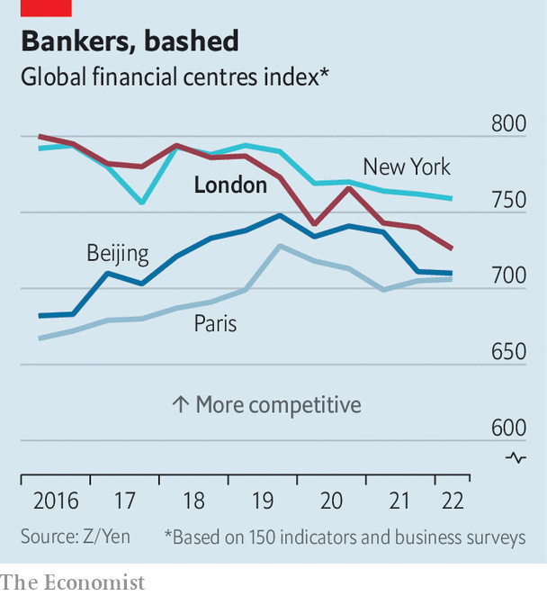

###### Capital ideas

# The City is fighting to carve out a post-Brexit role 

##### It still needs to find new business lines in which to excel 

 

> Sep 22nd 2022 

“A club no more”, the final instalment of David Kynaston’s four-volume chronicle of the City of London, opens on a bleak note. In 1945 the financial district was littered with debris from bombing and struggling to find a new role as the empire it had grown to serve splintered. But by the end of Mr Kynaston’s work, half a century later, the City had been transformed. Financial innovation had forged a hub for offshore lending and currency trading. Boiled-cabbage lunches and old school ties were replaced by Michelin stars and a modern, global financial centre.

The City needs to reinvent itself again. Brexit harmed it less than many had feared: ey, a consultancy, reckons that 7,000 jobs and £1.3trn ($1.5trn) of assets were lost from a sector that employs 1.1m, manages investment funds worth £11trn and holds banking assets worth £8.3trn. Yet the City’s shine has dulled. An index compiled by Y/Zen, a think-tank, shows that London’s position has slipped (see chart). International firms opening a European hub, whether Japanese banks or Chicago trading outfits, prefer Amsterdam or Luxembourg. And the City’s problems are Britain’s. The financial-services industry generates around a tenth of economic output. In 2020, together with associated professional services, it contributed taxes of nearly £100bn, or 5% of gdp. 

 


The efforts to reverse this gentle slide are taking place on three fronts. The first is an attempt to make Britain’s markets and financial institutions more competitive by streamlining regulations. The second is a wide-ranging debate over how to convene more capital for long-term investment. The third is a search for new business lines to replace the revenue that came from being a financial gateway to Europe.

For the speediest advance, look to the regulatory front. In recent years the government has sponsored a bevy of reviews aimed at improving Britain’s financial rulebooks, with targets ranging from refreshing the stockmarket’s listing regime to encouraging fintech firms to grow. A flurry of recommendations ensued, many of which are now being implemented with a pace and focus that has taken even seasoned executives by surprise.

Companies with dual-class shares, which grant directors outsized voting rights and are popular with technology firms, can now join the premium segment of the London Stock Exchange (lse). Early investors can retain more of their shares when a firm goes public, rather than being forced to sell. Rules governing the prospectus a company must produce to float will be slimmed down, and others tweaked to make it easier to raise follow-on capital.

Lord Hill, the author of one of the reviews, described a need to close a gap that had opened up between the City’s markets and those of its rivals. Britain’s new leaders also want to find ways for London to pull ahead of its rivals. Kwasi Kwarteng, the chancellor, is considering scrapping the cap on bankers’ bonuses, introduced by the eu in the wake of the financial crisis of 2007-09. Such a change ought to reduce firms’ fixed costs when hiring in London, making it more attractive for them to do so.

The second front is an attempt to turn the City into a better conduit for long-term investment in the economy. In theory, ample capital is available: Britain’s insurance funds, pension schemes and retail holdings are worth £6trn. But they have withdrawn from the domestic stockmarket. Julia Hoggett, the lse’s boss, recently noted that in 1998, 73% of pensions were invested in British equities and 10% in property. By 2018 the proportions had shifted to 13% and 52% respectively. The lse’s importance as an equity hub has dwindled. At its peak in 2006 it raised 18% of the capital invested in global initial public offerings; in the first half of this year, less than 1%.

Insurance regulation cropped up oddly often during the Conservative Party’s leadership contest. Liz Truss argued that the eu-inherited “Solvency II” rules, which specify how much capital insurers must earmark to ensure they can meet future liabilities, are ripe for reform. The Association of British Insurers (abi) estimated in 2021 that £95bn of capital could be freed up for long-term investment in the economy if the rules were loosened. The Prudential Regulation Authority’s proposed reforms are more conservative. It reckons it could free up between £45bn and £90bn; the abi protests that the pra’s proposals might release no capital at all. The reality will probably be somewhere in between.

City grandees have formed a “capital markets task-force” which aims to make Britain’s markets better matchmakers for investment-hungry firms and funds seeking returns. Many funds are fragmented. The Local Government Pension Scheme, with assets worth £342bn, is split into 86 separate pots, for example. That makes it uneconomical for each fund to hire the specialist teams required to invest in areas like early-stage firms and infrastructure projects. Merging them could make such investment possible. Until recently, says Ms Hoggett, attention was fixed elsewhere: the financial crisis, then Brexit, then the pandemic. But “almost the minute this conversation could come up for air, it did.”

It is only on the final front, the hunt for new business areas, where progress is hard to see. Hopes that London might become a global hub for trading crypto assets have faded as prices have crashed and regulators have warned of lax money-laundering controls. The City will struggle to become a centre for raising green finance—Britain’s capital markets make less use of it than the rest of Europe’s. William Wright of New Financial, a think-tank, points out that the development of a widely used carbon-offset market would be a chance to shine, given the City’s strengths in designing and trading complex financial instruments. But that prospect remains distant. For now, a wholesale repeat of the City’s post-war reinvention remains out of reach. ■

