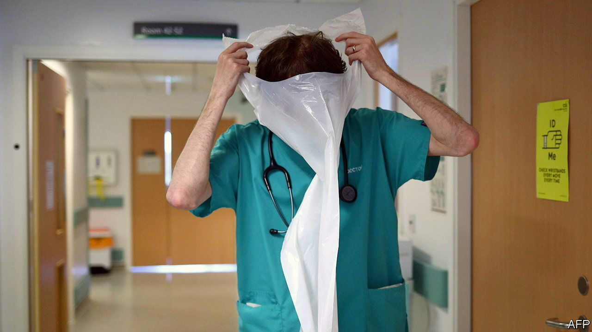

###### Locum motives

# The NHS has a lot of locums. It should listen to them 

##### Many people do not want to work full-time for the NHS. With good reason 

 

> Sep 22nd 2022 

The british television show “Casualty” must obey certain rules when it comes to on-screen carnage. Gore is permissible, but the camera may not linger on it in a “ghoulish” manner, says Paul Unwin, the show’s co-creator. Agony is allowed, although extended agony is not (a shot in which a man was impaled on a railing had to be trimmed). The show barely touches another painful issue: that of locum workers. “It can’t,” says Mr Unwin. Viewers would switch off if the characters changed constantly. “People like the familiar.”

The actual nhs cannot be so picky. Fully 76% of nursing vacancies and over 80% of doctor vacancies are filled by locums (jargon for off-contract workers who pick up work by the day, week or month) and other temporary staff. The nhs spends around £6bn ($7bn) a year, almost a tenth of its staffing budget, on them. Whereas “Casualty” offers its viewers reassuring continuity (one of the best-known characters, Charlie Fairhead, has been on screen for 36 years), real nhs rotas are often finalised just days, if not hours, in advance. Doctors on wards seem to be almost “randomly bouncing around,” says Louella Vaughan, a consultant physician and a senior researcher at the Nuffield Trust, a think-tank, “as if they were in Brownian motion.”

No episode of “Casualty” will ever turn on whether a nurse manages to resolve a knotty staffing problem for the third Sunday in October. But rotas matter. Done well, they can make a workforce happy and effective; done badly they make workers miserable or even drive them to leave the profession. And the nhs frequently does rotas very badly indeed. 

In theory, nhs workers on normal contracts should know when they are working six weeks in advance. In practice, many do not. Medical workers frequently struggle to plan holidays, child care and weddings—even their own. Trainee doctors have little control over where they live. It is “bonkers”, says Dr Vaughan. “The whole kit and caboodle of nhs employment is utterly Kafkaesque…No one else would tolerate being employed like this.” Increasingly, many do not: they simply leave contracted employment in the nhs and start to work as locums instead.

Locums are sometimes described as opportunists bleeding what money they can from an organisation that is already ailing. And the pay can be splendid: locum consultants can earn £120 an hour. But for many workers the calculation of whether to work as a locum is totted up not in pounds and pence but in the personal debts of Christmases missed, weekends lost and the high personal cost of working in an organisation that seems indifferent to their needs.

For a theoretically caring profession, the nhs can be a strikingly uncaring employer. Vishal Sharma, now a consultant and chair of the British Medical Association consultants committee, found it “virtually impossible” to arrange time off for his own wedding (to a fellow doctor, which made it harder yet). Similarly, when his wife was expecting her first child, he requested that he not be put on any on-call shifts or night shifts around her due date. His hospital refused: if she did go into labour, they said, he could then swap his shift with someone else. “It’s ludicrous to be worried about having to swap your night shifts when your wife is about to go into labour,” he says. 

Weddings and holidays are trivial; they are also hugely important. “For such a long time I think people just accepted it,” says Dr Sharma. Now, he says, there is a growing realisation that “this isn’t normal…this isn’t ok.” The writers of “Casualty” realised long ago that mere medicine isn’t enough: to keep people with you, you need good feeling, too. Those in charge of the nhs would do well to watch and learn. ■

