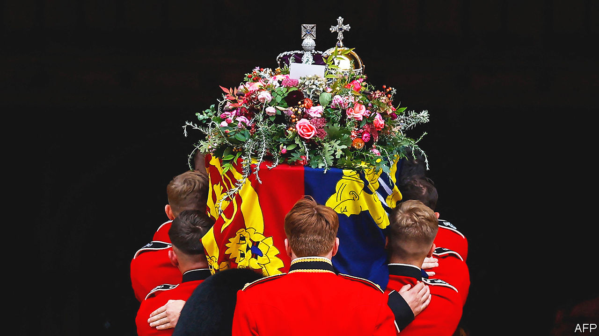

###### The monarchy

# The state funeral of Elizabeth II came off without a hitch 

##### Britain buries its longest-reigning queen 

 

> Sep 22nd 2022 

A coffin is a heavy weight on any shoulder but this one—English oak and lead-lined—looked heavier than most. Just before 11am on September 19th, eight soldiers with red coats and neatly trimmed necks lifted the coffin of Elizabeth II, crown on top, onto eight shoulders. Then they started to walk. 

The queen’s funeral offered many numbers: 96 tolls of Westminster Abbey’s tenor bell; 2,000 people in its congregation; tens of thousands on the streets beyond; 26m watching live in Britain; millions more worldwide. One number that many wondered about was the weight of the coffin. But this was not given: queens must be measured in more regal units than kilograms. 

Other things were also unknown—chiefly, what has just happened in Britain. History will be clear: an outpouring of grief by a traditionalist nation for its beloved monarch. But history is much muddier when it happens. In June a poll by YouGov found Britain was only mildly in favour of its monarchy. Speak to those in the gathering crowds and many were unclear why they had come except to say that she had done a good job, and that this was history. 

Watching the soldiers walk—step-pause-step-pause—up the steps into the Abbey, their gait implied gravity. To bear a crown, either for a morning or a lifetime, is a job both burdensome and tense. As few knew better than the queen, a single slip can ruin everything. But there was no slip. Shortly after 4pm the coffin and crown were set down. Their job—and hers—was done. 

