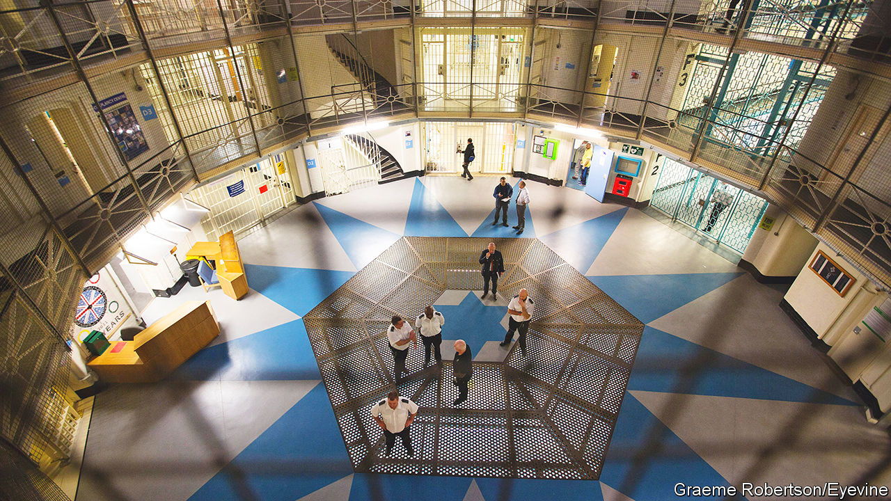

###### Prisons covid

# Why prisoners are spending more time in their cells 

##### It is no longer because of covid 

 

> Sep 22nd 2022 

Visitors to onley prison found a garden overgrown with weeds. Prisoners had not been tending it. Nor had they been going to classes or work, or planning for their lives after release, the Prison Inspectorate noted in May and June. Fewer than half had jobs or were enrolled in education. On weekdays, the unemployed stayed in their cells for 21 and a half hours. 

The prison service says the garden is now being used. But the restrictive regime that caused its neglect is still in place at many training prisons, which are meant to help prisoners prepare for release. In many English facilities, prisoners attend work or classes for half a day rather than a full day. In June more than half of prisoners at another training prison, Wandsworth, were locked up for 22 hours a day. 

The Prison Inspectorate’s annual report on all prisons described many young men sleeping or watching tv in their cells. Inspectors worry about this. The number one issue facing prisons is a failure to get inmates out of their cells and into work or education, said Hindpal Singh Bhui, of the Prison Inspectorate, at a recent conference.

A remedy becomes a habit

In part, the lack of time out of cells is a hangover from covid-19. When the pandemic struck, officials worried that it could sweep through prisons that are frequently old and overcrowded. Tough sentences have resulted in an ageing, vulnerable population. Health authorities estimated that 2,700 out of 83,000 inmates might die. So officials kept prisoners in their cells for 22 hours a day, and in small groups when unlocked (previously, entire wings would be unlocked at a time). The measures seem to have worked. Just 206 prisoners have died of or in connection to covid, according to figures published in August. 

But many governors noted a side-effect of the restrictions: prisons became easier to manage safely. In the years before covid prisons were growing more violent, owing to budget cuts and the arrival of new psychoactive drugs. Violence peaked in the year to March 2019 when there was an assault rate of 415 incidents per 1,000 prisoners. By keeping prisoners away from staff and each other, the pandemic measures cut the rate of prisoner-on-prisoner assault nearly in half and that of assaults on staff by a fifth. The rate of self-harm among men also decreased by 19%, although it increased among women. 

Ideally, prison governors would take what worked from the covid era—smaller groups, less aimless milling about, more in-cell technology—and feed it into their regimes while returning time out of cell to pre-pandemic levels. Some prisons have found ways to do this, but most do not have the money or staff, says Andrea Albutt, of the Prison Governors’ Association. The shortage of staff at Onley Prison was “one of the worst” inspectors had seen, according to its report. Others like Wayland and Wandsworth did not once during the year to March 2022 have the number of staff that the governor and director said was required for the facility to function. 

Some prison officers are quitting or missing work. In the year to June 2022, 15.3% of officers quit, up from 12.2% before the pandemic. (Turnover should be less than 10%, former officials say.) Staff missed an average of two weeks of work in the year to June 2022, the highest number of days since the Prison Service started tracking it. Mental and behavioural disorders were commonly cited as reasons. 

The Prison Service is raising the wages of officers in a bid to make the job more desirable. It has hired 4,000 extra staff in the past four years and plans to hire 5,000 more officers by the mid-2020s. It says that prisons are recovering from covid at different speeds, but that more prisoners are engaging in education and training overall.

But there is a danger that restrictive regimes could become entrenched. The Prison Officers Association, a union, wants to abandon target amounts of time that prisoners should be out of cell. “The days of full wing unlock and pointless association periods must cease,” wrote Mark Fairhurst, chair of the union, in an update to members in February. Governors are more concerned about the safety risks of unlocking many prisoners with few officers. “There’s an overly simplistic view that violence has gone down so we can leave it like this,” says Michael Spurr, former head of the National Offender Management Service (now hm Prison and Probation Service). 

Keeping prisoners locked up most of the time hinders what is ostensibly one of the key purposes of prisons: preparing inmates to re-enter society. Prisons with good quality work and education tend to have lower rates of drug use, a common cause of recidivism. At training prisons like Onley and Wandsworth, working life inside should imitate life outside as much as possible to ease prisoners’ transition, says Charlie Taylor, the Chief Inspector of Prisons. That means having prisoners in work or education for eight hours per day, and allowing mingling on the wings.

Keeping prisoners in their cells may not work much longer, anyway. In half the prisons inspected over the past year, rates of violence were increasing, including in two with little time out of cells. Onley Prison’s violence-reduction strategy identified the main source of violence as being prisoners’ frustration from poor access to work, education or other activities. Assaults may be down. But that could be a temporary blip if people stay locked up all day. ■

