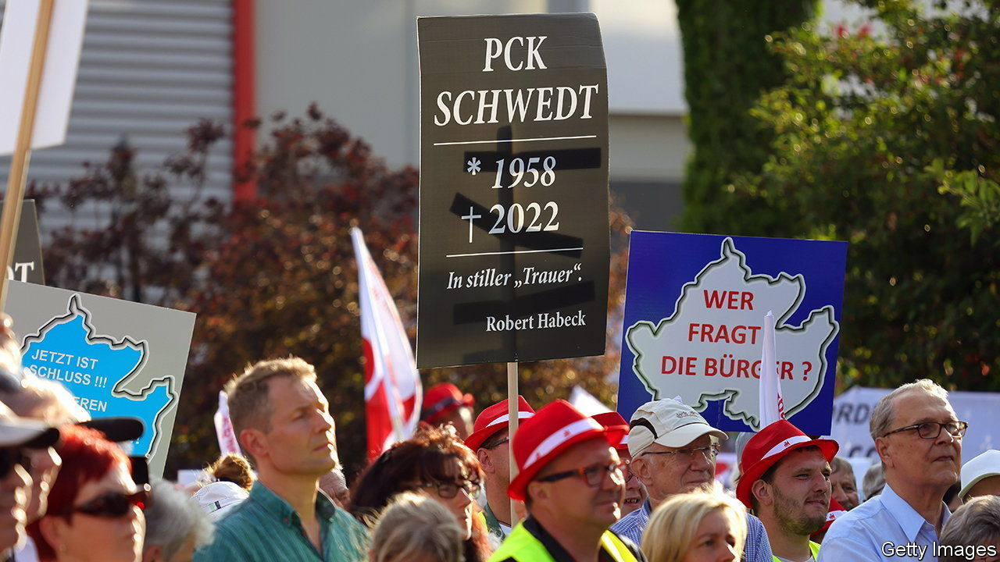

###### On the offensive

# Germany’s government seizes Russian energy assets 

##### What will it do with them? 

 

> Sep 22nd 2022 

After a hot and dry summer, the rain and chill in September brought some relief to parched Germans—but also a reminder of the looming winter. On September 16th Klaus Müller, boss of the Bundesnetzagentur (bna), Germany’s energy regulator, admitted that if it gets very cold “we will have a problem”. He could not rule out the rationing of natural gas, which Germany’s biggest supplier, Russia, has withheld as part of its war in Ukraine. 

Germany’s chancellor, Olaf Scholz, is doing all he can to avert this eventuality. In the past week his government has unveiled two radical measures as part of that effort. On September 21st the economy ministry announced the complete nationalisation of Uniper, Europe’s biggest and most gas-addled power utility. More controversially, five days earlier the government said it was seizing control of stakes held in three German refineries by Rosneft, Russia’s state-owned oil giant. The assets, pck, miro and Bayernoil, were placed under the trusteeship of the bna. 

This is not the first time since Vladimir Putin’s tanks rolled into Ukraine in February that Germany has expropriated Russian assets. In April it did the same to gas-storage facilities operated in the country by Gazprom Germania, a subsidiary of Russia’s national gas behemoth. The seizure of Rosneft’s assets, in particular pck, of which the Russian firm owned 54%, has proved quite a bit thornier. 

Thousands of jobs hinge directly or indirectly on pck in Schwedt, the biggest city in one of the country’s poorest regions, Uckermark. That and the fact that pck supplies 90% of Berlin’s oil, diesel and aviation fuel were the main reasons why Germany was hesitant to sign up to the eu embargo on Russian oil when it was first proposed in late May. The embargo, which is set to take effect at the end of the year, would mean the refinery will no longer be able to accept Russian crude. Moreover, suppliers, insurers and banks afraid of being inadvertently caught up in the sanctions net refused to do business with it so long as Rosneft remained part-owner.

Rosneft is, predictably, furious. It called the German government’s actions “illegal”. More surprisingly, the decision to place pck under trusteeship did not go down well in Schwedt, either. The city of around 30,000 sits atop Druzhba (Russian for “friendship”), the world’s longest pipeline, which started pumping crude oil from central Russia to “fraternal socialist people” including Poland, Hungary and then-Czechoslovakia in the 1960s. Druzhba is why many families moved to Schwedt, a city almost entirely razed during the second world war by advancing Soviet troops.

Jens Koeppen, an opposition mp who represents Schwedt, says that the government is “knowingly sacrificing” a successful business in Schwedt. He argues that it is absurd to pretend that German energy supply in the next five years will be secure and affordable without imports from Russia. 

The government, for its part, insists that pck does not need Russia’s crude to thrive. It has promised a €400m ($395m) upgrade to the oil pipeline from Rostock, a port on the Baltic Sea, to Schwedt. It wants to invest another €825m in the next 15 years in and around pck. That, it says, will keep it going until it can be sold to a new owner. Poland’s state-run energy firm, Orlen, has already expressed an interest in acquiring Rosneft’s seized stake. In the meantime, Mr Scholz’s ministers are in talks with their Polish counterparts to get supplies for pck through the Polish port of Gdansk. 

Mr Koeppen is nevertheless not crazy to worry about pck’s near-term prospects. The Rostock pipeline can at present only supply 60% of pck’s crude-oil needs. Even the promised upgrade will increase that to only 75%—and only in two years’ time, if all goes well. Getting oil from Gdansk is expensive, since the stuff is being shipped to Poland from Saudi Arabia. Another option is to import oil from Kazhakstan via Druzhba, but increasingly belligerent Russia will almost certainly not allow it. 

All this means that pck will run well below capacity as soon as Russian oil stops flowing, says Florian Thaler of OilX, a consultancy. Given Russia’s recent setbacks in Ukraine and its heightened war footing, that could happen any day. ■


