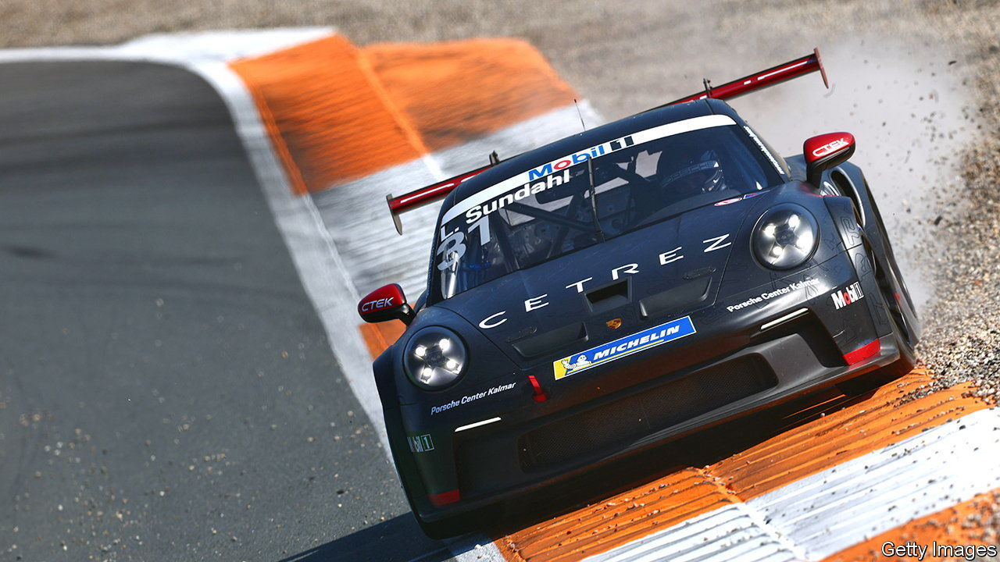

###### Speed merchants

# Porsche goes to market 

##### The German carmaker loosens ties with Volkswagen 

 

> Sep 22nd 2022 

The powerful rear-mounted engines of Porsche’s long line of 911 sports cars made them small and fast. In a corner, though, they acted like a pendulum, leaving some less skilful drivers parked in roadside hedges. After an initial public offering (ipo) on September 29th, the luxury carmaker will also require nimble handling to ensure its strengths do not become a source of weakness.

In a nod to its most famous model, the ipo will comprise 911m shares. Only 114m, with no voting rights, will be sold to the public and big investors, including the Qatar Investment Authority. The rest will be held by vw, which has owned Porsche since 2012, and vw’s largest shareholders, the Porsche (yes, the same one) and Piëch families. The listing could value Porsche at up to €75bn ($74bn), instantly making it the world’s fifth-largest carmaker by market value (see chart). 

 


Investors are giddy at the prospect. Requests for shares reportedly exceeded the total €9.4bn offering within hours of the ipo order book being opened up. For vw and Porsche it may seem an odd moment for such a bold manoeuvre. The car industry is facing uncertain times as supply chains creak and the global economy sputters. On September 19th Ford warned that profits in the third quarter might be less than half of the $3bn that analysts had forecast; its share price dropped by more than 12%. In recent weeks Nio, Li Auto and Xpeng, among China’s most successful electric-vehicle (ev) startups, reported growing quarterly losses. 

The spin-off strips vw of 100% ownership of a steady earner. In 2021 Porsche’s 300,000 or so cars, out of vw’s total of 8.6m, generated a quarter of the group’s operating profit. The marque has managed to add practical vehicles such as suvs (which now make up three in five Porsches sold) to its range without sacrificing the air of exclusivity. It has been able to keep prices high in a segment that is growing faster than the industry as a whole. Porsche’s net margin of nearly 20% comfortably beats those of premium rivals. It also means more resources to pursue ambitious ev plans, according to which 80% of new Porsches will be battery-powered by 2030.

The structure of the ipo at least allows vw to retain a right to a slice of Porsche’s future cashflows. For Porsche, the benefits of the arrangement are less evident. Maintaining ties was meant to let Porsche and vw share some development costs and engineering platforms, particularly in software. But Cariad, vw’s digital unit, is struggling; software delays have already forced Porsche to put off the launch of its e-Macan small suv by at least a year, to 2024. 

Meanwhile, financial independence means that Porsche can no longer rely on vw’s profits to bail it out should motorists ever fall out of love with its cars, or its margins be crimped by the arrival of competitors at the pricier end of the luxury segment (which Mercedes-Benz is already sizing up). Investors, fasten your seatbelts. ■


