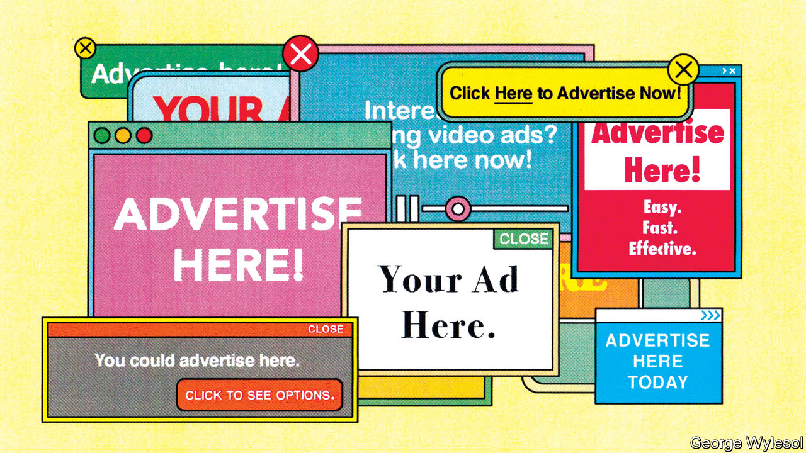
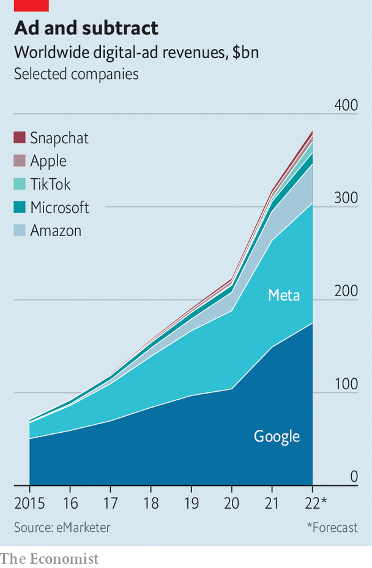

###### Commercial brakes

# The $300bn Google-Meta advertising duopoly is under attack 

##### The pair face a weak economy and powerful new rivals 

 

> Sep 18th 2022 

For the past decade there have been two universally acknowledged truths about . First, the rapidly growing industry was largely impervious to the business cycle. Second, it was dominated by the duopoly of Google (in search ads) and Meta (in social media), which one jealous rival has compared to John Rockefeller’s hold on oil in the late 19th century.

Both of these verities are now being challenged simultaneously. As China’s economy slows and the West’s slides towards a recession, companies everywhere are squeezing their marketing budgets. Until recently, that would have meant cutting non-digital ads but maintaining, or even raising, online spending. With most ad dollars now going online, that strategy is running out of road. Last quarter Meta reported its first-ever year-on-year decline in revenues. Snap, a smaller rival, is laying off a fifth of its workforce.

 


For Meta and for Google’s corporate parent, Alphabet, the cyclical problem may not be the worst of it. They might once have hoped to offset the digital-ad pie’s slower growth by grabbing a larger slice of it. No longer. Although the two are together expected to rake in some $300bn in revenues this year, sales of their four biggest rivals in the West will amount to almost a quarter as much. If that does not sound like a lot, it is nevertheless giving the incumbents reason to worry. Five years ago most of those rivals were scarcely in the ad business at all (see chart). What is more, as digital advertising enters , the challengers look well-placed to increase their gains.

The noisiest newcomer to the digital-ad scene is . In the five years since its launch the short-video app has sucked ad dollars away from Facebook and Instagram, Meta’s two biggest properties—so much so that the two social networks are reinventing themselves in the image of their Chinese-owned rival. TikTok’s worldwide revenue will exceed $11bn this year and will be double that by 2024, forecasts eMarketer, a firm of analysts.

The TikTok threat is well known—not least to Meta’s boss, Mark Zuckerberg, who mentioned the “unique” competitor five times on a recent earnings call. But Meta and Google may have more to worry about closer to home, where a trio of American tech firms are loading ever more ads around their main businesses.

, forecast to take nearly 7% of worldwide digital-ad revenue this year, up from less than 1% just six years ago. The company started reporting details of its ad business only in February, when it revealed sales in 2021 of $31bn. As Benedict Evans, a tech analyst, points out, that is roughly as much as the ad sales of the entire global newspaper industry. Amazon executives now talk of advertising as one of the company’s three “engines”, alongside retail and cloud computing.

Next in line is Microsoft, expected to quietly take more than 2% of global sales this year—slightly more than TikTok. Its search engine, Bing, has only a small share of the search market, but that market is a gigantic one. Its social network, LinkedIn, is unglamorous but its business-to-business ads let it monetise the time users spend on it at a rate roughly four times that of Facebook, estimates Andrew Lipsman of eMarketer. It generates more revenue than some medium-sized networks including Snap’s Snapchat and Twitter.

The most surprising new adman is Apple. The iPhone-maker used to rail against intrusive digital advertising. Now it sells many ads of its own. As sales of smartphones plateau, the company is looking for new ways to capture revenue from the 1.8bn devices, from smartphones to smart earphones, it already has in circulation. So far it is only dabbling in ads and does not report sales figures. But Bloomberg reported recently that Apple’s ad business was already generating sales of $4bn a year, making it about as big an ad platform as Twitter. Apple executives believe there is much more to be had.

They may well be right. Changes are coming to the digital-advertising industry which will suit the big-tech challengers. Apple itself is in part responsible for what may be the most consequential development. Its rules on “app-tracking transparency” (att), introduced last year, have made it much harder for advertisers to follow users around the web and serve them ads based on their interests. The eu’s Digital Services Act, unveiled earlier this year, takes steps in the same direction. America is mulling similar legislation of its own.

The crackdown on tracking has been especially hard on platforms that serve display ads, which target consumers on the basis of their interests, as opposed to things they have actively searched for. Meta, whose social networks specialise in such ads, said in February that att would knock $10bn off its ad business this year. It is trying to develop other ways of divining consumers’ interests. So are smaller platforms reliant on display ads, but their task is more difficult without Meta’s deep pockets. Or at least that is how investors see it: Snap’s market value has plummeted by 85%, or $102bn, in the past 12 months.

Amazon, Apple and Microsoft, by contrast, are insulated against anti-tracking initiatives. They rely mostly on “first party” data of their own. Amazon’s ads are based on what users search for on its site: type “socks” into its search bar and you will see sponsored promotions for exactly that. Microsoft’s Bing is similarly immune. LinkedIn is probably less so, though Microsoft could theoretically use data from Bing to fine-tune the ads shown to LinkedIn users (at the moment it does not, though it has looked into it). Ads on Apple’s app store follow the same principle as Amazon: search for TikTok, say, and you may see an ad for a rival app like Pinterest. Apple is rumoured to be preparing to introduce ads on its Maps app, to promote local businesses. Through its move into payments it could learn about customers’ shopping habits. None of this would require tracking, since the behaviour all happens on Apple’s platform.

The other big change coming to advertising is the migration of television-viewing from broadcast and cable to internet-connected tvs, capable of delivering targeted ads. Amazon has already shown ads alongside sport on its Prime Video streaming service. Apple has done the same on Apple tv+, and may yet launch an ad-supported subscription tier, as rivals such as Netflix and Disney+ soon will. Microsoft has no tv offering, but its acquisition earlier this year of Xandr, an ad-tech company, has given it a foothold in serving ads for other streamers. In July Netflix chose Microsoft to run its forthcoming ad business—to disappointment at Google, which had bid for the contract, and to some surprise at Microsoft itself.

Digital advertising is spreading into other markets where the new challengers are well positioned. Audio is undergoing a similar digitisation to video, as listening switches to streamed music and podcasting. This presents an opportunity for Amazon and Apple, both of which have audio-streaming services and make smart speakers. Both also have voice-activated assistants, Alexa and Siri, who could just as easily bark out promotions as take orders. Amazon sees Alexa as a future saleswoman as well as a servant.

Meanwhile, Microsoft’s pending acquisition of Activision Blizzard, a video-gaming giant, will make it a powerful force in that fast-growing and increasingly ad-supported industry. Its Xbox console already shows some ads on the user’s on-screen “dashboard” and will reportedly soon offer more help for developers to sell in-game ads. Activision’s units include King, the maker of “Candy Crush”; last year King generated revenue of $2.6bn from ads and in-game purchases by its quarter of a billion players.

As digital ads work their way into ever more corners of the economy, “a new order is going to materialise,” believes Mr Lipsman. He thinks that Amazon will overtake Meta in total advertising revenue, possibly within five years. Google is better placed to take advantage of the coming changes, with its healthy search ads and its vast YouTube video and audio services. Still, it will find things more competitive in future. The incumbent digital-ad duo might have hoped that, as ever more advertising went online, their empires would only expand. It looks instead as if new rivals will reach into their business. ■


