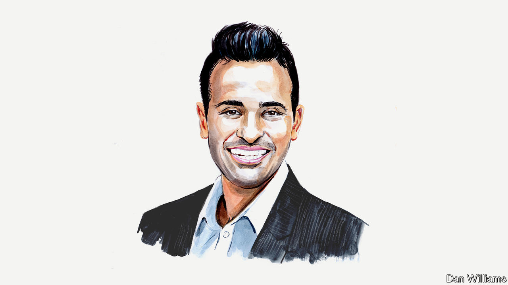

###### Woke business

# Stakeholder capitalism poisons democracy, argues Vivek Ramaswamy 

##### Citizens, not corporate chiefs, should tackle social issues, says the entrepreneur and author 

 

> Sep 14th 2022 

WHEN I FIRST started writing about the rise of “stakeholder capitalism” in corporate America—and its close cousin, the ESG (environmental, social and governance) movement in capital markets—I had to explain what these terms meant because they were new concepts to most audiences. Today I must explain what they mean for a different reason: the terms themselves are now widely familiar, but their definitions have been diluted by their greatest champions. That fact alone underscores the biggest problem of all with these movements.

Stakeholder capitalism refers—or at least used to refer—to the idea that companies should serve not just their shareholders, but also other societal interests. This notion stands in sharp contrast to shareholder capitalism, which calls for corporate executives to maximise shareholder return above all else. Proponents of this view, including the American economist Milton Friedman, worried that a shift away from shareholder primacy would make companies both less efficient and less profitable, leaving society as a whole worse off.

Thoughtful proponents of stakeholder capitalism argue that Friedman missed an important point: corporations do not exist in the state of nature, but exist only because society permits them to do so. Society endowed shareholders of corporations an extraordinary gift that ordinary persons do not enjoy: limited liability. This refers to the legal barrier that prevents anyone wronged by a corporation from holding an owner of that corporation personally liable.  has called limited liability “one of man’s greatest inventions”. Many economic historians believe it helped power the Industrial Revolution. They’re probably right. 

This is the strongest case for stakeholder capitalism. In return for this extraordinary gift, corporate shareholders owed an implicit obligation back to society: namely, that corporations ought to consider not only shareholder interests but broader societal interests when making decisions. This is what the world’s most influential proponent of stakeholder capitalism, BlackRock’s chief executive Larry Fink, meant when he proclaimed that “companies need to earn their social license to operate every day.”

This is a respectable view. Nonetheless I believe it falls short for legal and historical reasons that I lay out in “Woke, Inc”, my book published last year. In it I argued that the reason corporate law codifies shareholder primacy is not simply to protect shareholders, but to protect democracy. The creation of the limited-liability corporation was a potent tool to not simply unlock economic gains through the private sector, but also stop potentially limitless corporate power that could infect other spheres of society beyond the marketplace for goods and services. By limiting the focus of corporate boards to shareholders’ financial interests alone, corporate law intended to onfine the sphere of influence of corporations as a means of protecting democracy and other civic institutions from corporate overreach—just as society confers certain legal advantages to non-profit corporations in return for confining their activities to the sphere of charitable causes. Or at least, so I argued.

Reasonable minds can differ on this question, and this debate will take further book-length works to fully adjudicate. But as I awaited a rebuttal to my argument, something curious happened: the world’s greatest proponents of stakeholder capitalism responded with the surprising claim that actually stakeholder capitalism is indeed the same thing as plain old capitalism. In his letter from 2022 to America’s CEOs, Mr Fink asserted that “stakeholder capitalism…is not a social or ideological agenda. It is not ‘woke.’ ” (The emphasis is his). This has since become a popular refrain to defang Republican criticism of the ESG movement in particular.

But if “stakeholder capitalism is capitalism,” then why was it necessary to popularise the term in the first place? For the greater economic and political advantage enjoyed as a result by the people who get to coin the terms. ESG funds often charge many times more for investment funds that are nearly indistinguishable from those without the ESG title. Numerous alumni of BlackRock and other ESG-promoting financial institutions occupy senior roles in the administration of an American president who has himself voiced support for stakeholder capitalism. And our society’s approach to addressing important social questions such as climate change and racial inequity are more heavily influenced by the dictates of corporate chiefs in Davos than they are by the voices of everyday citizens in the public square.

This raises my greatest concern of all with stakeholder capitalism, no matter how it’s defined: its proponents are eager to strengthen the link between democracy and capitalism at a time when we should instead assiduously disentangle one from the other. Stakeholder capitalism is part of a broader worldview that holds that corporate leaders should play a fundamental role in determining and implementing a society’s core values. 

No citizen in a democratic society should want executives from $10trn financial institutions to play a larger role than they already do in defining and implementing social values. Part of what it means to live in a democracy is for those questions to be determined by the citizenry—publicly through debate and privately at the ballot box—where each person’s view is unadjusted according to the number of dollars that he controls in the marketplace.

The everyday citizen in Western democracies ranging from America to Britain now correctly senses that something is amiss. His voice counts for less when corporate elites use market power to settle political questions. The apostles of stakeholder capitalism convene in ski towns to decry the rise of populism without recognising that populism is itself an inevitable byproduct of their creed. 

Therein lies a great irony: a movement whose core justification was the need for capitalists to internalise the negative externalities of their actions has now created a new negative externality. It’s arguably the most damaging of them all: rampant and increasingly irresolvable cultural discord in democracies around the world. 

The social fabric of a diverse democracy depends on preserving certain spaces as apolitical sanctuaries, especially in a divided body politic like ours. Our system of unbridled profit-focused capitalism used to serve as perhaps the most important of those sanctuaries, but no longer. Stakeholder capitalism poisons democracy and partisan politics poisons capitalism. This is the great negative externality of stakeholder capitalism, and one that it ought to internalise by returning political power from its nebulous “stakeholders” back to citizens of nations.■

_______________


