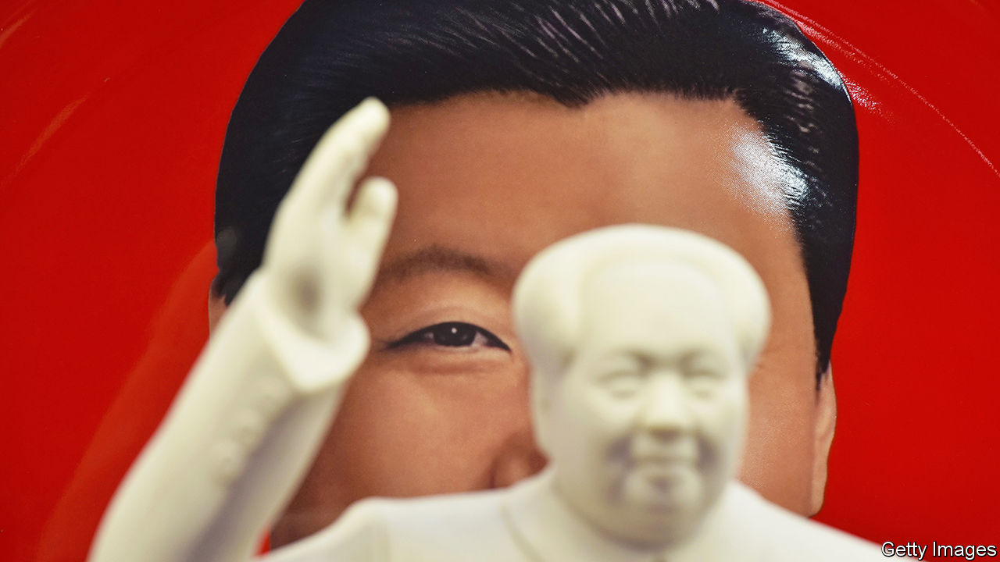

###### A bit more Mao-like

# How Xi Jinping might change the Communist Party’s constitution 

##### Two possible revisions could put him on a pedestal with Mao 

 

> Sep 22nd 2022 

When it comes to the top job, don’t expect any surprises at the Communist Party congress in October. There is little doubt that Xi Jinping will secure a third five-year term as party chief. But there will at least be some drama surrounding the party’s constitution. Observers will be watching to see how Mr Xi changes it. Even seemingly arcane revisions may signal that he sees himself on a par with communist China’s founder, Mao Zedong.

One area under scrutiny is Mr Xi’s philosophy, officially known as “Xi Jinping Thought on Socialism with Chinese Characteristics for a New Era”. Wide-ranging and vague, it is hard to define. Nevertheless, at the previous congress, in 2017, it was inserted into the constitution. That placed Mr Xi in a league above his immediate predecessors, Hu Jintao and Jiang Zemin. Their philosophies were also enshrined in the charter—but without their names attached. Deng Xiaoping’s name was inserted only after he had died, and his thinking is merely called a “theory”.

Mr Xi was the first living leader since Mao to be named as a guide to good Communist behaviour. Now there is speculation over the clunky name of Mr Xi’s philosophy. Party media have already begun using snappier forms. Some observers believe it will also be shortened in the constitution, to “Xi Jinping Thought”. Not only is that easier to say, but it evokes the founder’s philosophy, “Mao Zedong Thought”.

A second possible change would be more significant. Mr Xi has been called the helmsman of the country and the people’s leader—titles associated with Mao. But he has yet to re-establish the position of party chairman, a title that became almost an extension of Mao’s name. This tweak may sound blandly bureaucratic. But the title of chairman harks back to a style of overbearing leadership which was rejected by the party after the chaos and paranoia of Chairman Mao’s rule. In 1982, six years after Mao’s death, the position was abolished to signal that the party had adopted a more collective style of decision-making. To resurrect it would be a symbolic rejection of this post-Mao consensus, and a revealing marker of Mr Xi’s clout.

Mr Xi is China’s most powerful leader in decades, with a clutch of formal titles, including general secretary, at present the highest position in the party. He is also president (a largely ceremonial role) and head of the armed forces. Titles, anyway, are an imprecise measure of authority in China. In the early 1990s, as an old man, Deng Xiaoping wielded supreme power, though his only formal title was honorary head of the Chinese Contract Bridge Association. Mr Hu, by contrast, held the same positions as Mr Xi, but had less authority.

There could be a practical advantage to resurrecting the chairmanship role, says Ling Li of the University of Vienna. Mr Xi will be violating recent retirement norms if he stays on as general secretary at the congress. He has thus avoided anointing a successor. But by becoming chairman, Mr Xi would make it clear that he plans to remain in power indefinitely, argues Ms Li. That, in turn, might make him feel secure enough to name an heir, perhaps as vice-chairman or general secretary. Mao did much the same, cycling through four heirs-apparent before his death. A successor could be revealed “at a pace and in a manner that Xi finds most comfortable”, wrote Ms Li last year.

In 2016, as Mr Xi was accumulating power, an anonymous letter appeared for a brief time on a state-run website. “Hello, Comrade Xi Jinping. We are loyal Communist Party members,” it began, before cutting into the president for, among other things, ditching the party’s system of collective leadership and allowing himself to become the subject of a personality cult. Six years later those charges seem even more accurate, but it is hard to imagine any criticism emanating from the congress. Rather, the event is likely to kick off a new round of adulation for Mr Xi, with echoes of the Mao era. ■


