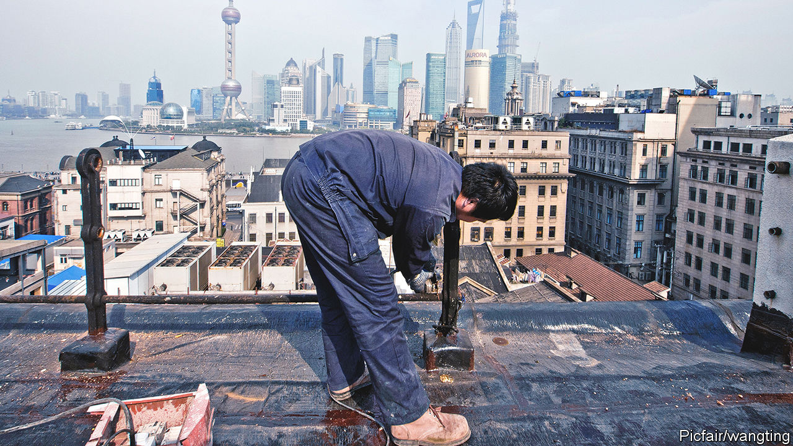
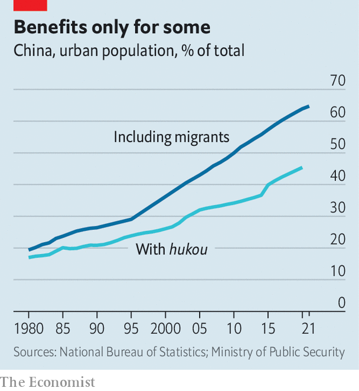
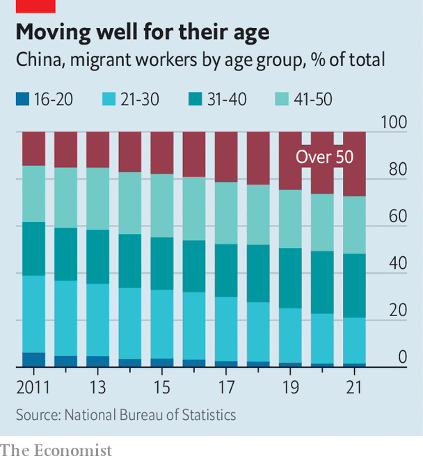

###### The widening gap

# Reforms to China’s hukou system will not help migrants much 

##### Big cities are still reluctant to give them social benefits 

 

> Sep 22nd 2022 

China’s netizens are usually cheerleaders for nationalist causes. So the recent showering of praise on Vietnam by some of them has been striking. A bout of it occurred last month when exaggerated news circulated on Chinese social media that Vietnam was preparing to abolish its  system of household registration, which makes it difficult for people from the countryside to obtain social benefits in cities. “Vietnam has completely surpassed China,” wrote one commenter on Weibo, a Twitter-like platform. “The future star of Asia”, enthused another. 

China’s equivalent of  is  (they are different pronunciations of the same term), a system devised in the 1950s to keep farmers in their villages. The Communist Party acknowledges ’s unfairness to a large share of China’s population, but despite numerous tweaks, its malign effects persist (as they will in Vietnam, where the system is simply going digital). Chinese officials may struggle to justify giving citizens different rights according to their place of origin, but they fret that equalising benefits would be colossally expensive. They also see the system as a useful brake on migration to the biggest cities, where they fear the spread of slums, crime and conflict with urbanites who are reluctant to share their superior schools and hospitals with people they regard as lower-class outsiders. 

In recent years, the issue of  reform has been front and centre. President Xi Jinping speaks of the need to  (make into urbanites) rural migrants—in other words, allow these 300m-400m people to enjoy the same access as other city-dwellers to education, health care, pensions, housing and government jobs. Smaller towns and cities have long been doing so. In 2019 the government said bigger ones, with up to 3m urban residents, should follow suit, and those with populations between 3m and 5m should ease their restrictions on obtaining local . The biggest cities were allowed to continue using a points system to determine migrants’ eligibility for benefits. This is based on criteria such as skills, education and social-security payments. 

Official reports are vague about how many cities with populations under 3m have already abolished their restrictions on obtaining local . In July , a state-run newspaper, said an “overwhelming majority” had done so. That may sound like huge progress. There are more than 600 such cities in China. Only about 30 are bigger, including Zhengzhou, the capital of Henan province in central China. It has been hailed by state media as a pioneer among cities with populations over 5m for unveiling plans this month to relax its  restrictions. 

But there is less to this than meets the eye. For most cities it is relatively easy to lower  barriers because they are not big magnets for migrants. The largest cities are the main destinations—though not Zhengzhou, which lies in a province renowned for exporting labour to other parts of China. And abolishing  barriers may not be quite what it sounds. As Charlotte Goodburn of King’s College London points out, applicants may still require proof of residency and employment (they will need such documents in Zhengzhou, if its plans go ahead). These are difficult for many migrants to acquire, as they often work without a contract and live in places that do not provide rental agreements. 

Local governments have little incentive to offer full social benefits to the poorest of migrants. But their revenues rely heavily on the property market. With the market now slumping, they are keen to attract migrants with stable jobs who are likely to be higher earners and therefore potential homebuyers. Zhengzhou has been struggling since early this year to boost demand for housing, by making it easier to get mortgages and for migrants to buy flats. 

Lifting  restrictions may not help any more than these other measures. On Weibo, commenters have heaped derision on the notion that people would flock to a city in such economic trouble. Some have also questioned why migrants would even want local . Many farmers fear that if they abandon their rural homes and farmland they will lose a fallback option should they fail to make ends meet in the cities: they often leave behind elderly family members as caretakers of their land-use rights. “I’ve been in Zhengzhou for 13 or 14 years and haven’t obtained ,” wrote one netizen. “But one’s own land is sweet-smelling, isn’t it?”

 


Even by one of its own much-touted measures, the central government’s efforts at  reform are failing to produce the desired results. In 2014, less than one and a half years after Mr Xi took power, the government published plans for a “new style” of urbanisation. It called for a reduction by two percentage points in the gap between the proportion of people living in cities (then 53.7%) and the proportion with urban  (about 36%) by the end of the decade. In fact it had widened by about one percentage point (see chart). Last year saw the first narrowing of the gap in years. In July the government issued new plans, calling for a “conspicuous” reduction by 2025, but not giving a target. 

 


The new plans still express anxiety about the “over-rapid” growth of the biggest cities and do not call for the scrapping of their  restrictions. The central government clearly sees the points system as a way of allowing them to suck in talent while erecting barriers that make it difficult for those without sufficient points to use local public services. 

For young migrants, lack of access to free schooling for their children is a big concern. If they cannot enroll them in state schools, they have little choice but to send them to private ones for migrants that are costly and often shoddy—or else leave their children at home in the countryside (tens of millions live apart from both parents). China’s migrant population is ageing, however. Many of those approaching retirement age, having toiled for decades in cities, are now wondering whether to stay or go back, if they still have a home in the countryside. Caring for them in their twilight years is a burden that cities show no enthusiasm for taking on. ■


