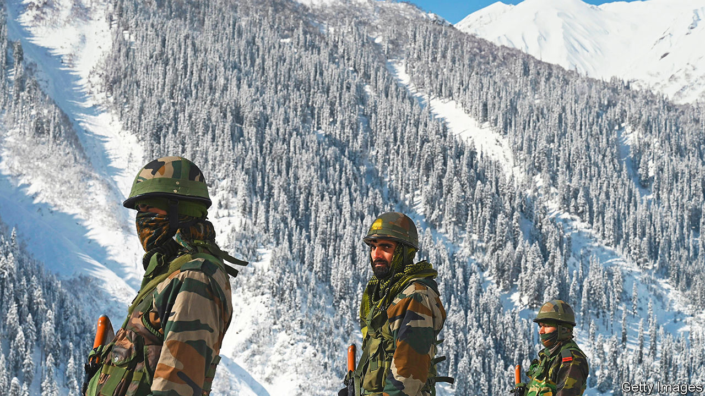
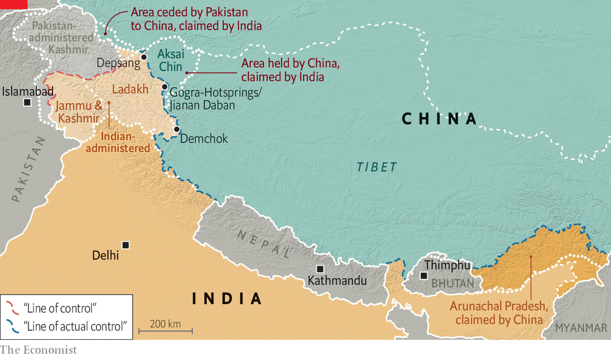

###### Still frosty

# Some progress in the border dispute between China and India 

##### Yet a mutual snub suggests it is far from over 

 

> Sep 22nd 2022 

Xi jinping seemed anxious to make up for lost time on his first trip abroad since the pandemic began. At a two-day summit of the Shanghai Co-operation Organisation in Uzbekistan this month, the Chinese president’s schedule featured a dozen meetings with national leaders. Yet there was one notable omission: India’s prime minister, Narendra Modi. Not only did the two not meet, they did not appear to exchange greetings when they stood next to each other at a group photo.

Some frostiness was expected given they had not met since a long-running dispute over a shared Himalayan border flared into clashes that killed 20 Indian troops and at least four Chinese ones in June 2020. On September 8th this year, however, both sides began withdrawing forces from a fifth point on the border, after pulling back from four others in the past two years. The timing raised hopes of a Xi-Modi meeting. Their mutual snub suggests the border dispute is stabilising, yet far from over. 

This matters not just because it has the potential to spark a broader conflict between Asia’s two biggest countries, which both have nuclear weapons and fought one brief border war in 1962 (China won). It has also prompted a historic change in India’s military posture, forcing it to shift resources away from Pakistan—its longtime adversary—and to enhance defence ties with America and its allies, especially Japan and Australia. They too are seeking to counter China’s military ambitions.

Managing relations with India has thus become one of Mr Xi’s biggest diplomatic challenges. He is attempting to assert China’s territorial claims, while positioning it as a champion of the developing world and undermining American efforts to build a coalition of like-minded democracies, including India. As well as alienating Mr Modi, who shares some of his authoritarian instincts, Mr Xi also risks losing access to the vast and fast-growing Indian market for Chinese companies that are struggling to grow at home and in the West. 

 


The dispute has its roots in the fuzzy frontiers sketched out when India was British-ruled. China claims the Indian state of Arunachal Pradesh. India claims a swathe of Chinese-controlled territory called Aksai Chin (see map). Since 1993 they have had protocols to stop encounters on the de facto border, known as the Line of Actual Control (lac), from escalating. Those include not using guns when border patrols clash. But as each side has improved border infrastructure in recent years, encounters have become more frequent—and more violent.

The latest flare-up began around May 2020, when Indian officials say China moved new troops and equipment towards the lac on the fringes of Aksai Chin. China said it was responding to new Indian infrastructure in the area. Each accused the other of breaching the lac and moved in thousands of troops and heavy weapons. Brawls erupted, culminating in the clash that killed 24 soldiers—the first combat deaths on the border since 1975.

The most recent disengagement comes after a 16th round of commander-level talks in July and mirrors the earlier withdrawals. Between September 8th and 12th, both sides pulled back forces from an area that India calls Gogra-Hotsprings and China calls Jianan Daban. That effectively creates a buffer zone on either side of the lac in which neither side conducts patrols or has any structures. It also leaves two main areas where the standoff continues—one near the village of Demchok and the other on the Depsang plains farther north. 

More talks are expected to try to create similar buffer zones in those areas. “From the standpoint of increasing stability and preventing crises, these buffer zones play a very important role,” says Taylor Fravel of the Massachusetts Institute of Technology. But the latest agreement covered a relatively small area, and was military, rather than political. “So I would not view it as a diplomatic breakthrough making possible a bilateral summit,” he added. Critically, China still rejects Indian demands to return to the status quo prior to April 2020.

Mr Xi’s motives are clear. Having placed new emphasis on territorial issues, he wants to show progress and stability ahead of a Communist Party congress in October that is expected to grant him a third five-year term as leader. He also wants to focus on Taiwan, mindful of recent American moves to enhance ties with the self-governed island and of Russia’s troubles in Ukraine. Besides, China has upgraded its infrastructure in Tibet and stationed enough forces there to respond quickly to another crisis on the Indian border. 

Mr Modi, too, appears anxious to avoid further clashes, given China’s superior firepower. For him, though, the calculus is more complicated. He has been facing criticism within India, including from retired military commanders, for ceding territory to China. Rahul Gandhi, a prominent opposition politician, tweeted on September 14th that Mr Modi had “given 1,000 sq kms of territory to China without a fight” and asked how he planned to retrieve it. That is not a realistic option. Neither, for the moment, is reconciliation. ■


