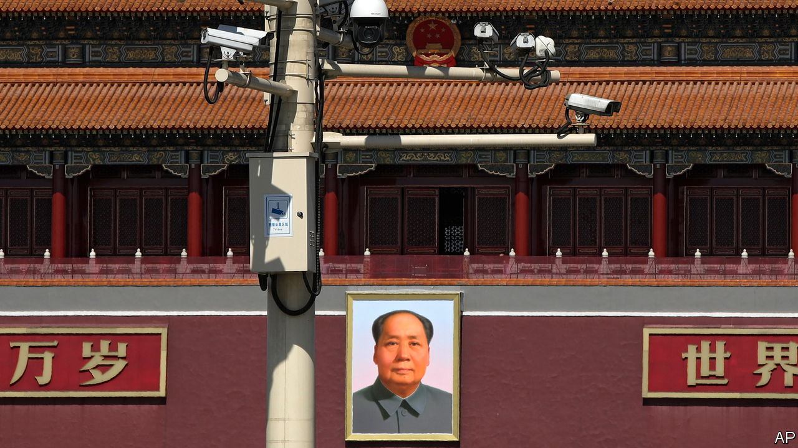

###### Technology and social control

# In China, surveillance crushes lives—and improves them 

##### Josh Chin and Liza Lin explain how in “Surveillance State” 

 

> Sep 22nd 2022 

By Josh Chin and Liza Lin. 

In the maoist era, the Chinese Communist Party used dossiers containing information on each person’s family background, education, political activities and job history to determine their treatment by the state. For critics of the government, these were, in the words of Tsering Woeser, a Tibetan poet, akin to “an invisible monster stalking you”. 

In “Surveillance State”, Josh Chin and Liza Lin of the  chart the replacement of the by a more comprehensive and powerful monitoring system. This new system has facilitated mass oppression and human-rights abuses—yet at the same time, the authors argue, it has improved the lives of some.

The explosion in surveillance technology, from facial-recognition cameras to the monitoring of social media, has given the Chinese state more insight than ever into citizens’ lives. For groups the party views as suspect, such as the Uyghurs, it is oppressive. “Surveillance State” opens and closes with haunting testimony from Tahir Hamut Izgil, a Uyghur poet whose blood, voice, irises and face were catalogued by police as his friends disappeared into the gulag. It describes the physical web of surveillance that spread around Mr Izgil and his wife in Urumqi, capital of Xinjiang, in 2017: clusters of cameras “clinging like malevolent barnacles” to lampposts; police armed with smartphone scanners.

But while surveillance technology is used to terrorise people in China’s far west, on the east coast it has benefited others. In Hangzhou, the home city of Alibaba, one of China’s tech giants, the company’s “City Brain” project revolutionised traffic control. As Mr Chin and Ms Lin describe, Alibaba developed an artificial-intelligence system that could spot traffic accidents and optimise the sequence of traffic lights to ease the flow of vehicles, particularly ambulances. Within two years of the project’s launch in 2016, Hangzhou dropped from fifth to 57th on the list of China’s most congested cities.

This acknowledgment of the upside of 21st-century surveillance in China distinguishes the book from much that is written on the subject. So does its awareness of the technology’s blind spots: several accounts of stunning feats of surveillance in state-run media turned out, on closer inspection, to be “embellished or fabricated entirely”. “Surveillance State” also looks beyond China’s borders, exploring the use of Chinese technology to stifle dissent in Uganda, and at the way Chinese-style methods have been employed by American police and prosecutors.

In winning prose, Mr Chin and Ms Lin make a nuanced argument. The party uses this technology to control and censor people. But in the absence of fair elections or a free press, surveillance is also a tool for gauging public opinion. As Meng Tianguang, a political scientist, tells the authors, the government has tried to devise systems capable of “automatically detecting signs of negative shifts in social-media conversation”, intelligence that can then contribute to decision-making.

Covid-19 has been the ultimate test of these systems. Across the world, concerns about privacy were superseded by the data requirements of public-health authorities. In China, where the outside world is depicted as a plague-ridden disaster zone, the price of “zero covid” has been zero privacy. In its impact on public tolerance for state snooping, Mr Chin and Ms Lin liken the pandemic to the terrorist attacks of September 11th 2001. 

Yet already there are signs, especially in cities, that the Chinese are wearying of the strict pandemic controls that surveillance has enabled. “Surveillance State” is an engrossing account of how, and why, the technology has become so pervasive. ■

