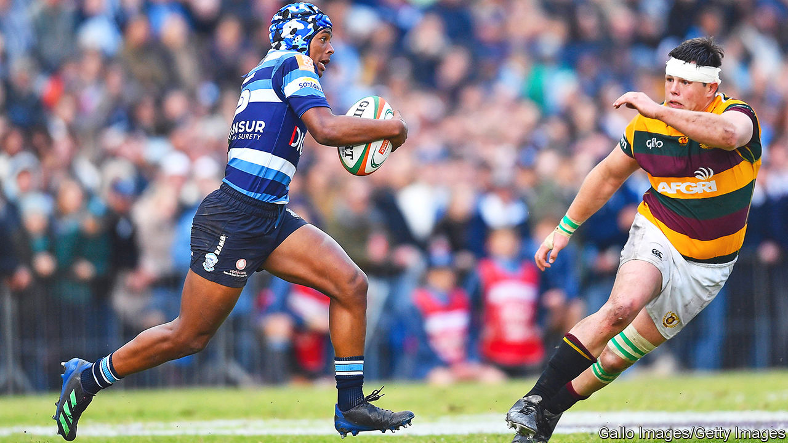
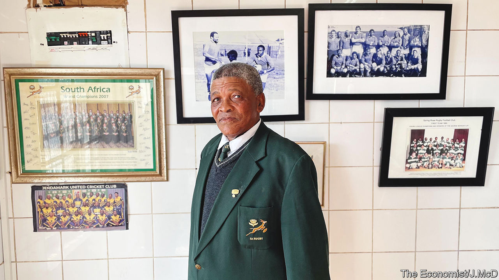

###### Try, the beloved country

# Rugby brings South Africa together—if only for 80 minutes 

##### The sport reflects the country’s uneven progress and enduring dreams 

 

> Sep 22nd 2022 

Perhaps it is the beer that has flowed since early morning, or the sugary food on sale at the kiosks, but as kick-off approaches in Paarl, the crowd is nearing a delirious crescendo. Every year the town in the South African winelands hosts what may be the biggest game of school rugby in the world. Along the main road, trees are wrapped in the blues and white of Paarl Boys’ High School or the green, gold and maroon of Paarl Gimnasium, local teams locked in a historic rivalry.

Not that anyone is on the streets. They are all in Faure stadium, watching school bands crank out fight songs for rows of pupils to bellow in unison, a scene that suggests Italian football “ultras” conducting a glee club. Then come the cheerleaders, parachutists billowing with school colours and, finally, a rugby match (pictured). The vibe is reminiscent of high-school football in the American South. But the scene is quintessentially South African. 

“Rugby is part of our culture,” says Hendrik Swart, a parent. “It’s rugby and biltong and  and close-knit family.” Rugby has long been associated with Afrikaners, white South Africans of Dutch and Huguenot descent, who embraced the sport after it was brought to what was then the Cape Colony by English public-school types. Near the stadium in Paarl is a giant abstract monument to the Afrikaans language. 

Under white rule, both rugby and the national team, known as the Springboks, were symbols of white South Africa’s resistance to change. As Nelson Mandela put it, rugby was “the application of apartheid in the sports field”. In his autobiography, “Rise”, Siya Kolisi, the Springboks’ current captain—and the first black player to be granted that honour—writes: “For so long, the Springbok emblem of a leaping antelope represented only a small part of the country and reflected how that part felt about themselves: that rugby was a sport for real men, white Afrikaners.” 

Such attitudes are largely consigned to the past. In 2019 Mr Kolisi captained the most diverse rugby team in South African history to victory in the World Cup. But the sport is still a symbol: of a country where racial progress is real but uneven, where change at the top is clearer than at the bottom, yet which still yearns to realise the tarnished dream of the rainbow nation.

The Robben Island league

If outsiders think of South Africa and rugby, they tend to recall the World Cup of 1995, held in the country a year after Mandela became its first black president. The master politician embraced the Springboks as part of a bid to woo recalcitrant whites. At the final Mandela famously wore the green-and-gold team jersey and joined the victorious captain, Francois Pienaar, on the field.

Black South Africans rallied to the team; Mandela was praised by Afrikaners who once deemed him a terrorist. “This was one of the final blows to exclusive right-wing Afrikaner nationalism,” wrote Frederik van Zyl Slabbert, a politician and academic, after the final. “I saw and heard one of the pot-bellied brigade whisper through his tears: ‘That is my president’.” 

The redemptive story of 1995 was memorably told by John Carlin in his book, “Playing the Enemy”, and less memorably depicted in “Invictus”, in which Morgan Freeman seems to think Mandela spoke just like the narrator of “The Shawshank Redemption”. It was a genuinely pivotal moment. But it has occluded the role that rugby had already played for generations in black and mixed-race communities. In fact, rugby was not a white sport belatedly embraced by non-whites, but a sport enjoyed by all races—only separately. 

“We didn’t see it as a white sport,” says Temba Ludwaba. “It was ours.” Under apartheid, when rugby was run on racially demarcated lines, Mr Ludwaba played for top black teams. Some trace their origins to the late 19th century, when British colonialists taught the game to Xhosas of the Eastern Cape as part of a supposedly “civilising” mission. (The Xhosa word for “rugby”, , means “a thing which is not round”.) When men went to work on farms and in mines, they took the sport with them. Robben Island, where Mandela was imprisoned, had a rugby league.

“Eastern Cape is the mecca of black rugby,” affirms Zola Yeye, who played for township teams and later joined the Springboks’ coaching staff. When visited, Mr Yeye had invited Mr Ludwaba and another rugby legend, Lucky Mange, to his butchery in New Brighton, a township on the outskirts of Port Elizabeth. Out back, meat roasted on an open fire; photos of the men’s playing days were on display out front. Did they resent being barred from playing for the Springboks? 

Yes and no, says Mr Mange. They wanted to show that they were as good, if not better, than Afrikaners; at the same time, for political reasons, they supported South Africa’s sporting opponents. Black rugby was “tough”, like that played by whites, “but with flair”, says Mr Yeye. It also gave structure to young men’s lives. “There were roles, there were rules, there was trust,” writes Mr Kolisi, who grew up in Zwide, a neighbouring township. 

Mr Kolisi was born on the last day before apartheid laws were rescinded in 1991 and was brought up by his grandmother. Too poor to have toys, he pretended that a brick was a car: “I could have ended up a  [gangster] but it was rugby that saved me.” He played games at Dan Qeqe stadium, the historic home of township rugby, which also hosted the funerals of anti-apartheid heroes. “Rugby at the time was a catalyst for social cohesion in the township,” remembers Dan Ngcape, who used to run a black rugby association.

These days the stadium is dilapidated. On a recent Friday the field was overgrown and strewn with weeds. The changing rooms had been ransacked. Truant teenagers lined the pockmarked concrete stands, getting drunk and smoking drugs.

For Mbulelo Gidane, who once captained the African Bombers team that played here, the scene was symbolic of the enduring poverty in South African townships. “All facilities in the township have been destroyed,” he says. “The community is not guarding its own.” He blames himself as a local leader of the African National Congress (anc). “We failed our people,” he sighs, looking out at the field. “We must accept that.” Such contrition from a member of the ruling party is vanishingly rare.

Ex-players are immensely proud of the likes of Mr Kolisi. At the same time they lament the decline of township rugby, noting that the black players who achieve stardom are plucked from state schools by the elite private ones that groom future professionals. Mr Kolisi was recruited by Grey High School, where for the first time he wore socks and had enough to eat. “There is no way that black schools can produce Springboks,” says Mr Ngcape. This, he suggests, is emblematic of what has happened more broadly since 1994. A black elite has emerged but, for the black majority, there are too few opportunities.

Out of many, 15

Racial “transformation” is a thorny subject in South Africa, including when it comes to rugby. After the Hollywood ending in 1995, the sport was slow to change. In 1997 a Springboks coach was sacked after he was taped using a racial slur. A few years later (in contested circumstances), a white player refused to room with a mixed-race one. 

The anc put increasing pressure on the authorities to pick black and mixed-race players. In 2005 the minister for sport said that winning was less important than the team’s racial composition. Black players, for their part, resented being seen as “quota players”. “There were times that I felt I was in the team just because of my skin colour,” Mr Kolisi has said. “And I hated it.”

 


When Rassie Erasmus became coach of the Springboks in 2018 he talked openly with the squad about how their team had to look like the rest of South Africa. Yet he stressed that there was enough talent, recalls Mr Kolisi, “for us to be competitive and transformed all at once”. He would showcase equality of opportunity, not diversity for diversity’s sake.

Mr Kolisi’s first game as captain of the national team (under Mr Erasmus’s stewardship) was a euphoric moment. Fans from the Eastern Cape travelled by minibus to Johannesburg, singing African spirituals. Springbok games are broadcast simultaneously in English, Afrikaans and Xhosa. As Mr Kolisi recalls, that day the Xhosa commentary, voiced by Kaunda Ntunja, resembled a sermon by a revivalist preacher:

Siya is the first black player in history to captain the national team…Siya is our grandson, our son, our nephew, our younger brother…A cement truck with no reverse gear! Let the teams battle each other!

At first Mr Erasmus stressed that the team could only inspire the country if it was winning games. But in 2019, when South Africa reached the World Cup final in Japan, he talked about what victory by this particular team might mean to those struggling back home. In “Chasing the Sun”, a fly-on-the-wall documentary, he tells the squad: “Rugby is not pressure. Pressure is not having a job, losing a child…” He tells his captain: “You are fighting, Siya, for the next lightie [child] in Zwide to not suffer like you suffered.”

Cheesy? Maybe. But Mr Erasmus, now South Africa’s director of rugby, and his team tap into profound feelings. South Africa is a patriotic country, yet one in which tensions are high and trust is low. Anything that awakens the dormant dreams of reconciliation and progress is cherished—and can unleash scrumloads of pent-up emotion. At the same time, the Springboks embody South Africans’ desire to be known for their wide-ranging achievements, not just the stereotypes of corruption, economic decline and high crime.

Back in Paarl the players—several of them non-white—are taking to the field, future Springboks almost certainly among them. The grandfather of one says that it has been tough for him to adapt. “You need to be ten times better [as a non-white player] to get a chance.” Yet that is not the universal view. Rabbie Leslie, whose son comes from a township near Mr Kolisi’s, says he is proud “to be able to give my child the opportunities I did not have, for him to be part of this tradition”. Might he play for the Boks one day? “I hope so. They make me proud to be South African.” ■

