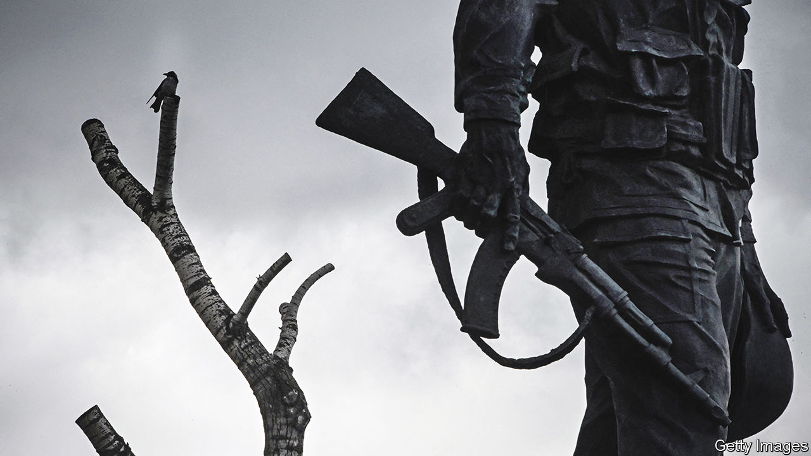

###### Home Entertainment

# The Soviet invasion of Afghanistan echoes in today’s war 

##### Many of the stories in Svetlana Alexievich’s “Zinky Boys” could have come from Ukraine 

 

> Sep 22nd 2022 

The conscripts came mostly from the far reaches of Russia. Some were told they were being sent to help with the harvest, only to be thrown into a war zone. They lived in fear of the local population, and of the enemy, whom they called “ghosts”. “We killed wherever we could,” one said. “We killed wherever we wanted.” Their rations and equipment were outdated, often by decades. As she began to suture an elderly woman’s wounds, an army nurse saw the thread between her fingers turn to powder. It had been sitting in a Soviet warehouse since 1945. 

These stories might almost have come from Ukraine, now the graveyard of tens of thousands of invading Russian soldiers and conscripts from the “people’s republics” of Luhansk and Donetsk. But they are from a different war and another era. More than three decades ago, Svetlana Alexievich, a Belarusian journalist, tracked down and interviewed scores of soldiers who survived the Soviet invasion of Afghanistan that began in 1979, and the mothers and wives of some who did not. The dead, who were brought home in zinc coffins, inspired her book’s title, “Zinky Boys” (sometimes translated as “Boys in Zinc”)

Ms Alexievich is a rare author who removes herself from her pages and puts the testimonies of her subjects, recorded, transcribed and edited, centre stage. “I strive desperately (from book to book)”, she wrote in the introduction to “Zinky Boys”, “to do one and the same thing—reduce history to the human being”. She eschews tidy narratives, elegant descriptions and flashy turns of phrase. Only the weary, disembodied voices remain. Thousands speak through her six books, the most recent of which, “Second-hand Time”, helped win her a Nobel prize in 2015. Her work is an unequalled oral history of the Soviet Union and its collapse. 

Some 15,000 Soviet soldiers died in Afghanistan in a conflict that lasted a decade. Many more Russians are thought to have perished in Ukraine in seven months. Scenes in “Zinky Boys” are a reminder of how little has changed. Mothers and wives from forsaken towns mourn the dead. Official lies and slogans are meant to drown out their grief. Young men and women are broken by war. 

Their atrocities haunt them for years. Hardened soldiers steal the uniforms of newly arrived conscripts. A dying man begs a friend not to tell his mother what he has seen on and off the battlefield. “Our children will grow up and deny their fathers ever fought here,” another despairs. Russian troops who invaded Ukraine will go home with similar stories. 

Few of their compatriots will want to hear them. Even fewer will think of recording or writing them down. Because of “Zinky Boys”, Ms Alexievich was dragged through the courts in the 1990s, accused of defamation and desecrating the soldiers’ honour. Prison awaits anyone who writes a similar book in Russia today; it may be decades before ordinary Russians come to terms with the crimes committed in their name in Ukraine. The voices of the Afghanistan veterans, curated by Ms Alexievich, may help show the way. ■

