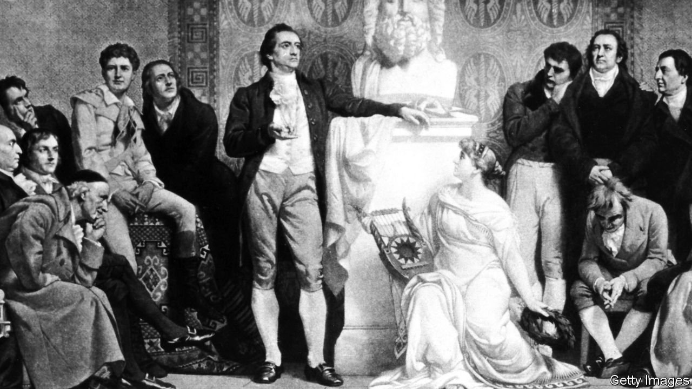

###### Intellectual history

# The “Jena Set” was the heart of German Romanticism 

##### Andrea Wulf brings them back to life in “Magnificent Rebels” 

 

> Sep 22nd 2022 

By Andrea Wulf. 

At a four-day house party in a corner of the Duchy of Saxe-Weimar in 1799, the guests indulged in “vertiginous bouncing between poetry, art, science, philosophy and religion”, as Andrea Wulf puts it in her group biography of what she calls the “Jena Set”. The relatively free-thinking regime at Jena’s university, and the proximity of Goethe and Schiller, brought to the town a gang of young German intellectuals who played an outsize part in the movement that came to be known as Romanticism.

Two brothers and their partners were at the centre of this circle: August Schlegel, a translator, writer and critic, and his wife, Caroline; and August’s younger brother, Friedrich, also a writer and critic, and his partner, Dorothea, who was a daughter of the so-called “Jewish Socrates”, Moses Mendelssohn. The women were more than helpmates; they wrote some of what appeared under the brothers’ names. 

Caroline, in particular, was a dynamo. She had been imprisoned by the Prussians when she was 29 because of her links to French revolutionaries. Later she married August and moved to Jena; after divorcing him she married a philosopher-prodigy, Friedrich Schelling, who was younger than some of his students and whose university lectures sparked something akin to Beatlemania. Novalis, a poet, called Caroline the heart of the group.

The Jena Set’s favourite themes included the unity of man and nature, the value of imagination and the need to “poeticise” the sciences, as Novalis put it. Schelling told his students that the works of artists and poets, not scientific treatises, provided the best way to comprehend nature. According to Ms Wulf, the mainspring of the Jena Set’s ideas was a concept of the “Ich”, or self, developed by Johann Gottlieb Fichte, a philosopher who taught in Jena from 1794 to 1799. 

It was never clear quite what Fichte meant by his “Ich”. His writing was dense, as Ms Wulf’s quotation of it illustrates: “the non-Ich can be posited only in so far as an Ich is posited in the Ich (in the identical consciousness), to which it (the non-Ich) can be opposed…” Heinrich Heine joked about a widespread misconception that “the Fichtean self was the self of Johann Gottlieb Fichte”, who “denied the existence of anything else”. What, mused Heine, would Mrs Fichte have made of that?

Keeping track of this cast and their ideas can be a challenge. Not only does it include the Schlegels, a Schelling, a Schiller and a Schleiermacher, but nearly half the male characters are called Friedrich. Yet from this ungainly material Ms Wulf somehow spins a lively yarn—as if Iris Murdoch had set a novel during an especially muddy phase of German metaphysics. Her prodigious research lets her conjure the bygone streets of Jena, with its seven bookshops, 41 butchers and 16 wig-makers, and the romances, rows, alliances and sorrows of its inhabitants.

People no longer “talk about Fichte’s self-determined Ich”, she writes, “because we have internalised it”. Happily, this is not the case. Rousseau has a stronger claim to have carved the modern conception of the self, not simply because he came first—he died when the Jena Set were children—but also because readers understood what he wrote. Yet Ms Wulf says nothing about Rousseau’s influential picture of the introspective free spirit that feels at one with nature and at odds with society. She mentions Rousseau only in passing, to note his ideas about childhood, his political concept of the general will and his defence of male supremacy.

A century ago Anglophone intellectuals were more aware of German ideas than they are today. Ms Wulf is to be thanked for bringing some neglected thinkers vividly to life. But she tries to swing the pendulum too far. She claims that the Jena Set “changed our world…irrevocably”. Yet much of the credit she awards them would in a less parochial account be more liberally distributed—not just to Rousseau but to Montaigne, Descartes and Locke. ■

