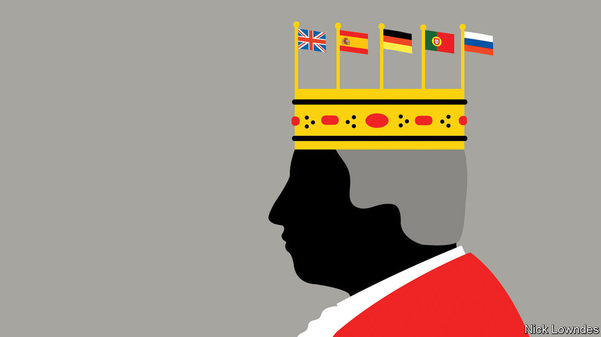

###### Johnson

# Translating royal names is a relic of European history 

##### It is time to give it up 

 

> Sep 22nd 2022 

The weekend after Queen Elizabeth II died, the continental European press was much taken with the arrangements for the royal transition. But readers of the —which explained in Catalan the change in titles of the former Prince of Wales and his wife—might have been a bit baffled. They would have encountered a few familiar people: Elisabet II was the late queen, and the former Príncep Carles is her son. But who is this Llitera of which the paper spoke? Readers on Twitter figured it out: a  is a stretcher or a bunk-bed in Catalan, or a translation of the Spanish , little bed. The paper quickly restored the new queen consort’s name to Camilla.

Countries have differed on whether and when to translate the names of the royal family. The Spanish-language media have gone for Carlos, but left Camilla alone. Outlets disagree on what to do with the others; Prince Guillermo’s wife may be Catalina, or she may be Kate. Guillermo’s brother is sometimes Henrique, sometimes Harry (perhaps because he is not expected to be king, or perhaps because Harry, unlike Henry, has no obvious translation). His wife, though, is just Meghan, for which there is no Spanish equivalent. The Portuguese papers tend to translate, while Brazilian ones leave Elizabeth and Charles alone. Russian media, following a Germanising tradition, went with Karl.

In France, Germany and elsewhere, the media have largely left the royal names in their English originals. But these countries have their own quirks. In Germany, the departed monarch was rarely . She was  If that seems odd, remember that in English the last monarch of Germany was the kaiser, rather than the emperor. (Kaiser is merely a German spelling of Caesar, just as “tsar” is a Russification of it.)

It used to be common to translate all manner of names. Scholars like Copernicus often published under Latinised names during the Renaissance (in Poland, where he was born, he was Kopernik). Translating the names of people who moved countries continued for centuries. Chopin’s friends didn’t call him Frédéric at the pub in Warsaw; he was born Fryderyk before moving to France. Meanwhile Spain has several places named after the French writer Julio Verne, and 19th-century Spaniards got their communism from Carlos Marx. They heard about José Stalin and Adolfo Hitler into the 20th century. 

The translation of names seems to belong to another era, when Europe thought of itself as “Christendom”. Translation was easy, since virtually everyone bore the name of an early saint or biblical figure, which had equivalents in most languages. Germanic names made their way across the continent with conquests by Goths, Franks and the like. Names such as Henry and Robert soon had equivalents across most of Europe too. 

But today, the likes of the Royal Spanish Academy say only popes, saints, other religious figures and, yes, monarchs and their family members should be translated. That holy company is a tell: if monarchs no longer tout the divine right to rule, they (like the saints and the pope) are still a class quite apart from their subjects. Not that it is impossible to join the club, as Catalina Middleton has found out. But the odd pairing of Kate’s ordinary English surname and her translated given name captures how out-of-date translating people’s names is in 2022.

Charles I of Spain, who as Charles V reigned as Holy Roman Emperor, was born in what is now Belgium and spent much of his life fighting around Europe. He is rumoured to have said: “I speak Spanish to God, Italian to women, French to men, and German to my horse.” The quote is unauthenticated, but it is not preposterous. The Habsburg emperor’s biography recalls a time when the royals belonged to Europe as a whole as much as to any one country. 

But that age is over. Perhaps it is time to give up translating monarchs’ names altogether, as out of step with the rhythm of modern nationalism. The head of the house formerly known as Saxe-Coburg-Gotha now belongs to Britain and other Commonwealth realms, not to Germany, Russia or Portugal. To call him a name he would hardly recognise seems less courteous than it might once have done. For their part, the Germans seem divided on whether to call him  or . The second option makes more sense; titles translate even when names don’t.

So those foreigners who wish to hail the new king should practise: 

