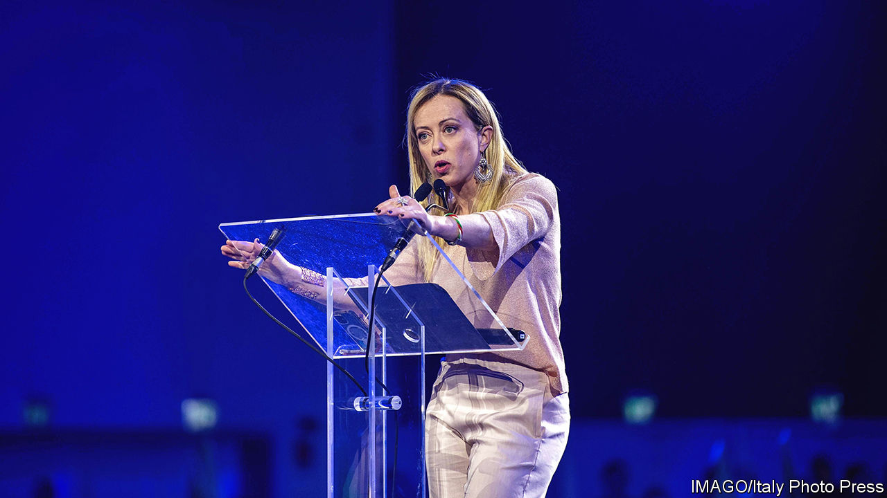
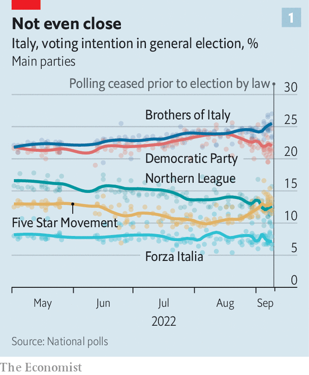
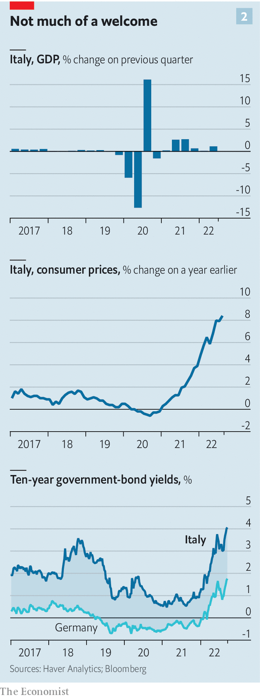

###### The Brothers are coming

# Giorgia Meloni and her Brothers of Italy look set to win the next election 

##### How might a coalition led by the hard right govern? 

 

> Sep 22nd 2022 

The woman who smiles winningly at voters from the electoral posters of the Brothers of Italy (fdi) party could scarcely be more reassuring. , say the posters: “Ready”. The message is that the woman, Giorgia Meloni, leader of the fdi, and her Brothers are prepared for government after Italy’s election on September 25th. Reassurance has been an important part of Ms Meloni’s campaign.

It was not always that way. There was a time when she warned that “There can be no possible mediation.” In a gravelly—even menacing—voice, she continued: “Yes to the natural family. No to the lgbt lobby. Yes to sexual identity. No to the ideology of gender.” And then she roared out: “No to mass immigration! Yes to jobs for our [compatriots]! No to big international finance! No to the bureaucrats of Brussels!”

Ms Meloni, whose party is expected to come first in this weekend’s election, was once an extremist. She joined the youth movement of the neo-fascist Italian Social Movement (msi) and at the age of 19 praised Italy’s Fascist dictator, Benito Mussolini. But then plenty of people who are now moderate left-wingers belonged to Communist parties at the same age. 

What is notable about Ms Meloni’s Eurosceptic harangue is that it was delivered barely three months ago: on June 12th, to a rally organised by Vox, a Spanish hard-right party. Two questions hang over Ms Meloni and her party, which is expected to form a coalition government with the hard-right Northern League and Silvio Berlusconi’s more moderate Forza Italia party. The first is what she truly believes. The second is whether, against a background of war in Europe, energy shortages, inflation and looming recession, she will have much scope to put her ideas into practice.

When Ms Meloni says her party has “handed fascism over to history” and that it “unambiguously condemns the suppression of democracy” in Italy in the 1920s, there is good reason to believe her. The Brothers, the defunct National Alliance from which they split, and indeed the msi from which the National Alliance in turn stemmed have all played by the rules of democracy since the foundation of the Italian republic in 1946. 

The extent of the Brothers’ dominance would depend on the size of the right’s majority and the share of votes and seats for each of the partners in the alliance. Given the idiosyncrasies of Italy’s electoral system, it is conceivable that a substantial plurality of votes could even translate into a two-thirds majority in parliament. That would, in theory, allow the right to change the constitution, introducing a presidential system, without a referendum. Not even their adversaries believe that is politically viable. But, warns Enrico Letta, the leader of the centre-left Democratic Party (pd), the biggest movement on Italy’s fractured left, “In a parliament in which [Ms Meloni] gets 40% of the seats, she will become uncontrollable.” 

That Ms Meloni’s chief rival should claim she represents a threat is hardly surprising. But she and her populist allies in the League have also come in for criticism from the editor of a newspaper of the centre-right. “I think they could be very dangerous. But they know what is needed [so as] not to appear dangerous,” says Claudio Cerasa, the editor of  and author of “The Chains of the Right”, a recent book that argues Italy’s radical right is in thrall to conspiracy theories. 

 


Others, though, disagree. “[Giorgia Meloni] is a conviction politician and she is certainly right-wing,” says Giovanni Orsina, who teaches political science at the luiss university in Rome. “But part of that is a belief in the national interest, and that makes her a realist. She tends to see the world as it is.”

According to those who know her, Ms Meloni is aware of having reached the cusp of government without a wide circle of expert advisers. She has surrounded herself with a tight-knit group of confidants that includes her brother-in-law. But she knows she will need more than that. Mr Orsina expects that the most prominent posts in the new cabinet would go to people of recognised international standing. She can count on the services of Giulio Terzi di Sant’Agata, who became involved with the Brothers after serving as foreign minister in the non-party administration of Mario Monti of 2011-13. Italy’s representative at the European Central Bank (ecb), Fabio Panetta, as well as another former Bank of Italy executive, Luigi Buttiglione, are among those said to be in line for the crucial finance ministry. The outgoing Mario Draghi’s minister for ecological transition, Roberto Cingolani, is tipped to remain.

On Ukraine, Ms Meloni has taken a firm pro-nato line, so the chances of immediate friction with America are remote, despite the friendly approach to Russia taken in the past by her leading allies. The relationship between a future hard-right government and the eu would be more complex. Mr Letta fears that, with the loss of Mr Draghi as prime minister, the eu “will lose an engine and acquire a brake”. Ms Meloni’s anti-federalist views align her more closely with Poland and Hungary than with France or Germany. On September 16th she sprang to the defence of Viktor Orban’s government after the European Parliament deemed Hungary was not a full democracy. “Orban won the elections, several times by a sizeable margin with all [the other parties] ranged against him,” she said.

Italy’s economic dealings with Europe have overlapping dimensions. One concerns its public accounts and its role in stabilising—or destabilising—the euro. Italy’s debts rose to 155% of its gdp during the pandemic. Thanks to a strong economic recovery, and the debt-eroding properties of inflation, the ratio has come down a bit since. But its future trajectory is highly uncertain, as growth falters and government spending increases.

A hard winter ahead

The economy grew at an annualised rate of 4.5% in the second quarter of 2022. But the outlook is bleak. Manufacturing surveys point to a decline in output and consumer confidence is at levels last seen during the euro crisis. Fitch, a ratings agency, sees the economy contracting by 0.7% in 2023. Spending, meanwhile, has increased considerably as Mr Draghi’s government scrambled to help businesses and households cope with their energy bills. At around 3% of gdp so far, it has spent more than most in Europe, though the government says it has to date been able to avoid extra borrowing.

 


Ms Meloni began the campaign as an advocate of fiscal prudence. But she has come under relentless pressure from Mr Salvini to show greater flexibility. “If you go into that bar over there, they won’t talk to you about the reform of the constitution,” he told your correspondent recently, pointing across a Rome square. “They’ll ask for help in paying their September electricity bill. I refuse to win this election and then have to hand out a million unemployment and furlough cheques.” Ms Meloni has started to waver, saying extra debt might need to be incurred “as a last resort”.

A second dimension of Italy’s economic relations with Europe concerns the European Commission. Italy stands to get around €200bn in grants and loans from the eu’s post-pandemic recovery fund, potentially the biggest injection of cash into the Italian economy since the Marshall Plan after the second world war. The Bank of Italy estimates that it could increase annual growth by an average of almost one percentage point a year over the next ten years. But that is contingent on Italy sticking to a daunting programme of reforms and investments drawn up by the Draghi government and approved by Brussels, intended to address the structural weaknesses of an economy that has seen almost no net growth in gdp per head since 2000.

Ms Meloni had already said that, as prime minister, she would seek changes to Italy’s national programme. Some adjustment would be reasonable. The programme was drawn up before inflation took off. But Veronica De Romanis, who teaches economics at Stanford University’s campus in Florence, says that, given Italy’s troubling debts, the commission is more likely to authorise a cut in the number of projects than an increase in funding. “In any case, a revision would take two months. So you lose time,” she says.

Ms Meloni’s aim may be to redirect as much spending as possible to averting the energy crunch on households and businesses. Italy will most likely add an energy chapter to its programme, as all countries have been encouraged to do under Brussels’s repowereu plan to wean the continent off Russian energy. That chapter could include measures to save fuel and speed up the roll-out of renewables. The funding available is limited. But it could be sold as a victory for the next government.

A big question is whether her administration would press ahead with the reforms agreed with Brussels as part of the investment plan. Markets are doubtful; the premium investors demand for buying Italy’s 10-year bonds rather than their German equivalents has risen to more than 2.3%.

“It is key that [Italy’s recovery plan] remain focused on the stated objectives,” says Sergio Nicoletti Altimari, the central bank’s head of research. “The plan addresses some of the most serious vulnerabilities of the Italian economy.” Several of the reforms Brussels is demanding aim to promote competition. But with a substantial following among small-business owners and the self-employed, the League is wary of too much liberalisation. More than once, Mr Draghi had to contend with resistance from Mr Salvini, some of whose objections were supported from the opposition benches by the Brothers. 

The Brothers’ economic creed is statist, corporatist and nationalist. They mistrust globalisation and their programme indeed calls for widespread renationalisation. In Ms Meloni’s rhetoric, foreign direct investment is a threat and the capital markets are hotbeds of speculation. But it remains to be seen how much, if any, of the Brothers’ economic programme could be enacted in a global context as challenging as the one that will confront the next government. 

Both the government’s fiscal management and its dealings with the commission over reform and investment will inform what the ecb can do to help. The bank has put together a new bond-buying programme to be activated in times of market stress. But it comes with strings attached: fiscal policies in line with the eu’s rules, sustainable public debt and adherence to agreed reforms. Picking fights with the rest of the eu over reform or spending might cause the ecb to withdraw its support.

How Ms Meloni would respond to a full-blown economic crisis is unknowable. Some who have had dealings with her fear she might fall back on her underlying beliefs, and propose more radical social measures at home as a distraction.

There have been few signs so far, however, that Ms Meloni has much appetite for a culture war. The Brothers are against gay marriage and adoption. They oppose abortion, euthanasia and surrogacy. But their leader says she will keep same-sex civil unions, which fall short of full marriage, and Italy’s existing abortion law. The Brothers’ policy is to insist on the abortion law’s vigorous enforcement. Passed in 1978, under a Christian Democrat government, it is officially cast as a law for the safeguarding of motherhood and the prevention of abortion. It requires family-planning clinics to look at possible alternatives to the termination of a pregnancy, offer pregnant women help in removing the motives for an abortion and urge them to take a seven-day pause for reflection. In practice, little of this is done. A government led by the Brothers could insist that it is.

The policy area that is shrouded in the deepest fog is the policy of a hard-right government on immigration. The Brothers’ programme calls for a naval blockade of parts of the North African coast. It is unclear how that could be imposed, and whether it would be any more successful than the existing cordon maintained by Frontex, the eu’s border-control agency. 

“I think that the most important question about this election is not whether Giorgia [Meloni] is a Fascist,” says Marcello Sorgi, the veteran political commentator of , a daily. “It is why Italians are not interested in the question of whether she is a Fascist or not.”

The two most common responses to that question offered by voters are that they have tried everything else and that Ms Meloni has at least been consistently true to her principles. But she and the Brothers have conveyed that impression by remaining doggedly in opposition, even refusing to join the widely respected Mr Draghi’s government of national unity. 

Being against has long been the trump card of Italian politics. No party or alliance has succeeded in getting re-elected since the collapse of the post-war political system in the early 1990s. Most recently, in 2018, this never-ending search for new saviours brought into office a party, the Five Star Movement, that was manifestly unprepared to govern. 

The posters from which Ms Meloni looks out so reassuringly aim to dispel the fear that Italy’s electorate is about to make the same mistake again.  Are the Brothers really prepared for the messy, compromise-necessitating business of running a country, rather than just criticising? It can only be hoped that they are. ■

