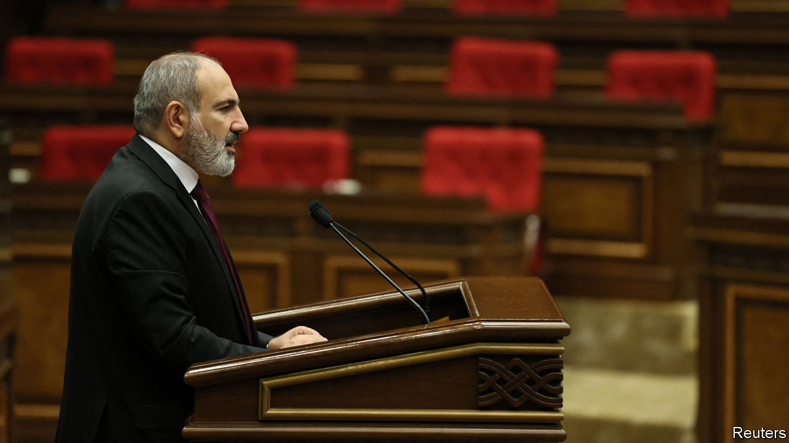
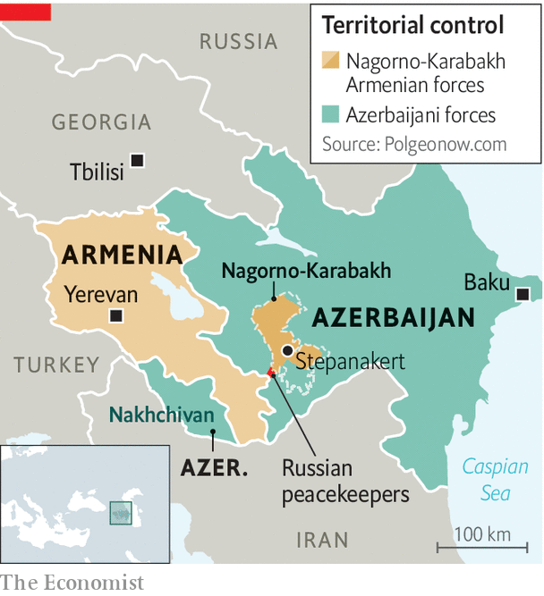

###### The guns do the talking

# Renewed fighting in the Caucasus shows Russia’s waning influence 

##### Nature abhors a vacuum 

 

> Sep 22nd 2022 

Azerbaijan must have reasoned that a new offensive against Armenia, which it beat in a war over the region of Nagorno-Karabakh two years ago, would force its neighbour to make new concessions. 

Early signs suggested that the move had paid off. On September 14th, a day after Azerbaijan’s army unleashed a barrage of artillery and drone strikes against Armenian positions, Armenia’s prime minister, Nikol Pashinyan, said he was ready to pay a high price for peace. “We want to sign a document, for which we will be criticised, scolded and called traitors,” he told parliament. “The people may even decide to remove us from power.”

Crowds duly demanded Mr Pashinyan’s resignation. Many Armenians assumed he meant Armenia was ready to recognise Azerbaijan’s sovereignty over Karabakh. Azerbaijan recaptured large swathes of the territory, populated largely by Armenians and held for nearly three decades by Armenian separatists, in late 2020. 

 


But the enclave’s status remains unresolved. Azerbaijan wants Armenia to renounce its claims to Karabakh. Armenia has been in no rush to do so, and wants guarantees for the region’s Armenians. Peace talks, brokered by the European Union, have made some headway, but a comprehensive settlement on Karabakh, border demarcation, and the construction of a transport corridor between Azerbaijan and its own western exclave, Nakhchivan, has proved elusive. 

Over 200 Armenian soldiers, as well as at least 79 troops from Azerbaijan, are believed to have died in the recent clashes, before a ceasefire took hold. Azerbaijan, whose autocratic government has spent billions of dollars on new weapons, including Turkish and Israeli drones, has a clear military advantage. 

Its decision to let the guns do the talking instead of the negotiators may backfire, however. “It will be hard for Armenia’s government to sell any peace deal at home because it will be seen as doing so under the threat of armed force,” says Zaur Shiriyev of Crisis Group, a think-tank. Mr Pashinyan already seems to have cooled on the idea in the face of a domestic backlash, made worse by reports of atrocities committed by the advancing Azerbaijani forces. “No document has been signed and no document will be signed,” he said only hours after his address to parliament. 

The violence has also exposed Russia’s waning influence in the region. When Armenia responded to Azerbaijan’s attack by invoking the mutual-defence clause of the Collective Security Treaty Organisation, a defensive bloc dominated by Moscow, Russia balked. The only response the bloc could muster was to send a fact-finding mission. Armenian officials could not hide their disappointment.

Still, Russia remains entrenched in the region. It sells arms to Azerbaijan and has a military base in Armenia. Russian troops patrol Armenia’s border with Turkey. Some 2,000 Russian peacekeepers remain in Karabakh as part of the 2020 ceasefire. “There are no illusions in the region about Russia’s power,” says Mr Shiriyev. “No one wants to antagonise Russia.” But Russia is also too overstretched in Ukraine to commit new resources to the Caucasus, says Thomas de Waal of Carnegie Europe, and neither America nor the eu is ready to step in. The result is a growing security vacuum. That does not bode well for peace. ■

