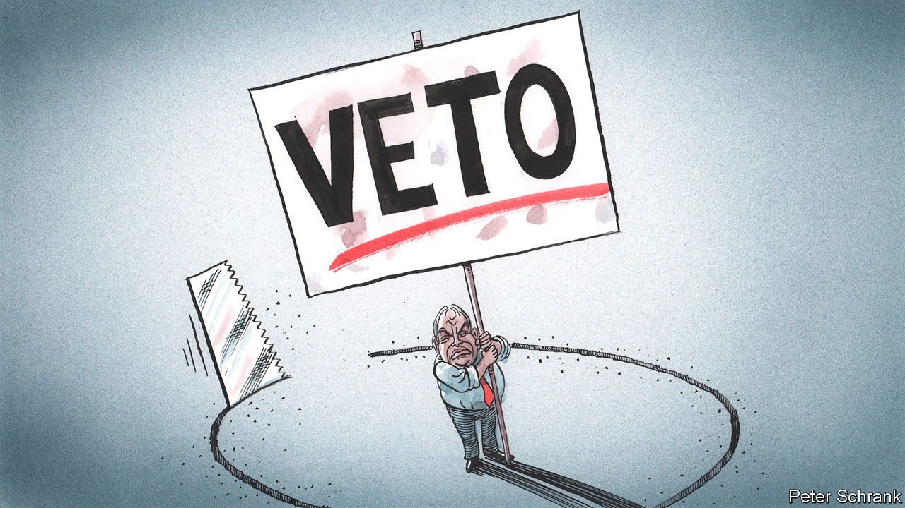

###### Charlemagne

# To prevent diplomatic shakedowns, Europe must curb abusive national vetoes 

##### Time to tweak the notorious Luxembourg Compromise 

 

> Sep 22nd 2022 

At 344 pages in its English version, the Consolidated Version of The Treaty on the Functioning of the European Union displays, as one might expect, a degree of exhaustiveness. The bloc’s constitution-in-all-but-name includes three pages of rules regulating the exports of a refinery in the Dutch Antilles. There is a mention of who gets to own summer houses in Denmark (only Danes). Somewhere in there are also bits on how eu laws are made, outlining the various powers of European institutions in Brussels as they marshal 27 member states towards ever-closer union.

But not included in the rulebook’s 600-plus articles is a mention of an edict that arguably holds sway over all eu business. Some say it does not exist anymore, others that it never really did; Eurocrats speak of it in hushed tones, as if mindful not to wake a monster. The Luxembourg Compromise holds that any national government can single-handedly derail any eu measure if it feels its “vital interests” are threatened. According to the rules, in most instances if enough member states agree, they can impose their will on a recalcitrant few. In the real world, the compromise suggests, a strong enough squeal from any one national government is enough to stall even measures agreed by the other 26 and eu institutions, rules be damned. (The measure was crafted in 1966 to assuage Charles de Gaulle, so piqued was he that lesser Europeans had designs to impose their rules on the French.)

The compromise is rarely seen in the wild; if anything its use is obliquely threatened behind closed doors. Yet other such vetoes abound in Brussels. Most eu business now is agreed by a qualified majority of countries. But in several policy areas unanimity among member states is still needed. This includes anything relating to defence and foreign policy, enlargement, taxation and policing. Cynical politicians have used this to extract concessions from their fellow Europeans. Countries have blocked the eu accession of their neighbours to extract benefits in some local dispute; tiny Cyprus blocked sanctions on Belarus in 2020 because it wanted the eu to focus on Turkey. But the master of the noxious veto is undoubtedly Viktor Orban, Hungary’s autocratic prime minister. Earlier this year he held up round after round of sanctions against Russia, and is now threatening to kibosh Europe’s participation in a global corporate-tax deal. In both instances links can be drawn between Hungary’s veto and its ongoing fights with the eu on unrelated matters. An expert shakedown artist, Mr Orban has spotted an opportunity to profit and seized it. 

The existence of any national vetoes enrages federalists who fret that selfish local politicians stand in the way of a functional European superstate. Those complaints can mostly be ignored. Vetoes are seldom a real problem. They often reflect legitimate gripes and accommodating them improves eu policies in the end. Abolishing them would cause too much power to seep away from national leaders, whose democratic legitimacy far outweighs that of little-known meps or commissioners. On September 20th a meeting of the bloc’s Europe ministers looked at ways to veto-proof more of the eu’s business by increasing the use of qualified-majority votes. But because the proposal to move away from unanimity itself requires unanimity, it is unlikely to go anywhere. 

That leaves the eu with an enduring problem. Hungarian-style exploitation of vetoes is patently beyond the use that was intended for them. Thus a new rule is needed: call it the Reverse Luxembourg. The original Luxembourg Compromise holds that in situations where vetoes are usually forbidden, they can be revived in exceptional circumstances. The Reverse Luxembourg offers that in situations where vetoes are usually allowed, they should be barred in similarly rare circumstances. The Luxembourg Compromise protects against federalist overreach. The Reverse Luxembourg would protect Europe from diplomatic blackmail. 

As with the original compromise, there is no need to codify the Reverse Luxembourg in any treaty. More efficient would be to punish the use of flagrantly abusive vetoes with cuts in eu money sent to countries that deploy them. Such threats work: Hungary is currently scrambling to update its anti-graft laws to avoid losing up to €7.5bn ($7.4bn) of funding from Brussels. The eu regularly comes up with new spending programmes, for example the €750bn pandemic-relief fund set up last year. It is easy to devise such schemes for 26 countries instead of 27: similar workarounds were once deployed to get around Britain in its most cantankerous years as a member of the club. Hungary (along with Poland) is currently not receiving any of the pandemic cash, specifically because of its rule-of-law shortcomings. Spelling out that member states shall not use their veto to hijack the bloc’s business could be made an additional criterion for receiving eu largesse.

Veto Corleone

The Reverse Luxembourg would solve another problem Europe will soon face: how to run a union of 35 or more, after enlargement to the likes of Serbia or Ukraine, without getting bogged down in a thicket of potential vetoes. Germany and France have hinted that more business would have to be done by qualified majority for them to agree to eu expansion. Eastern Europeans are keen on enlargement, but also want to keep the veto, particularly in matters of foreign policy, where they do not trust France or Germany. The Reverse Luxembourg is a neat compromise. It preserves legitimate vetoes, while keeping the eu manageable.

Sceptics will point out a veto that can be over-ridden is no veto at all. And who would decide if a veto was cynical? Why should Ireland be allowed to block a tax deal but not Hungary? Like pornography, veto abuse is a case of knowing it when you see it, and Europe has seen enough of late. The Luxembourg Compromise strikes fear into the heart of federalists precisely because nobody knows its precise contours. Devising a variant to keep cynical exploiters of eu rules in check would stem their undue influence. ■


