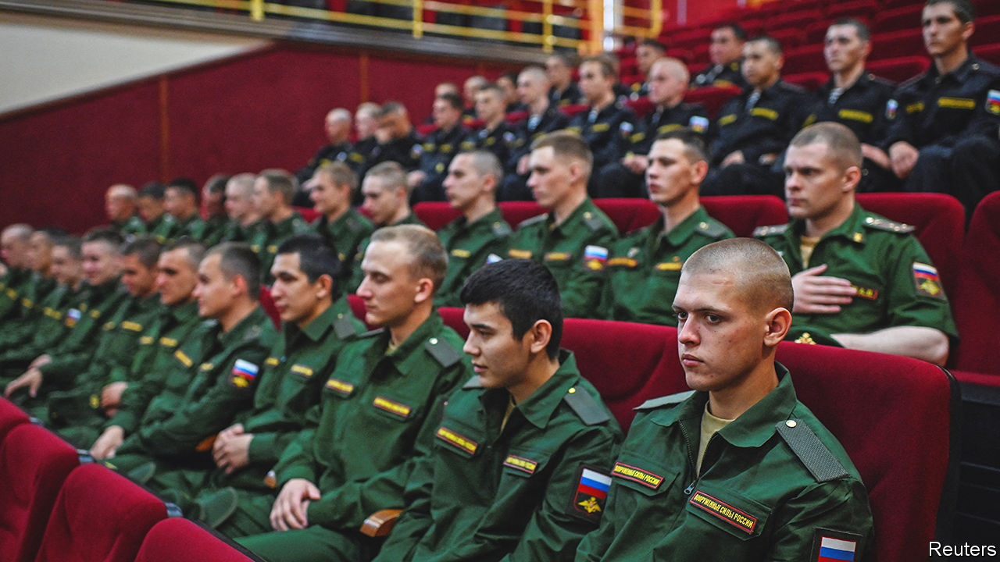
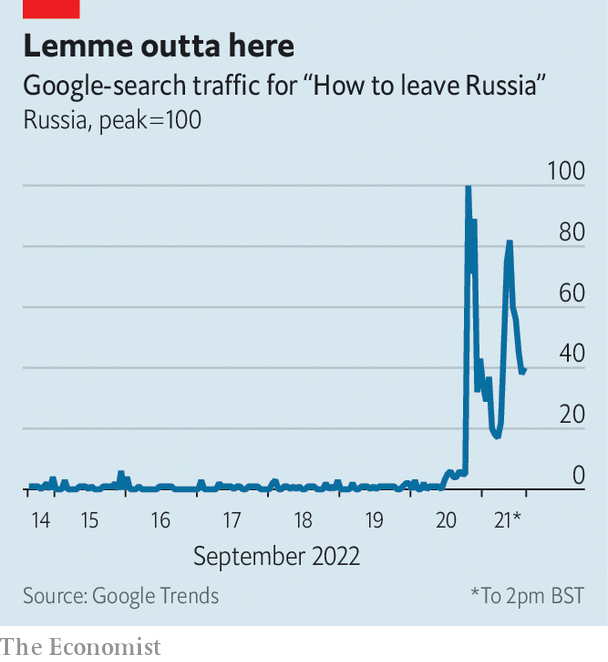

###### Halfway measure

# Vladimir Putin declares a partial mobilisation 

##### Ukraine’s advances force the Kremlin to take desperate measures 

 

> Sep 21st 2022 

For the first time since the start of Russia’s war in Ukraine, a sense of emergency has returned to Moscow. For seven months Vladimir Putin had reassured Russians that all was going to plan. But in a speech on September 21st, after weeks of Ukrainian advances, he told them he needed more men. Russia, he said, was under attack from the entire West. It required “partial mobilisation” to defend both itself and the people of territories it had occupied in Ukraine, who were begging to be absorbed into Russia. And he threatened to use nuclear weapons to defend Russia from what he termed the West’s efforts to destroy it.

The choreography of Mr Putin’s speech was rushed. On September 20th officials from Kremlin-installed governments in occupied Ukraine demanded that Russia annex them. Within hours Russia’s parliament backed their appeal. The territories announced that referendums on annexation, postponed during Ukraine’s counter-offensive, would be held from September 23rd-27th. Meanwhile the Duma passed legislation paving the way for partial mobilisation. Mr Putin’s speech, announced for the evening, was delayed until the next morning without explanation.

Many had expected mobilisation in May, when Russian forces were advancing. Declaring it after Ukrainian forces had counter-attacked looked like failure. The need for conscription also clashed with the optimistic casualty figures presented after Mr Putin’s speech by Sergei Shoigu, the defence minister. He claimed Russia had lost fewer than 6,000 men.

In fact, Russia’s army has suffered grievous losses. To plug the holes, Mr Shoigu said 300,000 reservists would be mobilised. In the past reservists sent to fight in Ukraine were offered extra money and could decline; under the new decree they cannot. The decree also imposes a stop-loss policy, keeping serving soldiers on the job indefinitely. Previous recruitment efforts—including the use of mercenaries and convicts—have clearly fallen short. 

Mr Shoigu explained that this was not a general mobilisation. Out of 25m people eligible, only 1% would be called up—those with prior military service and specialist skills, though the decree itself included none of those caveats. The promise of 300,000 new soldiers rests on shaky assumptions, argues Dara Massicot, an expert at rand, a think-tank. Russia’s recruitment system has fallen apart over the past decade, she says; draft-dodging is endemic. And even if enough men can be found, they do not amount to an effective military force. 

Mr Putin promised the draftees additional training, but many of the officers who could train them are dead or on the front lines. Another constraint is equipment. Russia has lost at least 1,155 tanks so far. And because it has already recruited the most nationalistic or financially desperate veterans, those now dragooned are unlikely to be enthusiastic.

Even so, partial mobilisation will help Mr Putin’s war effort. The situation might otherwise have become “catastrophic” in the winter, says Rob Lee of King’s College London, as volunteers on short contracts left. Reservists can fill out depleted battalions, but the full impact will only be felt next year. That suggests Ukraine has a window of opportunity before Russia’s army can recover. It will keep pressing on the west bank of the Dnieper river in Kherson province and advancing around the border of Donetsk and Luhansk in the east.

The so-called referendums which the Kremlin plans to stage in the provinces of Donetsk, Luhansk, Kherson and Zaporizhia, under the guns of Russian occupiers, will no doubt yield huge majorities for annexation. Since Mr Putin says he will use nuclear weapons to defend Russian territory, making occupied regions part of that territory implicitly extends the nuclear umbrella to them. He noted that this was “not a bluff”. 

But his speech exposed his problems. Most Russians acquiesced in the invasion on the understanding that it did not affect their own lives. Pollsters show a majority supporting the war, but only a militant minority backing mobilisation. Yet since Russia’s defeats in the Kharkiv region, that minority has grown louder. Zealots on state television and social media also call for a formal declaration of war and for levelling Ukraine’s infrastructure. 

 


Meanwhile the war’s costs have eroded backing among Mr Putin’s quieter supporters. On September 18th Alla Pugacheva, a Soviet-era pop diva whose fame in Russia rivals that of the Beatles in the West, called for an end to a war in which “our boys [are] dying for illusory goals” and “which has turned our country into a pariah”.

Mr Putin’s growing vulnerability has forced him to side with the more bloodthirsty part of his electorate. Yet partial mobilisation has only partly satisfied them. Surveys by Levada, an independent pollster, show younger people are paying less attention to the war and even fewer are prepared to die in it. On September 20th Google registered a surge of searches for “how to leave Russia” (see chart). After Mr Putin spoke, tickets for direct flights out of Russia sold out in minutes. 

Mobilisation, one of the most unpopular decisions of Mr Putin’s presidency, risks bringing the war back home. After colleagues of Alexei Navalny, Russia’s imprisoned opposition leader, called for protests, demonstrations broke out in Moscow and over 30 other cities. Around 1,300 people were arrested, and some were reportedly served draft notices. As Russia discovered in 1917, it can be risky to give arms to people who do not wish to fight. ■


