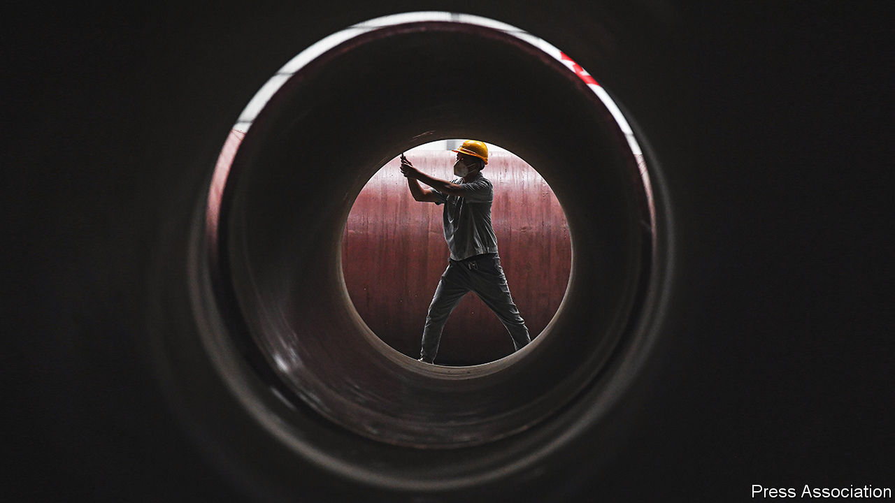
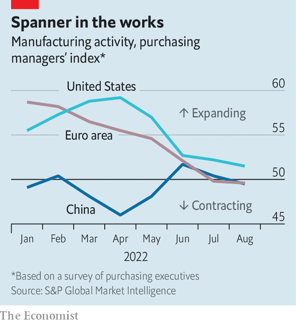

###### Factories, floored

# A global manufacturing slowdown suggests worse is to come 

##### Recession would be brutal for countries that have still not recovered from covid-19 

 

> Sep 21st 2022 

“Is a global recession imminent?” asks a new report by the World Bank. The answer—that one very well might be—will not be a surprise to manufacturers. In August global manufacturing output shrank relative to the month before, and new orders fell for the second month in a row, according to JPMorgan Chase, a bank. As economic woes mount, worse could be ahead, for factories and the broader economy.

Last year industry enjoyed an epic boom. Consumers, bolstered by generous covid-19 relief, splashed out on goods, and the easing of lockdowns allowed factories to make up lost ground. The value of global manufacturing output leapt to more than $16trn, representing the highest share of gdp in nearly two decades. Roaring industry powered a banner year for the world economy, with overall global output rising by 6.1%, the fastest pace on record, despite supply-chain problems. 

A softening of demand was inevitable as life became normal, and spending shifted back from goods to services. But even service-sector activity looks disappointing of late, and manufacturing troubles reflect much bigger shocks. The most serious is the energy-price crunch caused by Russia’s war in Ukraine. Industrial production in the euro zone fell by 2.4% in July against the year before. Firms have had to idle plants in the face of energy costs which render production uneconomical—a cold winter would bring even more pain. 

 


The beleaguered Chinese economy is also a problem. Manufacturers struggling with “zero-covid” policies and a property-market bust were hit by an additional shock over the summer, as intense drought impeded shipping and dealt a blow to hydropower. Data from , a business publication, show that Chinese manufacturing sales shrank in August compared with the previous month. The performance of economies which typically export lots of goods and components to China also spells trouble. South Korean production swooned over the summer, for instance, as its exports to China tumbled. 

The drag from high energy costs and a limping Chinese economy has been reinforced by tightening monetary policy. Surging demand for goods over the past two years overtaxed the capacity of factories, ships and ports, pushing inflation up. High prices have proven remarkably persistent—thanks in part to the shock of the war in Ukraine—so central banks are taking aggressive action. Such synchronous tightening has occurred rarely over the past half century, notes the World Bank, and resembles the positioning which triggered a global recession in 1982. 

For now, manufacturers in India and South-East Asia have resisted global headwinds. That may reflect efforts to diversify supply chains away from China. During the first seven months of 2022, China’s exports of goods to America were up by 18% compared with the year before. Exports from India were up by 30%, however, while those from Vietnam were up by 33%, Indonesia by 41% and Bangladesh by 50%. Yet their fortunes are ultimately roped to the world economy as a whole; if it continues to weaken, even relatively insulated places will find it difficult to avoid a slump. 

A global recession is not a foregone conclusion. Manufacturing suffered in 2015-16 and in 2019, and in both cases the economy avoided a downturn. But in these periods, policy changed dramatically to prevent weakening growth from snowballing. In the middle of the decade, the Federal Reserve raised rates far more slowly than it had led markets to expect—and China opened a fire hose of stimulus. In 2019, the Fed pivoted to rate cuts even as President Donald Trump’s tax plan swelled American deficits, boosting the world economy. 

There is little immediate hope for similar reversals. China is wedded to its zero-covid policies for now, meaning new stimulus would do little to . Recently Fed officials have told markets they should expect American interest rates to rise higher and stay there for longer—even if this pushes the economy towards recession (see next story). Indeed, so long as American consumer spending remains robust, the Fed will probably feel that its inflation-fighting work is unfinished. 

The safe bet is that conditions will get worse before they get better. But how much worse? The World Bank presents three scenarios for next year. The baseline is one consistent with the current consensus outlook for growth, of about 1.5% per person, but which is probably not consistent with central banks’ desired fall in inflation—and which is thus almost certainly too optimistic. In a second, “sharp downturn” scenario, central banks have to work harder to arrest inflation but still fail to restore price stability, and growth decelerates to 0.8% per person. The third is one in which significant, synchronous monetary tightening induces a recession, such that global output shrinks by about 0.4% per person. 

Either of the latter scenarios would be bitter for countries still recovering from the covid downturn. Debt loads around the world remain alarmingly high, and many countries’ economies lag below their pre-pandemic trendline. Their leaders will be watching the slowdown in global manufacturing with considerable trepidation. ■


